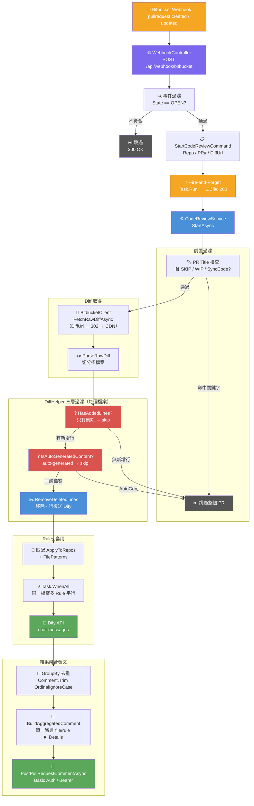
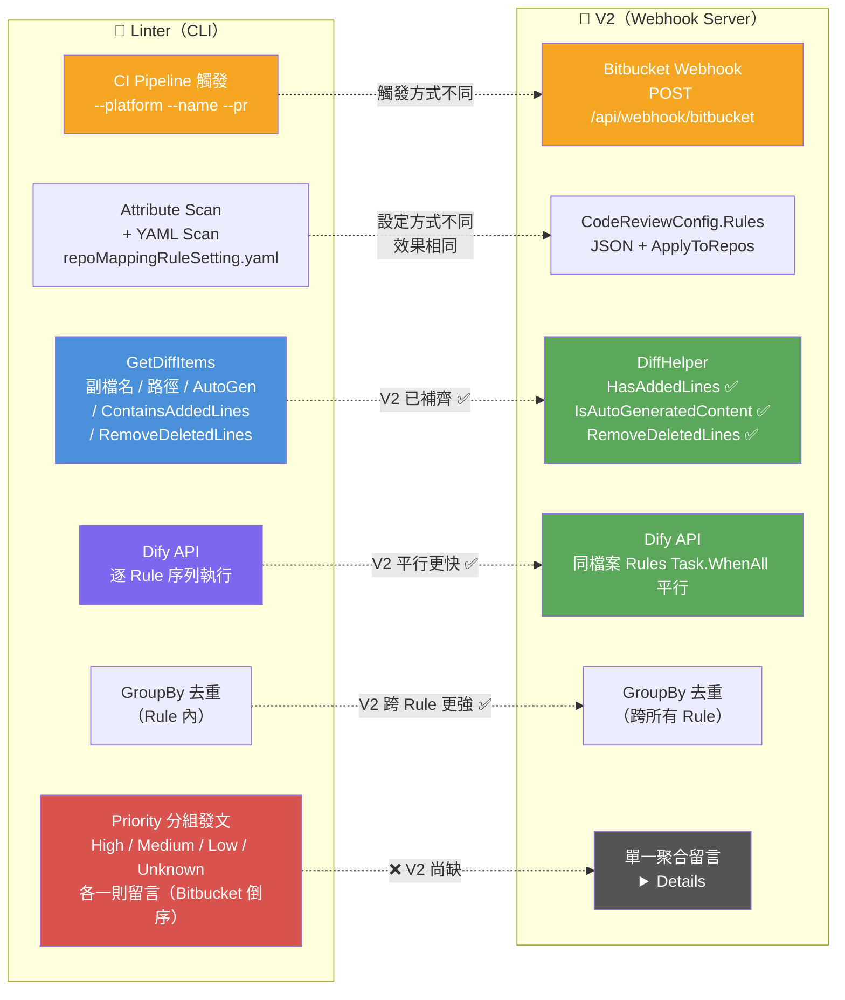
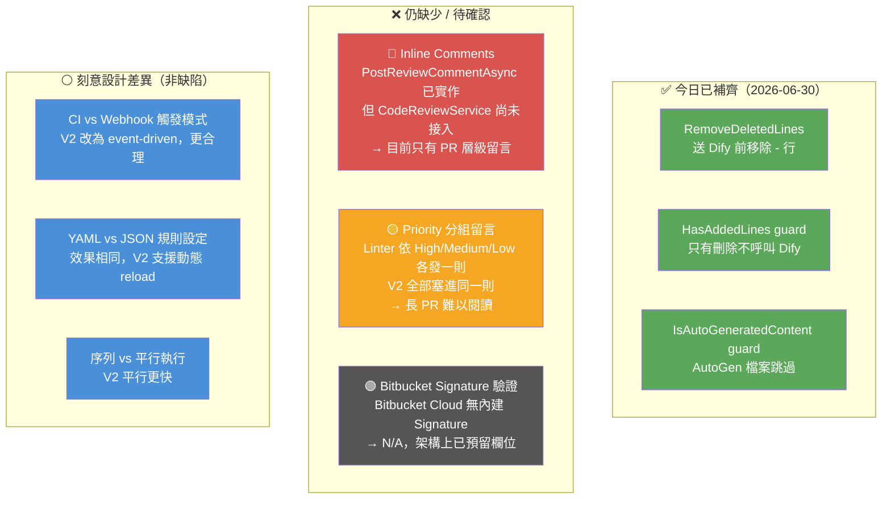

# AI Code Review V2 — 執行流程分析與 Linter Gap 分析

> 分析日期：2026-06-30  
> 對比對象：Linter（CLI）vs AI Code Review V2（Webhook Server）  
> 目前專案路徑：`C:\91APP\AI_Devs\codereview\gitlab-codereview\nineyi.ai.code.review.v2`

---

## 一、AI Code Review V2 — Bitbucket Webhook 完整執行流程



---

## 二、Linter vs V2 — Bitbucket 流程對比



---

## 三、Gap 分析 — V2 還缺什麼



---

## 四、今日變更摘要

### 新增 `DiffHelper.cs`

路徑：`src/BusinessLogic/NineYi.Ai.CodeReview.Application/Utilities/DiffHelper.cs`

| 方法 | 說明 |
|------|------|
| `RemoveDeletedLines(diff)` | 移除 `-` 開頭的刪除行，`---` header 保留 |
| `HasAddedLines(diff)` | 確認 diff 含新增行，只有刪除則略過 |
| `IsAutoGeneratedContent(diff)` | 偵測前 20 行是否含 `<auto-generated>` 標記 |

### 修改 `CodeReviewService.cs`

在 `foreach diffFile` 迴圈加入三層 guard，送 Dify 前先套用 `RemoveDeletedLines`：

```csharp
// ❶ 無新增行 → skip
if (!DiffHelper.HasAddedLines(diffFile.Diff)) continue;

// ❷ Auto-generated → skip
if (DiffHelper.IsAutoGeneratedContent(diffFile.Diff)) continue;

// ❸ 移除刪除行後送 Dify
FileDiff = DiffHelper.RemoveDeletedLines(diffFile.Diff)
```

> `DiffHelper` 集中一處，Bitbucket / GitLab / GitHub 三平台共用，解決 Linter 各自散落重複實作的問題。

---

## 五、剩餘待辦

| 優先 | 項目 | 說明 |
|------|------|------|
| 🔴 高 | **Inline Comments 接入** | `PostReviewCommentAsync` 已實作但未 wire 進 `CodeReviewService`，目前僅 PR 層級留言 |
| 🟡 中 | **Priority 分組留言** | 長 PR 所有意見擠在一則 `<details>`，可依 High/Medium/Low 分則發送 |
| ⚪ N/A | Bitbucket Signature 驗證 | Bitbucket Cloud 本身不支援，架構預留即可 |
