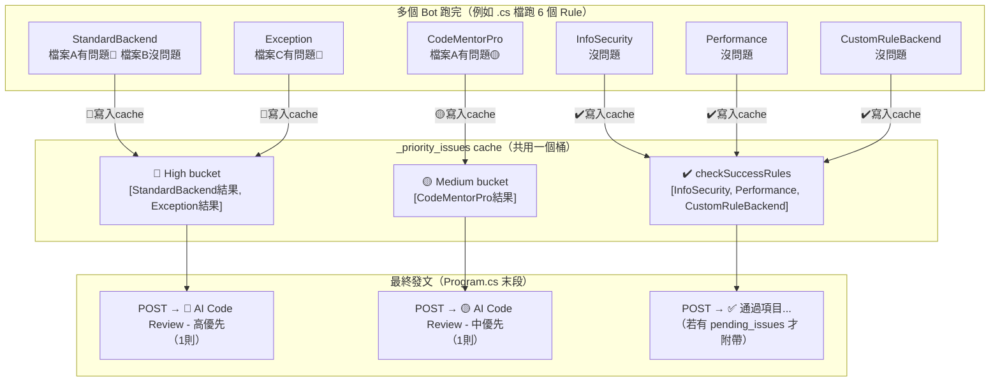

# Linter 留言聚合機制說明

> 分析日期：2026-06-30

---

## 核心結論

| 問題 | 答案 |
|------|------|
| 一個檔案一則留言？ | ❌ 不是，所有檔案的結果都混入同一個 priority bucket |
| 一個 Bot 一則留言？ | ❌ 不是，6 個 Bot 的結果合併進 High/Medium/Low 桶 |
| 最終幾則留言？ | **最多 4 則**（有幾個 priority 就幾則），所有 Bot × 所有檔案全聚合 |
| 是 PR 層級還是 inline？ | **PR 層級**，不是貼在 diff 特定行旁邊 |

---

## 聚合流程圖



---

## 兩條 Cache 路徑

Linter 在 Program.cs 末段讀取兩個 cache key 來決定發文：

### 路徑 A — `_pending_issues`（非 AI 靜態規則，舊機制）

- 由 `CrossDbContextJoinRule`、`NineYiDatabasesSPJoinRule` 等靜態規則寫入
- 所有靜態規則的結果聚合成**一則留言**，標題「# 🤖 Linter 檢查報告」
- 可以包含行號（`Line 123`），但仍是 PR 層級文字，不是真 inline comment

### 路徑 B — `_priority_issues`（AI 規則，新機制）

- 由 `BaseAiAssistantRule.PushAiPriorityMessages()` 寫入
- 所有 AI Bot × 所有檔案的結果，依 priority **分桶**：

| Bucket | 觸發條件 | 發文標題 |
|--------|---------|---------|
| High | Dify 回傳 `[高優先]` | `# 🔴 AI Code Review - 高優先` |
| Medium | Dify 回傳 `[中優先]` | `# 🟡 AI Code Review - 中優先` |
| Low | Dify 回傳 `[低優先]` | `# 🟢 AI Code Review - 低優先` |
| Unknown | 無優先標記 | `# 🤖 AI Code Review` |

每個 bucket 有內容就發**一則**，最多 **4 則**。

---

## Bitbucket 特殊處理：倒序發文

Bitbucket 留言區**由新到舊顯示**（最新留言在最上面），因此 Linter 倒序發文：

```
發文順序：Unknown → Low → Medium → High
顯示結果：High（最上）→ Medium → Low → Unknown（最下）
```

GitLab / GitHub 由舊到新顯示，所以正序發（High → Medium → Low → Unknown）。

---

## Linter vs V2 留言機制對比

| 面向 | Linter | V2 |
|------|--------|----|
| AI 結果分組 | 依 Priority 最多 4 則 | 全部聚合 **1 則** |
| 跨 Bot 聚合 | ✅ 同一 priority bucket 合併 | ✅ 全部合併 + `<details>` 折疊 |
| 跨檔案聚合 | ✅ 同一 priority bucket 合併 | ✅ 全部合併，按 file/rule 分層 |
| 是否為 inline comment | ❌ PR 層級文字留言 | ❌ PR 層級文字留言（`PostReviewCommentAsync` 已寫但未接入） |
| 平台差異 | Bitbucket 倒序，GitLab/GitHub 正序 | 無差異，永遠 1 則 |
