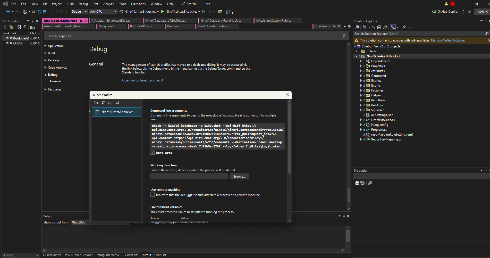

## reference


https://docs.google.com/presentation/d/1LeGzjDa3vHmxq1m06kV15UK13dAXk4gXLcTVpOG2X2k/edit?slide=id.g5ad8a602eb_0_536#slide=id.g5ad8a602eb_0_536


https://docs.google.com/presentation/d/1kV-gJzQLp6-34lvJoqHSROGmPd-zWxQufRul3phJ_eg/edit?slide=id.g13f9354171c_0_173#slide=id.g13f9354171c_0_173


## linter 觸發


https://91app.slack.com/archives/GLS17U8UX/p1732276180025039


入版到 NineYi.Linter
https://bitbucket.org/nineyi/nineyi.linter/src/develop/

手動執行 CI-Master Linter-Deploy
http://ci-master.91dev.tw:8080/job/Linter-Deploy/

手動執行 CI5 - Install Linter
https://ci5.91dev.tw/job/Install%20Linter/


## create API Key

Username : Allen_Lin_91app


##　app password


https://bitbucket.org/account/settings/app-passwords/


ATATT3xFfGF04OeZzQsKqwkq4UANA4u8ZQUuq9hnAZLSGF-GTi9s_hb8LqygOnNMGVsUBTFVcNihRU17sTUNXgrciNL1uAs8Ts1HcaMnwLo1xYT3Ni3YBDdRxdPXropU3dcgEp9iY0QY0z6TKl2jS5wnehETO4_t9WX2Uf-XkMsMHLt8BDSuwho=15D1F3A0


## 添加 webhook


http://bitbucket.org/nineyi/allenlin.nineyi.sms/admin/webhooks


url : http://ci5.91app.io/generic-webhook-trigger/invoke


Secret

IF#B@Z3xl*9oiNlP


eable history

https://bitbucket.org/nineyi/allenlin.nineyi.sms/admin/webhooks/159049fa-3d6c-4ad9-a1a3-52811bdd7328


好像要自己在UI手動發 PR 才會觸發成功


## 啟動前設定




csproj => properties => Debug => General => Open debug launch profiles UI


```bash
check -n NineYi.Databases -p bitbucket --api-diff https://api.bitbucket.org/2.0/repositories/nineyi/nineyi.databases/diff/tell6530/nineyi.databases:6b452d730911%0D7d71b0ed27b2?from_pullrequest_id=4733 --api-comment https://api.bitbucket.org/2.0/repositories/nineyi/nineyi.databases/pullrequests/4733/comments --destination-branch develop --destination-commit-hash 7d71b0ed27b2 --log-folder C:\Files\Log\Linter
```


## 以前的

```json
{
  "BitbucketApiKey": "ATCTT3xFfGN0ifhekf2_No7ZwZ6x7YZNlA3uJYU1UR7y-0acp7IdgWCOPKNj0e5reS897l6eig1ekceW2lBS2pO_DNBxsrVkOjOjAOlU-c_cpIIJWuGtOPQqrxlC24OnPbUhV0sMa2YZMnws1cK0HXqyXoDdLVx4sH9H-knVQOs63GI3aUGp9kY=B77A4F89"
}
```


## logic


在這邊建構每個 rules


```csharp
var strategy = Activator.CreateInstance(type, appSetting, opts, cache);
```