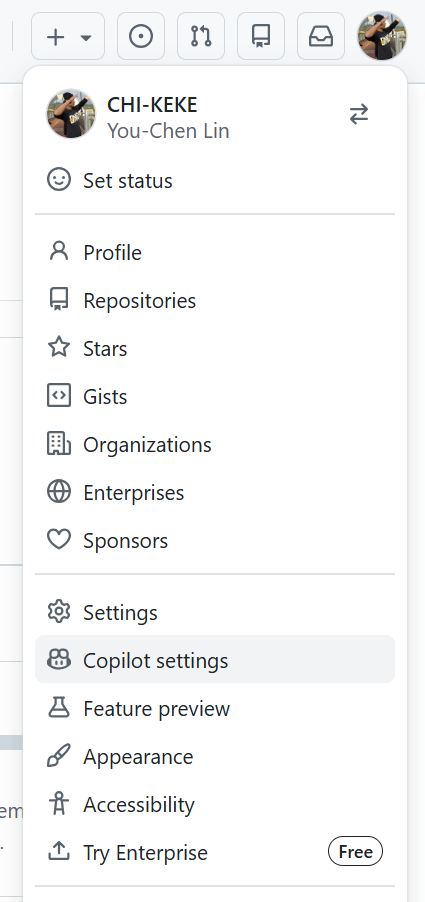
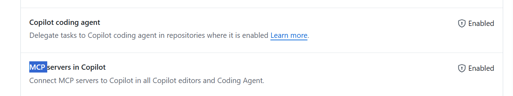
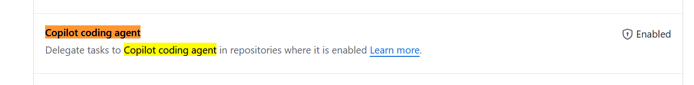

https://code.visualstudio.com/docs/copilot/copilot-coding-agent#_method-2-delegate-from-chat
https://code.visualstudio.com/docs/copilot/copilot-coding-agent

https://code.visualstudio.com/docs/setup/windows

## Copilot Business / Enterprise 要怎麼 Enable

1️⃣ Organization 層級

到 GitHub
進入 Organization
點 Settings
左側找 Copilot
找到 Copilot coding agent

設定為：✅ Enabled

📌 官方文件對應：
Adding GitHub Copilot coding agent to your organization

MCP

Delegate

## githubPullRequests.codingAgent.uiIntegration

Optional: Enable the experimental setting githubPullRequests.codingAgent.uiIntegration to show a Delegate to coding agent button in Copilot Chat for easier task delegation.

## chat.agentSessionsViewLocation

You can also manage coding agent sessions from a dedicated chat editor and view a Chat Sessions view by enabling the experimental setting chat.agentSessionsViewLocation.

## Delegate to Agent 實在是長不出來

githubPullRequests.codingAgent.uiIntegration

