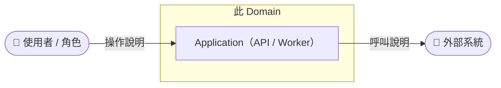
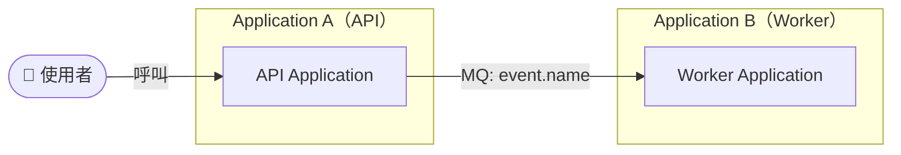
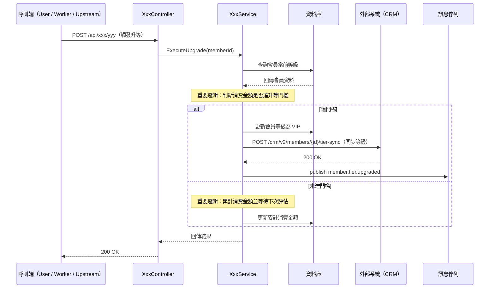
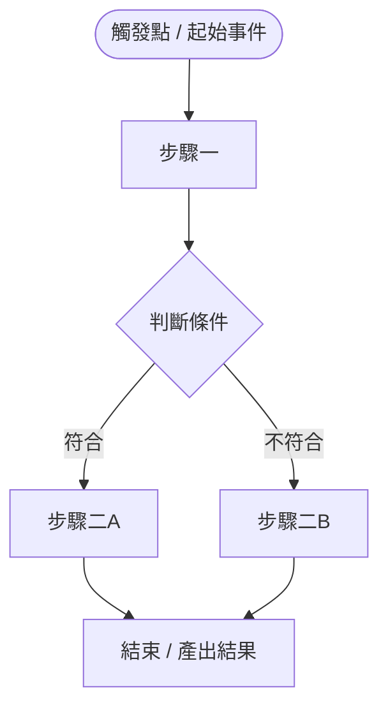

# Domain Document Templates

> 本文件定義 8 個獨立 md 檔案的模板，由 Domain Creator Skill 依內容分別產出。
> 🤖 自動產出　✍️ 人工撰寫　📝 草稿 + 人工審閱　🔲 待實作　📋 待 RD 補充

---

## 00-overview.md

```markdown
# {Domain 名稱} — Overview

> 產出方式：🤖（核心業務價值、程式碼清單）+ 📝（專有名詞 / 關鍵字 Mapping）
> 產出時間：YYYY-MM-DD HH:MM

---

## 核心業務價值

> 這個 Domain 解決了什麼業務問題？為誰解決？帶來什麼價值？（1-3 句）

[待填寫]

---

## 程式碼範圍

| 類型 | 名稱 | 說明 | 實作狀態 |
|---|---|---|---|
| API Controller | `XxxController` | 負責... | ✅ 已實作 / 🔲 待實作 |
| Worker | `XxxWorker` | 定期執行... | ✅ 已實作 / 🔲 待實作 |
| DB Table | `table_name` | 儲存... | ✅ 已實作 / 🔲 待實作 |

---

## 專有名詞 / 關鍵字 Mapping

> 此表是 **Domain 業務概念的中英文索引**，方便依關鍵字反查所屬 Domain，也作為業務語意定義。
> 英文關鍵字寫的是「業務溝通會用到的英文名詞」，**不是程式碼 Entity 類別名**。
> 同步維護於 `.docs/B2E/domain-catalog.md`，請確保兩處一致。
> 業務說明請使用業務語言，避免純技術術語。

| 中文名 | 英文關鍵字 | 業務說明 |
|---|---|---|
| [中文業務名稱] | `Keyword1`, `Keyword2`, `Keyword3` | [業務定義；若有多個關鍵字請說明彼此差異與適用場景] |

> 範例（Member Domain）：
>
> | 中文名 | 英文關鍵字 | 業務說明 |
> |---|---|---|
> | 會員 | `Member`, `VIP Member`, `CRM Member` | `Member` 指平台註冊會員、`VIP Member` 指付費 VIP 等級會員、`CRM Member` 指由 CRM 系統同步進來的會員（以業務語言描述，非程式碼類別） |
```

---

## 01-c4-l1-system-context.md

```markdown
# {Domain 名稱} — C4 L1 System Context

> 產出方式：🤖 骨架 + 📝 人工審閱
> 此圖呈現此 Domain 在整體系統中的位置，以及與外部使用者、外部系統的互動關係。

---

## System Context 圖



---

## 說明

| 角色 / 系統 | 類型 | 互動方向 | 說明 |
|---|---|---|---|
| [使用者角色] | 使用者 | 呼叫此 Domain | [說明] |
| [外部系統] | 外部系統 | 被此 Domain 呼叫 | [說明] |
```

---

## 02-c4-l2-container.md

```markdown
# {Domain 名稱} — C4 L2 Container

> 產出方式：🤖 骨架 + 📝 人工審閱
> 此圖呈現此 Domain 涉及哪些 Application，以及彼此的串接方式。

---

## Container 圖



---

## Application 清單

| Application | 類型 | 職責說明 | 實作狀態 |
|---|---|---|---|
| [Application 名稱] | API / Worker | [職責] | ✅ 已實作 / 🔲 待實作 |

## 串接關係

| 來源 | 目標 | 方式 | 說明 |
|---|---|---|---|
| [Application A] | [Application B] | REST / MQ / Redis | [說明] |
```

---

## 03-db-schema.md

```markdown
# {Domain 名稱} — DB Schema

> 產出方式：🤖 table name（2A 自動掃出；2B 來自訪談）+ 📋 schema 欄位待 RD 補充

---

## 資料表清單

| Table 名稱 | 所在 DB | 主要用途 | 實作狀態 |
|---|---|---|---|
| `table_name` | [DB 名稱] | 儲存... | ✅ 已實作 / 🔲 待實作 |

---

## Schema 定義

### `table_name`

> 📋 欄位定義待 RD 補充

| 欄位名稱 | 型別 | 說明 | 備註 |
|---|---|---|---|
| `id` | int | 主鍵 | |
| `status` | varchar | 狀態 | 📋 待 RD 補充 |
| `created_at` | datetime | 建立時間 | |
```

---

## 04-sequence-diagram.md

```markdown
# {Domain 名稱} — Sequence Diagram

> 產出方式：🤖 骨架 + 標註重要邏輯與對外 API 路徑 + ✍️ RD 補充細節
>
> **必須標明：**
> 1. **重要邏輯**：關鍵判斷分支、狀態變更、業務規則套用點（用 `Note` 或訊息標籤註明）
> 2. **對外呼叫的 API 路徑**：若呼叫外部服務 / 其他 Application，訊息標籤需包含完整 **HTTP method + endpoint**
>    - 範例：`POST /api/members/{id}/upgrade`、`GET /crm/v2/members/{memberId}`
> 3. **參與者**：依實際呼叫鏈展開（Controller / Service / Repository / 外部系統）

---

## 主流程 Sequence Diagram



---

## 重要邏輯說明

| 步驟 | 邏輯說明 | 程式碼依據 |
|---|---|---|
| 升等判斷 | [描述條件] | `XxxService.MethodName`（2A）/ 來自訪談（2B） |
| 狀態變更 | [描述狀態流轉] | `XxxService.MethodName`（2A）/ 來自訪談（2B） |

## 對外 API 清單

| 對象系統 | HTTP Method | API 路徑 | 用途 | 程式碼依據 |
|---|---|---|---|---|
| [系統名] | GET / POST / ... | `/path/to/endpoint` | [呼叫目的] | `HttpClientClassName.MethodName`（2A）/ 來自訪談（2B） |

> 若仍有未確認的細節，請 RD 補充並更新本表。
```

---

## 05-api-list.md

```markdown
# {Domain 名稱} — API List

> 產出方式：🤖（2A 從 Controller 掃出）/ 🔲（2B 規劃清單）

---

## API 清單

| Controller | Endpoint | HTTP Method | 說明 | 實作狀態 |
|---|---|---|---|---|
| `XxxController` | `/api/xxx` | GET | 取得... | ✅ 已實作 / 🔲 待實作 |
| `XxxController` | `/api/xxx` | POST | 建立... | ✅ 已實作 / 🔲 待實作 |
```

---

## 06-event-queue.md

```markdown
# {Domain 名稱} — Event / Queue

> 產出方式：🤖（2A 從 NMQ Publisher/Subscriber 掃出）/ 📝（2B 來自訪談）

---

## 訂閱的事件（外部 → 此 Domain）

| 事件名稱 | 來源系統 | 觸發的動作 | 依據 |
|---|---|---|---|
| `event.name` | [來源系統] | [此 Domain 執行的動作] | `ConsumerClassName`（2A）/ 來自訪談（2B） |

---

## 觸發的事件（此 Domain → 外部）

| 事件名稱 | 目標系統 | 觸發條件 | 依據 |
|---|---|---|---|
| `event.name` | [目標系統] | [什麼情況下發布] | `PublisherClassName.MethodName`（2A）/ 來自訪談（2B） |
```

---

## 07-cross-app-relationship.md

```markdown
# {Domain 名稱} — Cross-App Relationship

> 產出方式：🤖（2A 從 HTTP Client 分析）/ 📝（2B 來自訪談）

---

## 外部服務相依

| 外部服務 | 整合方式 | 此 Domain 職責 | 對方職責 | 邊界定義 |
|---|---|---|---|---|
| [服務名稱] | REST / MQ / Redis | [我做什麼] | [對方做什麼] | [邊界說明] |

---

## 跨 Application 呼叫方向

| 方向 | 說明 | 依據 |
|---|---|---|
| [Application A] → [Application B] | [說明呼叫目的] | `HttpClientClassName`（2A）/ 來自訪談（2B） |
```

---

## 08-business-flow.md

```markdown
# {Domain 名稱} — Business Flow

> 產出方式：🤖（從 Q6 訪談或 Service 邏輯分析）+ 📝 人工審閱

---

## 核心業務流程



---

## 狀態轉移（如有狀態機）

| 從 | 到 | 觸發條件 | 依據 |
|---|---|---|---|
| 狀態A | 狀態B | [條件說明] | `ClassName.MethodName`（2A）/ 來自訪談（2B） |
```
