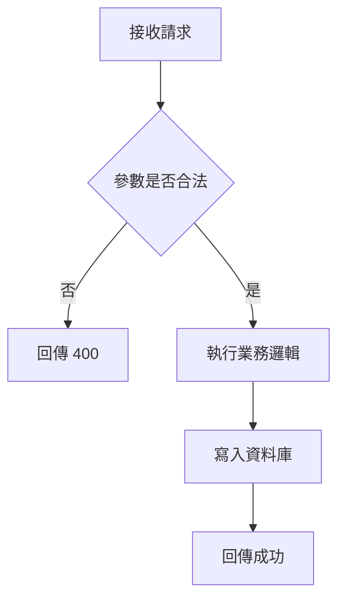
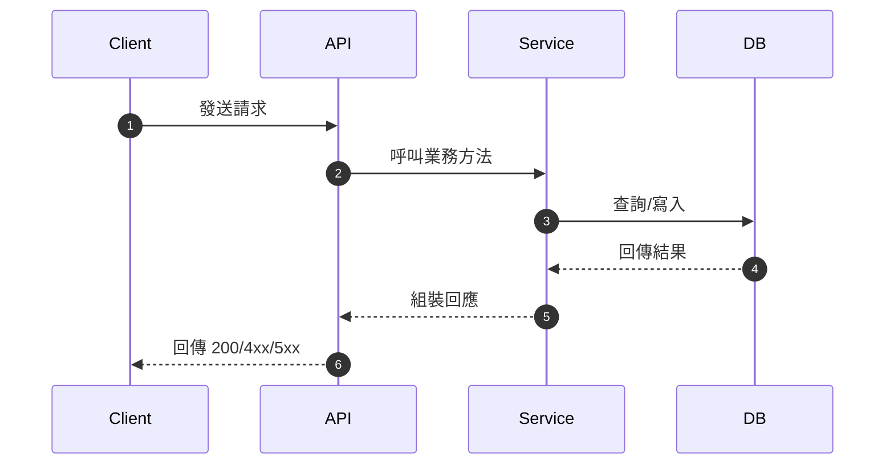

# 程式碼盤點 Skill

協助 RD 快速理解程式碼庫，從整體概覽到細節分析，四個層級依需求選用。

## 核心原則

- **日常查詢導向**：RD 問一個問題，快速得到答案，不需要讀完整份文件
- **漸進式深入**：從高層概覽到細節，按需展開
- **可行動**：每份輸出讀完之後，RD 知道下一步該看哪裡
- **風險標註**：明確標示技術債、注意事項、變更影響
- **時效標記**：每份報告末尾標註盤點時間（`盤點時間：YYYY-MM-DD HH:MM`）
- **固定落地**：所有盤點結果都必須寫入 `/.doc/` 目錄，不只在對話中回覆
- **流程圖像化**：流程邏輯優先以 Mermaid 圖呈現，避免只用長段文字

---

## 選擇盤點層級

| 使用者問的是… | 使用層級 | 觸發關鍵字範例 |
|---|---|---|
| 這個 repo 大概在幹嘛？ | Level 1 — Repository 層 | `盤點 repo`、`整體架構`、`有哪些專案` |
| 某個模組的內部結構？ | Level 2 — 模組層 | `盤點模組`、`這個 Service 怎麼組織` |
| 某個 class 的方法和邏輯？ | Level 3 — 類別層 | `盤點類別`、`這個 class 做什麼`、`有哪些方法` |
| 某個 method 的內部邏輯？ | Level 3.5 — 方法層 | `這個方法在做什麼`、`解釋這段邏輯`、`這個 method 的流程` |
| 改了這邊會影響誰？ | Level 4 — 跨系統相依 | `跨系統相依`、`影響範圍`、`誰呼叫了我` |

判斷後直接執行對應層級，不需要再詢問使用者確認。如果模糊，從 Level 2 開始，最後補充說明可以往哪個方向深入。

---

## Mermaid 圖表呈現規則

### 圖種選擇

| 情境 | 圖種 | 規則 |
|---|---|---|
| 單一方法內有條件分支、迴圈、早期返回 | `flowchart` | 必須產出流程圖 |
| 有跨元件互動（Controller/Service/DB/Redis/MQ/外部 API） | `sequenceDiagram` | 必須產出循序圖 |
| 同時有複雜分支 + 跨元件互動 | `flowchart` + `sequenceDiagram` | 兩張都要 |

### 輸出規範

- 圖表語法必須使用 Mermaid 標準關鍵字：`flowchart TD`、`sequenceDiagram`
- 每張圖至少涵蓋主成功路徑；若存在錯誤處理或 fallback，至少標註 1 條例外路徑
- 節點文字使用業務語意，不直接貼整段程式碼
- 圖下方需附「依據來源」：`類別.方法` 或 `檔案路徑#方法名`

### 範例

---

## Level 1：Repository / Solution 層級

**適用場景**：「這個 repo 是做什麼的？裡面有哪些主要模組？」

### 分析步驟

1. 讀取 solution 根目錄結構（`*.sln`、`README.md`、`*.config`）
2. 列舉所有專案（`*.csproj` / `*.fsproj`）並識別專案類型
3. 讀取每個專案的主要 namespace 和 `Program.cs` / `Startup.cs` / `appsettings.json`
4. 識別共用引用關係（`<ProjectReference>`）
5. 識別關鍵進入點（Web API Controllers、Worker、Console）

### 輸出模板

使用 `assets/level1_template.md` 的格式輸出。詳細欄位說明見 `references/output_formats.md`（Level 1 段落）。

重要提示：
- 技術棧直接從 `.csproj` 的 `<TargetFramework>` 和 `<PackageReference>` 讀取，不要猜測
- 模組類型從輸出類型（`<OutputType>`）判斷：`Exe` = Console App、`Library` = Class Library，沒有指定通常是 Web API
- 共用 Library 定義為被 ≥ 3 個專案引用

---

## Level 2：專案 / 模組層級

**適用場景**：「OrderService 這個模組負責什麼？內部怎麼組織的？」

### 分析步驟

1. 讀取目標模組的目錄結構（列出所有 `.cs` 檔案，依資料夾分組）
2. 讀取 `*.csproj` 取得 `<PackageReference>` 和 `<ProjectReference>`
3. 對每個子資料夾識別職責（Controllers、Services、Repositories、Models 等）
4. 讀取所有 `public class` 的宣告行（不需讀全文），統計行數，評估重要度
5. 從 `<ProjectReference>` 推導「依賴誰」，從整個 solution 掃描反向引用推導「誰依賴我」

### 重要度評估標準

- 🔴 高：Service 核心類別、主要 Controller、行數 > 300 行
- 🟡 中：Validator、Mapper、Helper，行數 100-300 行
- 🟢 低：純 DTO、Config 類別，行數 < 100 行

### 輸出模板

使用 `assets/level2_template.md` 的格式輸出。詳細欄位說明見 `references/output_formats.md`（Level 2 段落）。

---

## Level 3：單一檔案 / Class 層級

**適用場景**：「這個 OrderService.cs 在做什麼？有哪些重要方法？」

### 分析步驟

1. 讀取目標 `.cs` 檔案完整內容
2. 解析：命名空間、類型（Class / Interface / Enum / Abstract）、繼承/實作
3. 列舉所有 `public` 方法：名稱、參數、回傳值、行號範圍
4. 對行數 > 50 行的方法，分析內部邏輯流程（呼叫了哪些依賴）
5. 掃描技術債標記：`// TODO`、`// FIXME`、`// HACK`、magic number、方法行數過長（> 100 行）
6. 識別建構子注入的依賴

### 輸出模板

使用 `assets/level3_template.md` 的格式輸出。詳細欄位說明見 `references/output_formats.md`（Level 3 段落）。

技術債嚴重度標準：
- ⚠️ 警告：方法行數 > 100 行、magic number、TODO 超過 5 處
- ℹ️ 資訊：TODO 1-5 處、輕微命名不一致

---

## Level 3.5：單一 Method 邏輯深析

**適用場景**：「這個 `CreateOrder()` 方法到底做了什麼？每一步的業務邏輯是什麼？」

> 與 Level 3 的差異：Level 3 給你**整個 class 的地圖**（有哪些方法），Level 3.5 給你**單一方法的逐步解析**（每個階段做了什麼、為什麼）。

### 觸發時機

使用者明確指定一個方法名稱，並想了解其內部邏輯，例如：
- 「解釋 `ProcessUpgrade()` 這個方法的邏輯」
- 「`SyncMemberData` 方法在做什麼，逐步說明」
- 「我要修改這個 method，先幫我看懂它」

### 分析步驟

1. 定位目標方法的起訖行號，讀取完整方法體
2. 讀取類別建構子，識別此方法有實際使用到的依賴
3. 將方法體拆解為「階段（Phase）」，每個階段對應一個有意義的業務動作
4. 識別關鍵決策點（條件分支、早期返回、冪等保護）
5. 整理外部依賴呼叫清單（呼叫誰、傳入什麼、取回什麼、失敗影響）
6. 掃描風險點（空值、N+1、無 transaction、異常吞掉）
7. 根據圖種選擇規則產出 Mermaid 圖：
  - 方法內部決策流程 → `flowchart`
  - 涉及跨元件互動時再補 `sequenceDiagram`

### 輸出模板

使用 `assets/level3_5_template.md` 的格式輸出。讀取 `agents/level3_5_method_analyst.md` 取得詳細分析指引。

**拆解原則**：
- 用**業務語言**描述每個階段，不要直接貼程式碼
- 條件分支要說明「**什麼條件** → 什麼結果」
- 迴圈要說明「**對誰** 做 **什麼**」
- 方法很短（< 20 行）且單純時，不需強行拆成多個 Phase

---

## API Spec 規格文件化

若使用者需要產出 API 規格文件（Request/Response 欄位、DB Schema 對照、範例），請改用 **`common-api-spec-creator`** Skill。

此 Skill 聚焦在程式碼邏輯盤點；API 對外契約文件化由 `common-api-spec-creator` 負責。

---

## Level 4：跨系統相依關係

**適用場景**：「改了這個模組，會影響到哪些其他系統？」

### 分析步驟

1. 從目標模組的程式碼掃描所有外部呼叫：
   - HTTP Client（`HttpClient`、`RestClient`）→ REST API 呼叫
   - Redis / StackExchange.Redis → 快取互動
   - MQ（RabbitMQ / Azure Service Bus）→ 訊息發送
   - EF Core DbContext → 資料庫存取
   - 直接 `new` 或注入的外部套件
2. 掃描整個 solution，找出所有引用此模組的地方（`<ProjectReference>`、直接 `using` namespace）
3. 從 DbContext 識別共用資料表
4. 產出跨系統互動的 Mermaid `sequenceDiagram`；若有條件分流，再補 `flowchart`

### 輸出模板

使用 `assets/level4_template.md` 的格式輸出。詳細欄位說明見 `references/output_formats.md`（Level 4 段落）。

**變更影響評估標準**：
- **必須驗證**：直接呼叫此模組 API 的系統（Inbound REST API 消費者）
- **建議通知**：間接依賴（引用同一個 Library）的系統
- **注意監控**：訊息佇列下游消費者、共用資料表的其他寫入方

---

## 組合盤點

如果使用者說「完整盤點」或「全部盤點」，依序輸出 Level 1 → Level 2（針對核心模組）→ Level 4，中間用 `---` 分隔。Level 3 按需展開（通常不一次產出所有 class，除非使用者明確要求）。

---

## 輸出文件位置

完成任一層級盤點後，將結果儲存至 **`/.doc`** 目錄底下：

- 單一層級輸出檔名格式：`/.doc/code-scanner-{level}-{scope}.md`
  - `{level}`：`level1`、`level2`、`level3`、`level3-5`、`level4`
  - `{scope}`：以分析目標命名（英文小寫 + 連字號），例如：
    - `/.doc/code-scanner-level1-nine1-shopping.md`
    - `/.doc/code-scanner-level3-order-service.md`

- 組合盤點輸出檔名格式：`/.doc/code-scanner-full-{scope}.md`
- 若 `/.doc` 目錄不存在，先建立目錄再寫入
- 寫入完成後，回覆使用者檔案儲存路徑

---

## 輸出品質檢核清單

每份輸出在產出前自我確認：

- [ ] 每個層級有一句話摘要（「這是什麼 / 做什麼」）
- [ ] 技術資訊從實際程式碼讀取，非推測
- [ ] 技術債、風險有明確標註（⚠️ / ℹ️）
- [ ] 流程邏輯已用 Mermaid 呈現（`flowchart` 或 `sequenceDiagram`，或兩者）
- [ ] Mermaid 語法關鍵字正確（`flowchart TD` / `sequenceDiagram`），可正常渲染
- [ ] 圖下方有依據來源（類別 + 方法，或檔案路徑）
- [ ] 末尾有盤點時間戳記
- [ ] 表格欄位對齊、Markdown 格式正確
- [ ] 文件已儲存至 `/.doc/code-scanner-{level}-{scope}.md` 或 `/.doc/code-scanner-full-{scope}.md`

---

## 參考資源

- `references/output_formats.md` — 各層級輸出欄位的詳細說明與填寫規範
- `references/csharp_patterns.md` — C# 專案結構識別模式（如何判斷類型、如何掃描相依）
- `assets/level1_template.md` — Level 1 輸出模板
- `assets/level2_template.md` — Level 2 輸出模板
- `assets/level3_template.md` — Level 3 輸出模板
- `assets/level3_5_template.md` — Level 3.5 輸出模板
- `assets/level4_template.md` — Level 4 輸出模板
- `agents/level3_5_method_analyst.md` — Level 3.5 詳細分析指引
