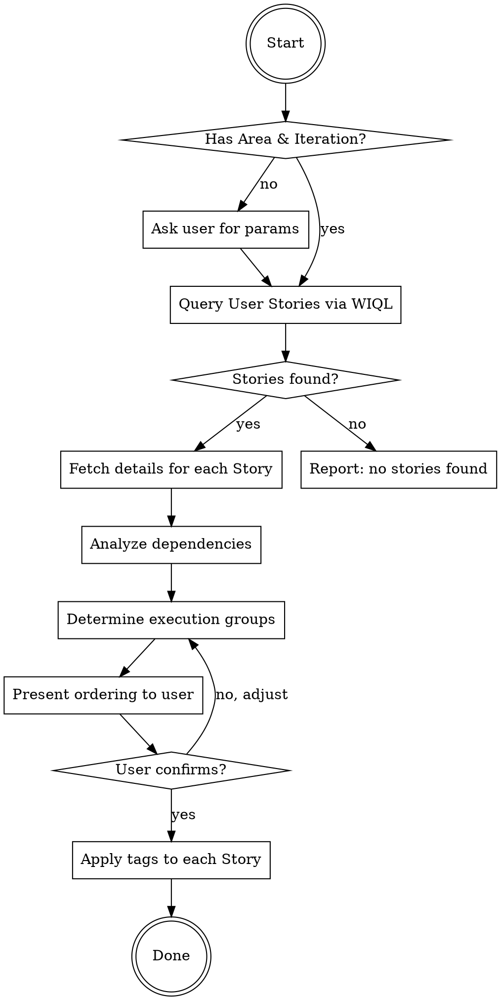

# User Story Execution Order Sorting

Analyze dependencies and parallelization possibilities based on User Story Description, Acceptance Criteria, and Implement Plan content, then determine the optimal execution order and apply corresponding Tags.

## Required Inputs

| Parameter | Description | Example |
|-----------|-------------|---------|
| **Area** | Azure DevOps Area Path | `G11n\OKR` |
| **Iteration** | Azure DevOps Iteration Path | `G11n\Sprint228` |

If not provided by the user, you must proactively ask for them.

## Execution Flow



---

## Step 1 — Query User Stories

Use `query_work_items` with WIQL to query all User Stories under the specified Area + Iteration:

```wiql
SELECT [System.Id], [System.Title], [System.State], [System.Tags]
FROM workitems
WHERE [System.WorkItemType] = 'User Story'
  AND [System.AreaPath] UNDER '{Area}'
  AND [System.IterationPath] = '{Iteration}'
  AND [System.State] <> 'Removed'
  AND [System.State] <> 'Closed'
ORDER BY [Microsoft.VSTS.Common.Priority] ASC
```

If no results are found, report and terminate.

---

## Step 2 — Fetch Detailed Content for Each Story

Use `get_work_item_details` to retrieve the following for each User Story:

| Field | Purpose |
|-------|---------|
| **Description** | Understand feature scope, involved modules, tech stack |
| **Acceptance Criteria** | Identify acceptance prerequisites, cross-Story dependencies |
| **Custom.ImplementPlan** | Identify architectural dependencies (DB Schema, shared Interfaces, API Contracts) |
| **Tags** | Confirm existing Tags to avoid overwriting |

---

## Step 3 — Dependency Analysis

### 3.1 Dependency Signal Identification

Extract the following dependency signals from each Story's content:

| Dependency Type | Signal Keywords |
|-----------------|-----------------|
| **DB Schema Dependency** | Create Table, ALTER TABLE, Entity, Migration |
| **Shared Interface/Contract** | Interface, DTO, Contract, Shared Model |
| **API Consumer** | Calls APIs/Endpoints produced by other Stories |
| **Service Injection** | DI Registration, Inject, depends on a Service |
| **Data Flow Dependency** | Requires data produced by another Story to function |
| **Infrastructure** | Config, Queue, Cache, Event Bus |

### 3.2 Dependency Matrix Construction

Build a producer-consumer matrix between Stories:

```markdown
| Story | Produced Artifacts | Consumed Artifacts | Depends On |
|-------|-------------------|-------------------|------------|
| #ID-A | IOrderService, Order Entity | — | — |
| #ID-B | OrderController | IOrderService | #ID-A |
| #ID-C | PromotionService | Order Entity | #ID-A |
```

### 3.3 Parallelization Assessment (all 4 criteria must pass to mark [P])

1. **File Independence** — No overlapping file paths
2. **Dependency Independence** — Does not consume newly produced contracts from the other
3. **Shared Resource Independence** — Does not modify shared DB Schema, Config, or DI registrations
4. **Independent Testability** — Build and Unit Tests do not require the other's output

---

## Step 4 — Determine Execution Groups

Divide into execution groups based on analysis results:

```markdown
**Group 1 (Foundation layer, executed first):** Story A, Story D
  → Reason: Produces shared Entity / Interface, no upstream dependencies

**Group 2 (Parallelizable, after Group 1 completes):** [P] Story B, [P] Story C
  → Reason: Each consumes Group 1 output, no overlap between them

**Group 3 (Integration layer, after Group 2 completes):** Story E
  → Reason: Integrates output from Story B + C
```

### Ordering Principles (highest to lowest priority)

1. **Infrastructure Layer** — DB Schema, shared Entities, shared Interfaces
2. **Core Business Logic** — Service layer implementation
3. **External Interface Layer** — Controller / API Endpoint
4. **Integration & Verification** — Cross-Story integration, E2E verification

---

## Step 5 — Present Ordering Results (await confirmation)

Present the complete ordering report to the user:

```markdown
## 📊 User Story Execution Order Analysis Report

**Area:** {Area} | **Iteration:** {Iteration}
**Analysis Date:** YYYY-MM-DD | **Total Stories:** N

### Execution Groups

| Order | Group | Story ID | Title | Tag | Reason |
|-------|-------|----------|-------|-----|--------|
| 1 | Group-1 | #12345 | Create Order Entity | `StoryOrder-1` | Foundation DB Schema, no upstream dependencies |
| 2 | Group-2 | #12346 | Implement Order Service | `StoryOrder-2`, `StoryParallel-2` | Consumes Group-1 output, parallel with #12347 |
| 2 | Group-2 | #12347 | Implement Notification Service | `StoryOrder-2`, `StoryParallel-2` | Consumes Group-1 output, parallel with #12346 |
| 3 | Group-3 | #12348 | Create Order API | `StoryOrder-3` | Requires Group-2 Services to be complete |

### Dependency Diagram

{Text description or Mermaid flowchart}

### ⚠️ Risk Warnings
- {List dependencies with concerns or unconfirmed assumptions}

---
**Please confirm if the ordering is correct, or if adjustments are needed.**
```

**Wait for user confirmation before executing Step 6.**

---

## Step 6 — Apply Tags

Use `update_work_item` to add ordering Tags to each Story:

### Tag Naming Convention

| Tag | Purpose | Format |
|-----|---------|--------|
| `StoryOrder-N` | Execution order (N = Group number) | N starts from 1 |
| `StoryParallel-N` | Marks parallelizable Groups | All Stories in the same Group receive this Tag |

### Tag Update Strategy

- **Preserve** existing Tags, only **append** new Tags
- If `StoryOrder-*` or `StoryParallel-*` Tags already exist, remove old ones before applying new ones
- Use the `tags` parameter of `update_work_item` (comma-separated string, including existing + new)

### Report After Update Completion

```markdown
## ✅ Tags Applied Successfully

| Story ID | Title | Applied Tags |
|----------|-------|--------------|
| #12345 | Create Order Entity | `StoryOrder-1` |
| #12346 | Implement Order Service | `StoryOrder-2, StoryParallel-2` |
```

---

## Common Mistakes

| Problem | Solution |
|---------|----------|
| All Stories marked as parallel | Re-examine shared contracts in ImplementPlan |
| Ignoring DB Migration order | Stories with ALTER TABLE must precede consumers |
| Tags overwriting existing labels | Must read existing tags first, merge, then update |
| ImplementPlan is empty | Mark as "insufficient information", judge based on Description + AC only |

---

## Limitations & Notes

- This skill **does not modify** Description, AC, or ImplementPlan content
- Ordering results are expressed solely through Tags
- If a Story's ImplementPlan is empty, make best-effort inference from Description + AC, and indicate lower confidence in the report
- If dependency relationships are unclear, proactively ask the user for confirmation
