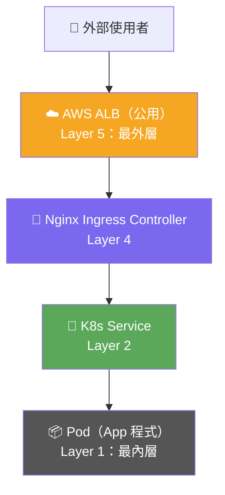
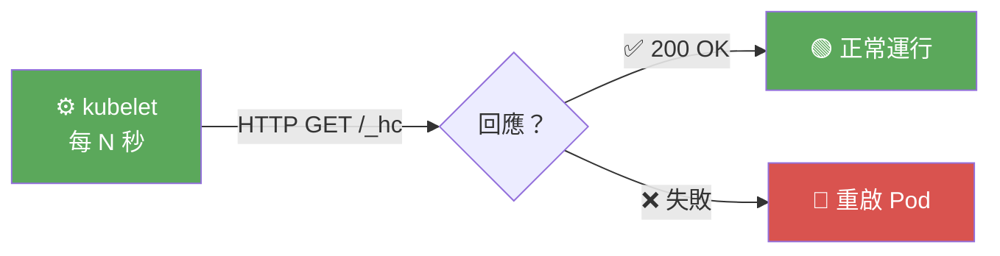
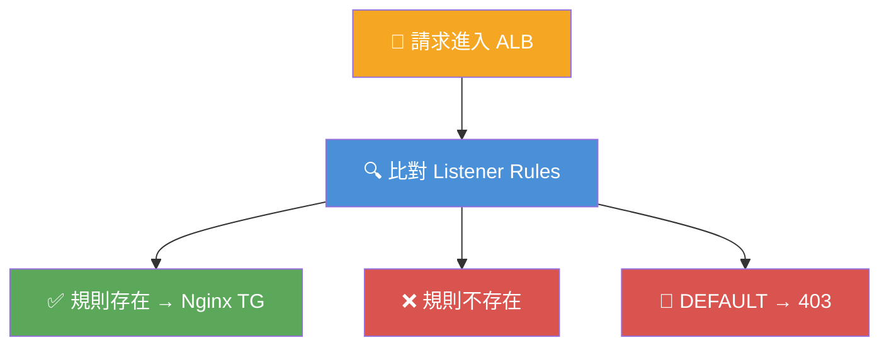
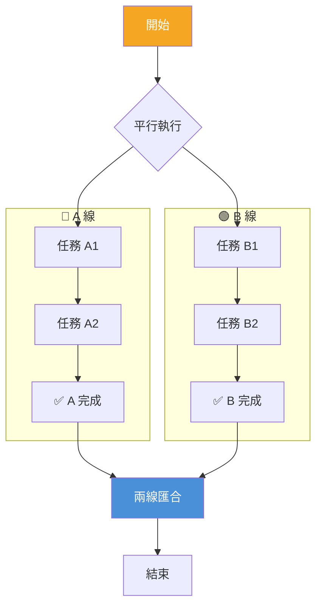
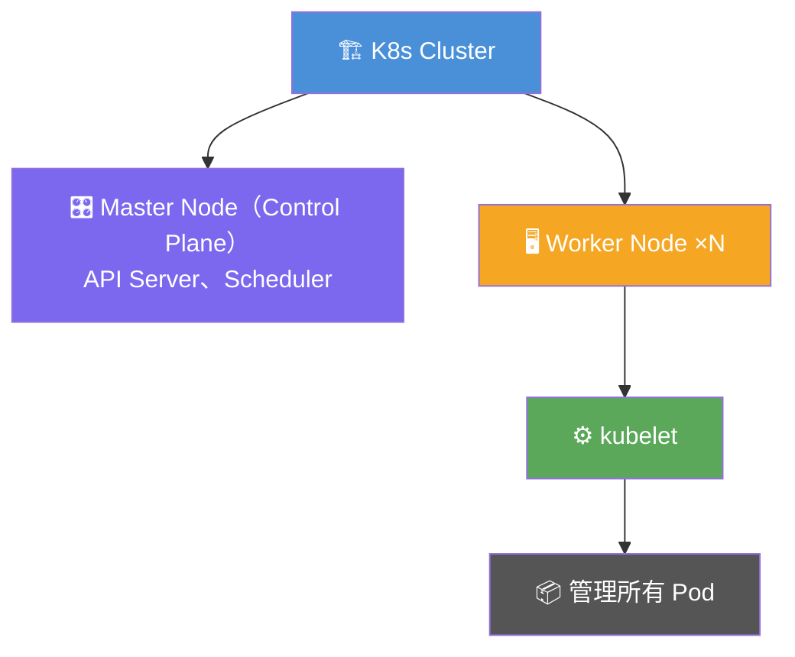
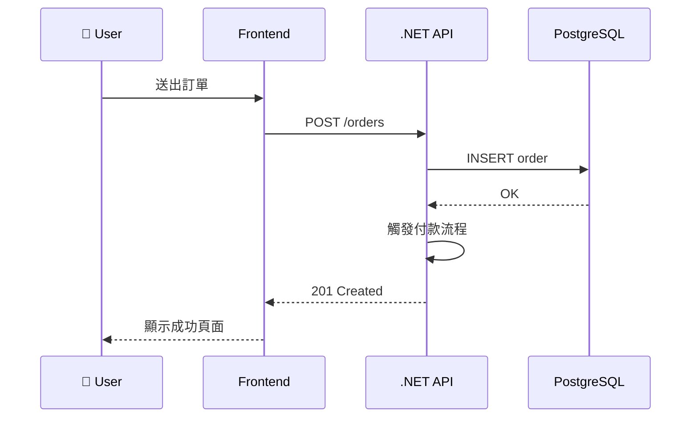
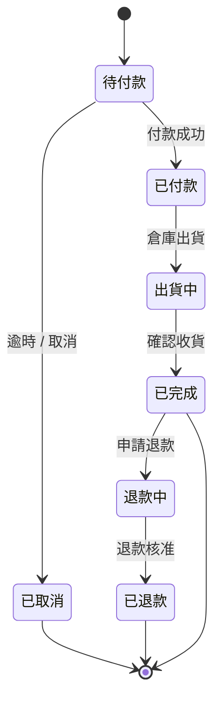

# Mermaid 語法模式與配色範例

## 目錄

1. [flowchart TD — 縱向流程](#flowchart-td--縱向流程)
2. [flowchart LR — 時序觸發](#flowchart-lr--時序觸發)
3. [flowchart 含決策分支](#flowchart-含決策分支)
4. [flowchart 含 subgraph（平行流程）](#flowchart-含-subgraph平行流程)
5. [graph TD — 樹狀從屬](#graph-td--樹狀從屬)
6. [sequenceDiagram — 時序圖](#sequencediagram--時序圖)
7. [stateDiagram-v2 — 狀態機](#statediagram-v2--狀態機)
8. [語意配色快速參照](#語意配色快速參照)
9. [常見錯誤與修正](#常見錯誤與修正)

---

## flowchart TD — 縱向流程

**使用時機：** 層次結構、外到內、上游到下游、請求進入系統的路徑



**重點語法：**
- 節點：`ID["顯示文字"]`
- 多行文字：`ID["第一行\n第二行"]`
- 箭頭鏈：`A --> B --> C`
- 帶標籤箭頭：`A -->|"標籤"| B`

---

## flowchart LR — 時序觸發

**使用時機：** 觸發→判斷→結果的時序，Probe 流程，輸入到輸出



**重點語法：**
- 菱形節點（判斷）：`ID{問題？}`
- 條件分支：`HC -->|"✅ 成功"| OK`

---

## flowchart 含決策分支

**使用時機：** 多條件路徑、if-else 邏輯、排查樹



---

## flowchart 含 subgraph（平行流程）

**使用時機：** CI/CD 的 A 線/B 線、Blue-Green 部署、並行任務



**重點語法：**
```
subgraph 名稱["顯示標題"]
    direction TB
    節點...
end
```

---

## graph TD — 樹狀從屬

**使用時機：** 組織結構、系統組件從屬、K8s 架構層次

> 用 `graph` 而非 `flowchart`：`graph` 強調從屬關係，`flowchart` 強調流程



---

## sequenceDiagram — 時序圖

**使用時機：** API 鏈路、跨服務呼叫、非同步流程



**重點語法：**
- 宣告參與者：`participant ID as 顯示名稱`
- 實線呼叫：`A->>B: 訊息`
- 虛線回應：`A-->>B: 訊息`
- 自呼叫：`A->>A: 內部處理`

---

## stateDiagram-v2 — 狀態機

**使用時機：** 訂單生命週期、部署狀態、連線狀態



**重點語法：**
- 初始狀態：`[*] --> 狀態名`
- 轉換：`狀態A --> 狀態B : 事件/條件`
- 終止：`狀態 --> [*]`

---

## 語意配色快速參照

```
起點 / 觸發 / 外部輸入    → fill:#F5A623,color:#fff  (橘)
中介 / 控制 / 管理層      → fill:#7B68EE,color:#fff  (紫)
設定 / 規則 / 決策樞紐    → fill:#4A90D9,color:#fff  (藍)
成功 / 目的地 / 正常狀態  → fill:#5BA85B,color:#fff  (綠)
失敗 / 危險 / 異常        → fill:#D9534F,color:#fff  (紅)
底層執行 / 最終層         → fill:#555555,color:#fff  (灰)
```

**套色方式（在 mermaid 區塊末尾統一加）：**
```
style 節點ID fill:#F5A623,color:#fff
```

---

## 常見錯誤與修正

| 錯誤 | 症狀 | 修正方式 |
|:---|:---|:---|
| 流程圖放進 `bash` 代碼塊 | 顯示等寬字、深色背景，無法渲染 | 改用 ` ```mermaid ` |
| 節點 ID 含空格或特殊字元 | 渲染失敗 | 改用英文 ID，顯示文字放 `["..."]` |
| 節點文字太長不換行 | 節點框過寬，圖形變形 | 用 `\n` 在節點文字中換行 |
| 過多節點在同一張圖 | 圖形雜亂、線條交叉 | 拆成多張圖，每張只回答一個問題 |
| `flowchart` 用來畫從屬關係 | 語意不清（graph 才是從屬） | 改用 `graph TD` |
| 所有節點同一顏色 | 顏色沒有傳遞語意 | 依角色套用語意配色系統 |
