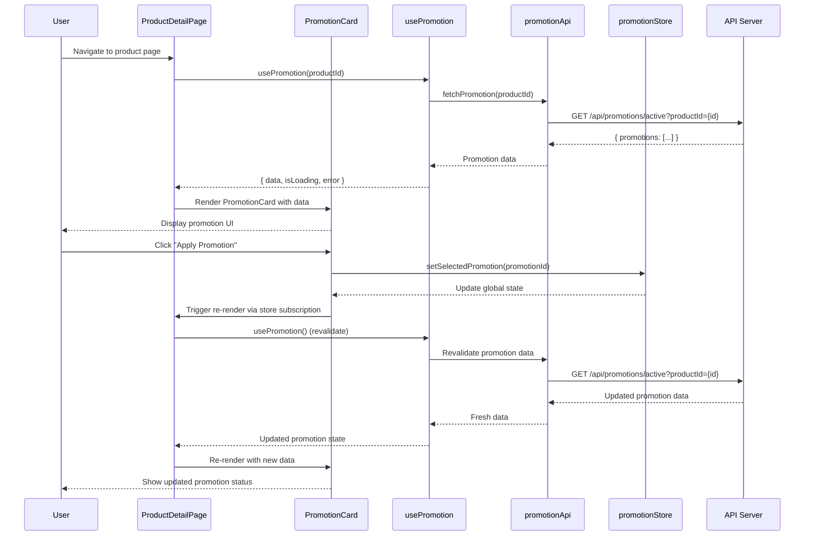
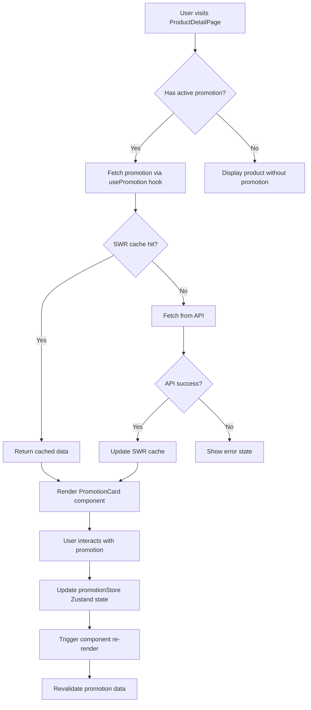

## Preconditions

- `f2e-designing-core-architecture` must be complete (`implement-plan.md` must exist)
- F2E Clarifications must be complete (all uncertain items resolved)
- Work Item Description and Acceptance Criteria must be accessible

## Workflow Steps

#### 1 🔐 Critical Cross-Cutting Concerns

Focus on **most relevant aspects** for this frontend feature:

##### 🔒 Security
- **XSS (Cross-Site Scripting) Risk**: User-generated promotion content displayed without sanitization
- **Mitigation Strategies**:
  - Sanitize all promotion data from API using DOMPurify or React's built-in escaping
  - Use `dangerouslySetInnerHTML` only when absolutely necessary and with strict sanitization
  - Implement Content Security Policy (CSP) headers
  - Validate and escape all user inputs before rendering

- **CSRF (Cross-Site Request Forgery) Risk**: Unauthorized promotion actions
- **Mitigation Strategies**:
  - Ensure API endpoints require CSRF tokens for state-changing operations
  - Use SameSite cookie attributes for authentication cookies
  - Implement proper CORS policies on backend

##### ⚡ Performance
- **Rendering Performance**:
  - **Potential Bottleneck**: Re-rendering large product lists when promotion data updates
  - **Optimization Strategy**:
    - Use `React.memo()` for `PromotionCard` component to prevent unnecessary re-renders
    - Implement virtual scrolling for product lists with 50+ items
    - Use `useMemo` for expensive promotion calculations (discount calculations)
    - Lazy load promotion images using `loading="lazy"` attribute

- **Bundle Size Impact**:
  - **Analysis**: New components and hooks may increase bundle size
  - **Optimization Strategy**:
    - Code split promotion-related components using React.lazy() and Suspense
    - Tree-shake unused promotion utilities
    - Monitor bundle size increase (target: <10KB gzipped for promotion feature)

- **Core Web Vitals Considerations**:
  - **LCP (Largest Contentful Paint)**: Optimize promotion image loading (use WebP format, proper sizing)
  - **FID (First Input Delay)**: Ensure promotion interactions are not blocked by heavy JavaScript
  - **CLS (Cumulative Layout Shift)**: Reserve space for promotion badges to prevent layout shifts

- **Data Fetching Performance**:
  - Use SWR's built-in caching to reduce redundant API calls
  - Implement request deduplication for concurrent promotion queries
  - Consider stale-while-revalidate strategy (SWR default) for better perceived performance

##### 🛠️ Maintainability
- **Code Quality**:
  - **ESLint Compliance**: Ensure all new code passes ESLint rules (extend existing config)
  - **TypeScript Strictness**: Use strict mode, avoid `any` types, define proper interfaces
  - **Test Coverage**: Target 80%+ coverage for promotion components and hooks
    - Unit tests: Component rendering, hook logic, utility functions
    - Integration tests: User interactions, API integration, error handling

- **Component Architecture**:
  - Follow Single Responsibility Principle (SRP) - separate presentational and container components
  - Avoid prop drilling - use Zustand store or Context API for shared state
  - Document component props and hook return types with JSDoc comments

- **Refactoring Considerations**:
  - Identify components with excessive logic (mixing view, state, and business logic)
  - Flag components with too many props (consider composition or state management)
  - Note tightly coupled components for future decoupling

##### 📈 Scalability
- **State Management Scalability**:
  - Current approach (SWR + Zustand) supports feature growth
  - Consider splitting Zustand store if promotion state becomes complex
  - Evaluate need for Redux if state management requirements grow significantly

- **Component Scalability**:
  - Design `PromotionCard` to be flexible for future promotion types
  - Use composition pattern for extensible promotion displays
  - Plan for internationalization (i18n) if multi-language support needed

##### 👁️ Observability
- **Monitoring & Logging**:
  - Log promotion API errors with context (productId, promotionId, error type)
  - Track promotion display metrics (impressions, clicks, conversion)
  - Monitor SWR cache hit rates for promotion data
  - Set up error tracking (e.g., Sentry) for promotion-related errors

- **Debugging Support**:
  - Add React DevTools support for Zustand store inspection
  - Include development-only logging for promotion state changes
  - Provide clear error messages for promotion-related failures

##### 💻 Technical Debt Assessment
- **Code Quality Analysis**: 
  - ESLint errors: Review existing patterns, ensure consistency
  - TypeScript strictness: Maintain type safety, avoid type assertions
  - Test coverage gaps: Identify untested edge cases (error states, loading states)

- **Performance Debt**:
  - Large components: Monitor component size, split if >300 lines
  - Unnecessary re-renders: Use React DevTools Profiler to identify bottlenecks
  - Memory leaks: Ensure proper cleanup in useEffect hooks, unsubscribe from SWR subscriptions

- **Legacy Dependencies**:
  - Check for outdated React/TypeScript versions
  - Review deprecated APIs (e.g., componentWillMount, legacy React Router)
  - Security vulnerabilities: Audit dependencies with npm audit

**Note**: Other concerns (Accessibility, SEO) should be addressed but are assessed as standard requirements - ensure WCAG 2.1 AA compliance and proper semantic HTML.

---

#### 2 📊 Visual Representation (Conditional Execution)

**Execution Trigger:**
```
IF (user flow involves 3+ React components) 
   OR (contains complex state management logic) 
   OR (requires component interaction diagram)
   OR (has complex data fetching flow):
  → Generate Mermaid diagram (sequence/flowchart/component diagram)
ELSE:
  → Skip diagram generation
  → Add note: "Simple component - visual diagram not required"
```

**Diagram Type Selection:**
- Use **Sequence Diagram** for: Component interactions, API calls, hook data flow, user interactions
- Use **Flowchart** for: Conditional rendering logic, form validation flows, state transitions
- Use **Component Diagram** for: Component hierarchy, props flow, composition structure

**Example Complex Frontend Flow:**


**Example Component Interaction Flow:**


---

#### 3 📝 Architecture Decisions (Optional - Nice to Have)

**Purpose**: Document key architectural decisions made during RD and AI discussion.

**Note**: This section is **optional** and serves as a reference for discussions between developers and AI. If architectural decisions were explicitly discussed during clarification or design phases, document them here. Otherwise, this section can be left empty or omitted.
```markdown
| # | Decision | Selected Approach | Key Rationale |
|----|----------|------------------|----------------|
| 1 | State Management | SWR (server state) + Zustand (client state) | SWR handles API caching/revalidation automatically; Zustand provides lightweight global state without Redux complexity |
| 2 | Component Architecture | Presentational + Container pattern | Separation of concerns; PromotionCard is pure UI, ProductDetailPage handles data orchestration |
| 3 | Data Fetching Strategy | SWR hooks with automatic revalidation | Reduces boilerplate, handles caching/error states, supports optimistic updates |
| 4 | Component Reusability | Extend existing ProductCard vs. new component | Maintains consistency, reduces bundle size, leverages existing design system |
| 5 | Type Safety | Strict TypeScript interfaces for all API contracts | Prevents runtime errors, improves developer experience, enables better IDE support |
```

**Usage Guidelines:**
- Only populate if specific architectural choices were debated and decided
- Focus on decisions that have significant impact on implementation (e.g., state management choice, component architecture pattern)
- Include trade-offs analysis: why this approach over alternatives
- This is NOT a required deliverable - prioritize completing Sections 1-2

---

## Hard Constraints

- **Mermaid conditionally triggered**: The IF/ELSE rules in Section 2 must be followed; simple components must not be forced to generate diagrams
- **Architecture Decisions is optional**: Section 3 is optional and must not be force-filled
- **Cross-cutting focused**: Only describe the most relevant aspects for this feature; do not inject generic descriptions unrelated to the use case
- **No code implementation**: Only perform architectural design and risk assessment; must not produce actual implementation code

## Good/Bad Examples

**✅ Good — Mermaid condition evaluated correctly**
```
Component count < 3, no complex state management
→ Skip Mermaid diagram
→ Add note: "Simple component - visual diagram not required"
```

**❌ Bad — Adding Mermaid to every feature regardless of complexity**
```
Regardless of complexity, generate both a sequence diagram and a flowchart for everything
```
(Too many diagrams reduce readability; diagrams should reflect actual complexity)

## Quality Checklist

- [ ] Section 1 describes the most relevant Cross-cutting Concerns for this feature
- [ ] Section 1 includes a Security assessment (XSS / CSRF risks)
- [ ] Section 1 includes a Performance assessment (Core Web Vitals, bundle size)
- [ ] Section 2 Mermaid diagram has been handled conditionally (generated or skipped)
- [ ] Section 3: if architectural decisions were discussed, results are recorded; otherwise left empty or omitted
- [ ] No implementation code produced; architectural design only