# 圖表範例

以下全部是為說明選圖與語法而設計的假設案例，不是 91APP 的實際系統。使用時先按 [選圖規範](diagram-selection.md) 核對來源、名稱與分支，再放入文章既有 tabs。範例不限定配色，沿用文章已定調的風格。

## 系統情境：誰使用系統？

核心系統不展開內部類別，箭頭說明互動目的。

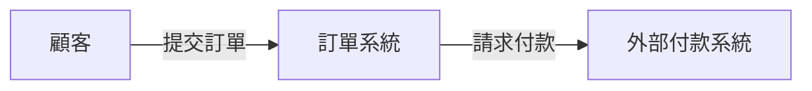

## Container 視圖：系統由哪些應用與儲存組成？

假設前端、API、Worker 與資料庫是已確認的應用程式／資料儲存。這是以 flowchart 表達的 Container 視圖，並非 Docker 拓撲。

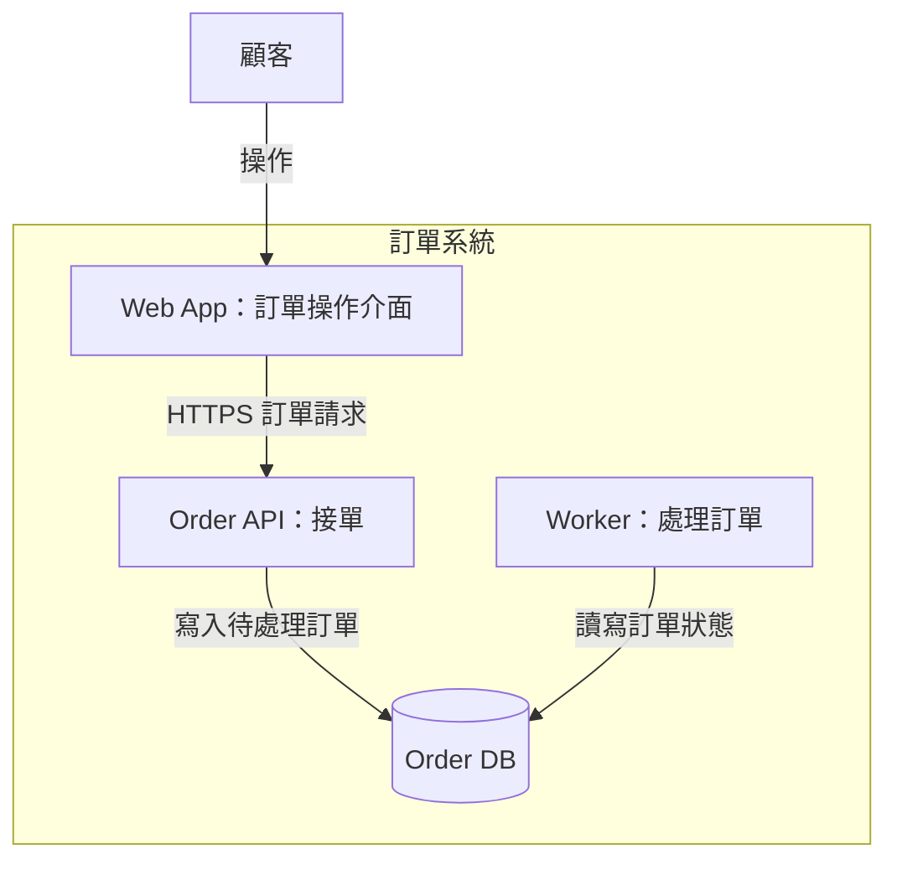

## Component 視圖：放大單一應用程式

只展示 Order API 內部元件，不將 Controller 說成獨立部署單位。

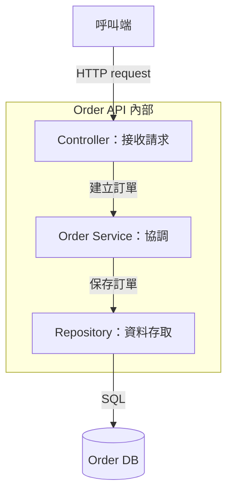

## Sequence：同步請求與互斥結果

此假設 API 的規格已明確定義兩種回傳。`alt` 兩邊擇一，activation 在分支結束後統一關閉。

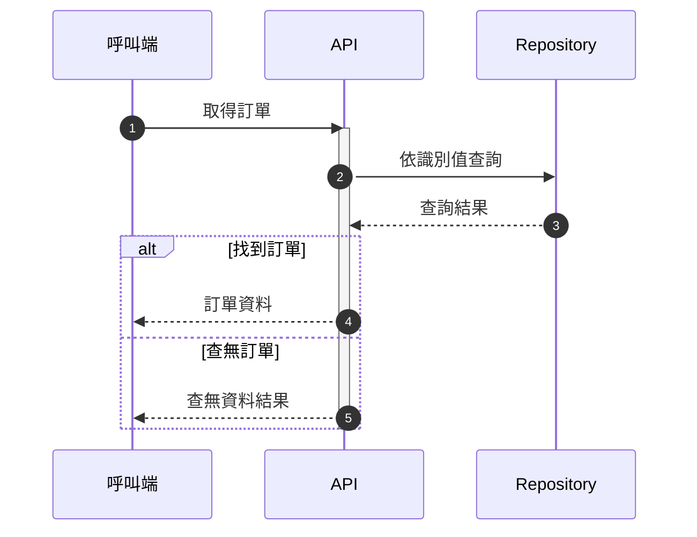

## Sequence：非同步事件與接收確認

假設是推送式交付。入列確認與稍後的業務結果分開；未提供 ACK 規格時不額外畫消費確認。

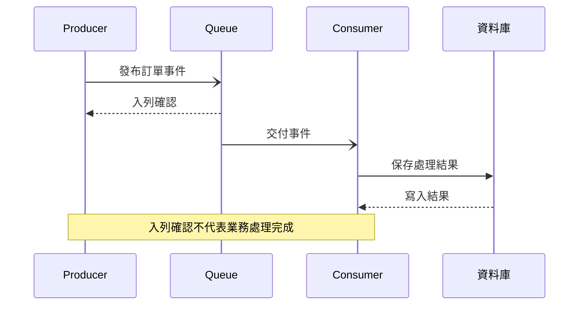

## Sequence：重試與逾時

假設 Client 會在仍未成功且未達設定上限時重試。逾時由 Client 察覺，不捏造遠端失敗回傳；成功後不再滿足 loop 條件。

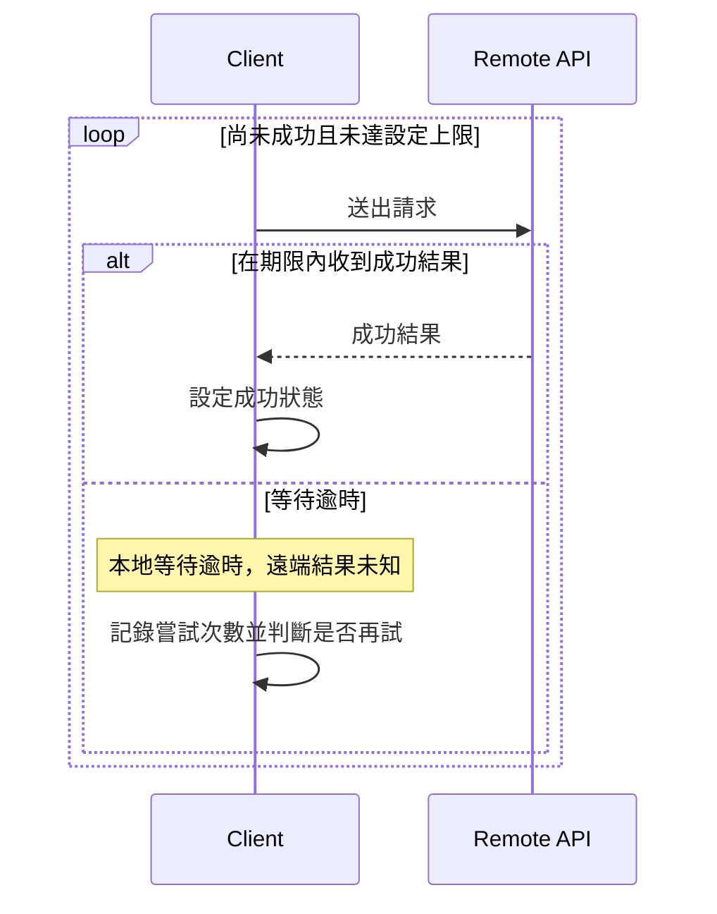

## Sequence：平行、可選動作與中止

只有來源證明兩項檢查並行時才用 `par`。拒絕時 `break` 中止後續保存；通知為可選步驟。

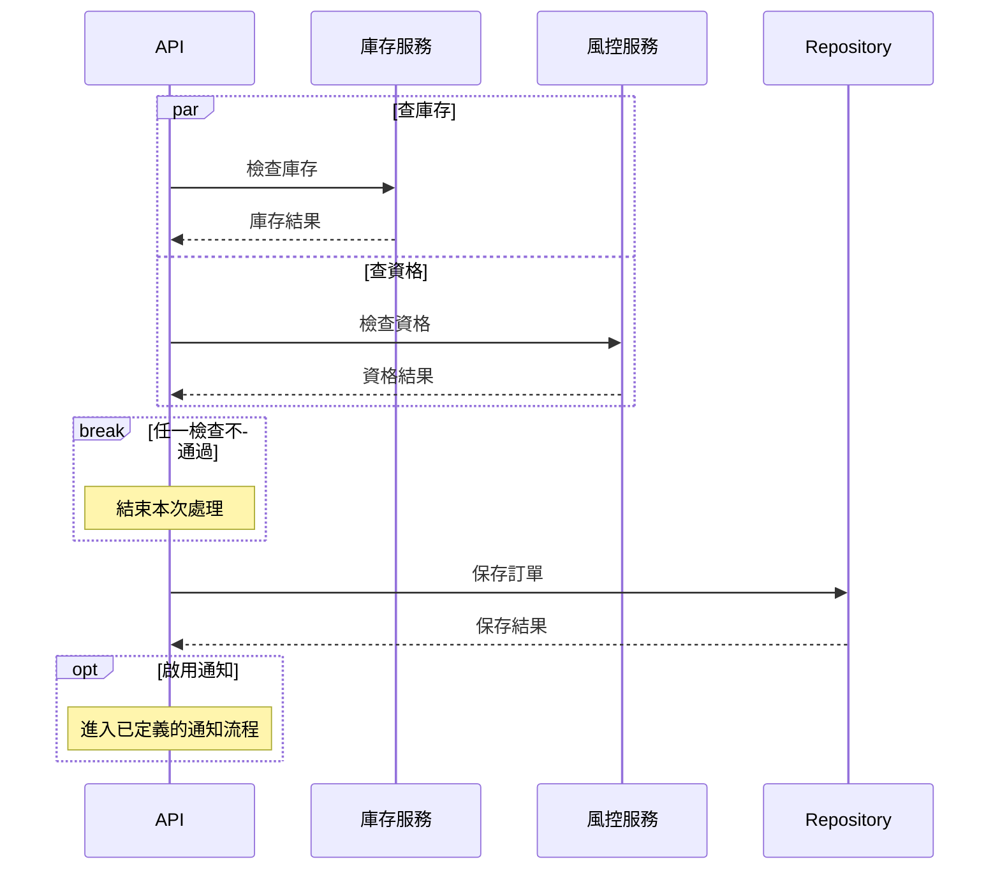

## Flowchart：快取決策

HIT 直接匯入使用資料，MISS 才查來源；不畫成命中後又未命中的串行步驟。

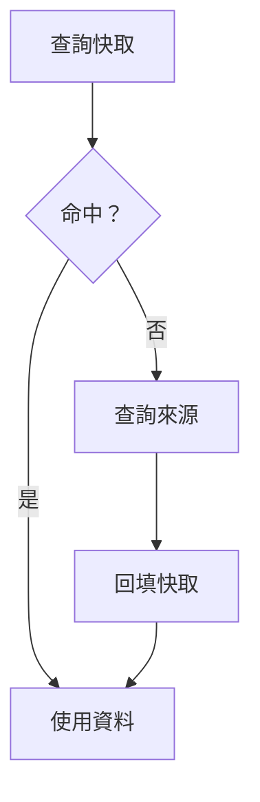

## 泳道式示意：跨責任建置交接

subgraph 是責任分區，不宣稱是 BPMN。箭頭上的交付物讓跨責任交接可以追蹤；實際排列仍需瀏覽器檢查。

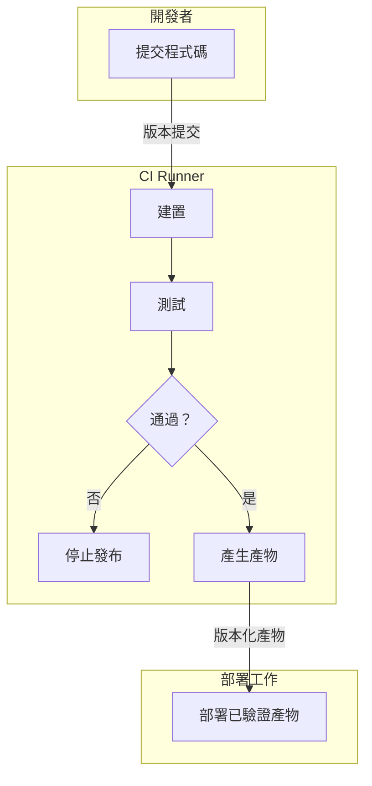

## 資料流：來源、轉換與儲存

箭頭表示資料移動，並不宣稱同步執行順序。

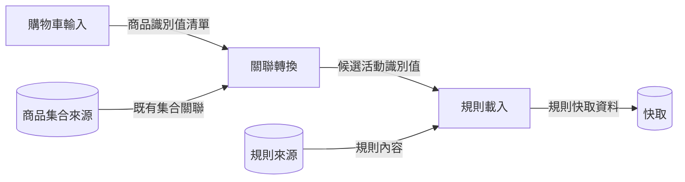

## State Diagram：任務生命週期

假設規格允許 Failed 重試，Succeeded 才是此模型的終止狀態。

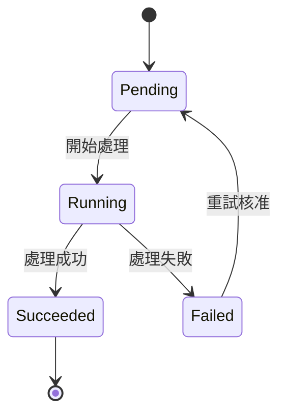

## ERD：關聯與基數

假設每個 Order 必屬一個 Customer，而 Customer 可以尚未有 Order。這裡明確畫實體 FK；無約束證據時不能照抄。

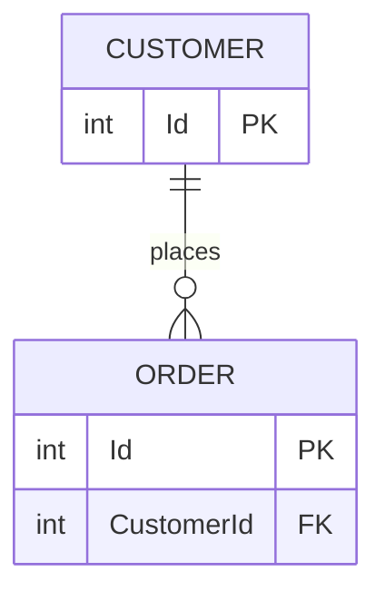

## Class Diagram：介面與實作

此圖只說明型別實作與依賴，不表示資料儲存關聯。

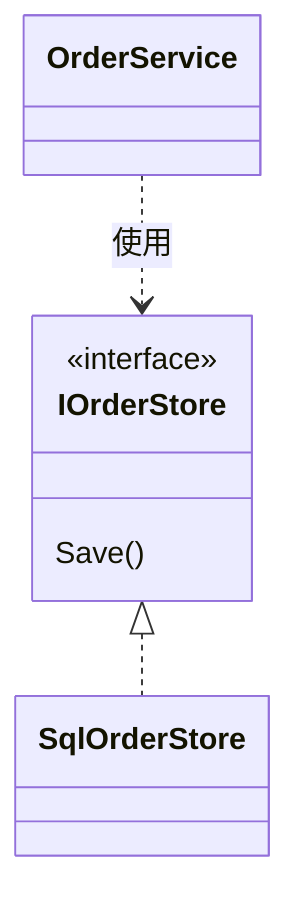

## Deployment：特定環境的執行位置

假設 QA 確實只有一個已知 API instance 與一個資料庫服務。副本數未知時不自行補成多台。

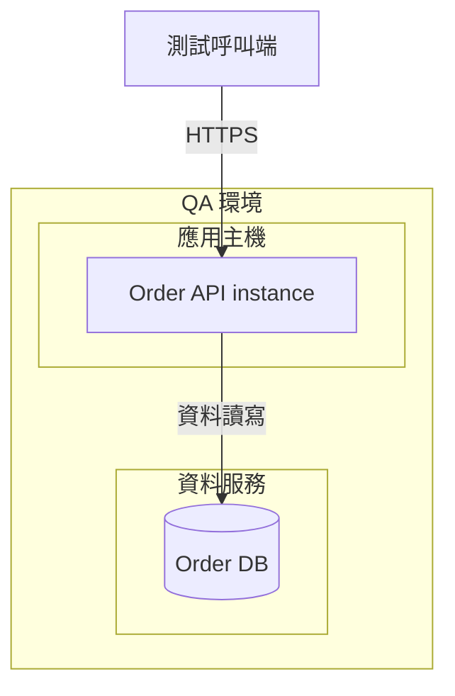

## 事件時間表與環境矩陣

這兩種內容不必硬轉成 Mermaid。以下為假設記錄；使用時替換成已驗證資料。

| 時間（Asia/Taipei） | 觀察事件 | 證據 |
| --- | --- | --- |
| 10:00 | 首次偵測錯誤 | 告警記錄 |
| 10:03 | 任務進入重試 | Worker log |

時間先後不代表兩件事必然互為因果。

| 比較面向 | QA | Production |
| --- | --- | --- |
| 部署環境 | 測試 | 正式 |
| 副本數 | 待查設定 | 待查設定 |
| 發布條件 | 待查 pipeline | 待查 pipeline |

矩陣各環境使用同一組欄位；未知就標待查，不以常見配置填入數字。
