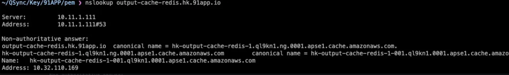
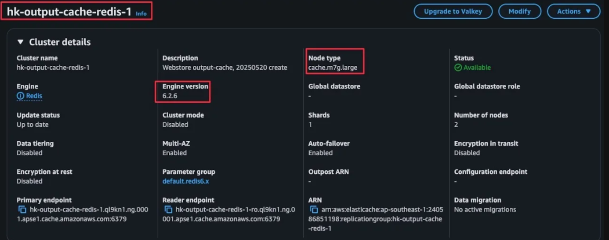

# AWS ElasticCache 操作指南

## 目錄
- [查詢 Domain](#查詢-domain)
- [AWS Console 資訊](#aws-console-資訊)
- [Client 連線](#client-連線)
- [CLI 連線](#cli-連線)

<br><br>

---

## 查詢 Domain

☘️ **查 domain**

<br>

指令 `nslookup output-cache-redis.hk.91app.io`

<br>

**查詢成功時**：

<br>

✅ 有回應對應的私有 IP（10.32.110.169）

<br>

✅ 從 .cache.amazonaws.com 可看出是 AWS 託管的 Redis 實例

<br>

✅ 因為你能查出 AWS 私有網域的解析紀錄，代表你目前處於 EC2 或 VPN 內網

<br>

- Non-authoritative answer 是正常的，表示這不是原始 DNS zone 回應，而是透過快取或轉送得來的結果。
- Aliases 表示有經過多層 CNAME 指向。

<br>



<br><br>

---

## AWS Console 資訊



<br>

| 項目 | 說明 |
|------|------|
| Cluster name | hk-output-cache-redis-1，是你這個 Redis Cluster 的名稱 |
| Description | 備註說明：Webstore output-cache, 20250520 create，表示用途是 output cache，建立於 2025/05/20 |

<br>

🔹 **核心設定**

<br>

| 項目 | 說明 |
|------|------|
| Engine | 使用 Redis 引擎 |
| Engine version | 6.2.6，是 Redis 的版本 |
| Node type | cache.m7g.large，是 AWS ElastiCache 的實例型別，代表每個節點使用 ARM 架構的中型機種（Graviton） |
| Number of nodes | 2，代表這個叢集有兩個節點（主 + 備） |
| Multi-AZ | Enabled，代表主從節點分布在不同可用區（Availability Zone）以確保高可用性 |
| Auto-failover | Enabled，代表當主節點掛掉時，備援節點會自動接手 |
| Shards | 1，表示是單一資料分片（沒做水平切分） |

<br>

🔹 **安全性與資料管理**

<br>

| 項目 | 說明 |
|------|------|
| Encryption at rest | Disabled，靜態加密沒開（資料儲存在磁碟上不加密） |
| Encryption in transit | Disabled，傳輸加密也沒開（Redis Client 與 Server 之間是明文連線） |
| Parameter group | default.redis6.x，使用預設參數群組，未做自定義優化 |
| Data tiering | Disabled，未使用分層儲存（通常是 R6gd 節點支援） |
| Cluster mode | Disabled，未開啟 cluster 分片模式（所以是非 cluster 模式） |

<br>

🔹 **連線資訊**

<br>

| 項目 | 說明 |
|------|------|
| Primary endpoint | hk-output-cache-redis-1.ql9kn1...cache.amazonaws.com:6379，主節點連線位置與 port（6379 是 Redis 預設 port） |
| Reader endpoint | 提供讀取流量使用（只讀節點），可做讀寫分離 |

<br>

🔹 **狀態與管理**

<br>

| 項目 | 說明 |
|------|------|
| Status | Available，表示目前運作正常 |
| Data migration | No active migrations，目前沒有進行資料遷移 |

<br><br>

---

## Client 連線

指令 > `client list`

<br>


<br>

**Redis 連線欄位說明**

以下是 Redis client 連線的各項欄位說明，常用於診斷、監控與管理 Redis 連線狀況：

<br>

🔹 **id=801**

說明：此連線的 Redis client ID

<br>

用途：唯一標識一個連線，可用於追蹤或強制斷線（CLIENT KILL ID）

<br>

🔹 **addr=10.1.11.60:57475**

說明：來源 client 的 IP 和 port

<br>

用途：代表這台主機是主動連 Redis 的 client 端（即誰發起連線）

<br>

🔹 **laddr=10.1.110.130:6379**

說明：Redis 實例的 IP 和 port

<br>

用途：代表 Redis 所在主機的接收端，這是 Redis 所監聽的地址與埠

<br>

🔹 **fd=21**

說明：檔案描述器（file descriptor）

<br>

用途：對應到系統層級的連線編號，可用於低層級除錯

<br>

🔹 **name=SG-MY-MWEB1**

說明：使用者自訂的連線名稱

<br>

用途：透過 CLIENT SETNAME 設定，方便辨識連線用途或來源服務 ✔️

<br>

🔹 **age、idle、flags**

說明：

- age：連線存活時間（秒）
- idle：連線閒置時間（秒）
- flags：連線屬性標誌（如 N=normal、x=可被關閉 等）

<br>

用途：協助判斷連線是否異常或閒置過久，常用於連線管理與除錯

<br>

🔹 **cmd**

說明：此 client 最近一次執行的 Redis 命令

<br>

用途：觀察正在執行的操作，如 subscribe、ping、client 等，可判斷是否為長連線或繁忙指令

<br><br>

---

## CLI 連線

```bash
redis-cli -h <your-redis-endpoint> -p 6379
```


