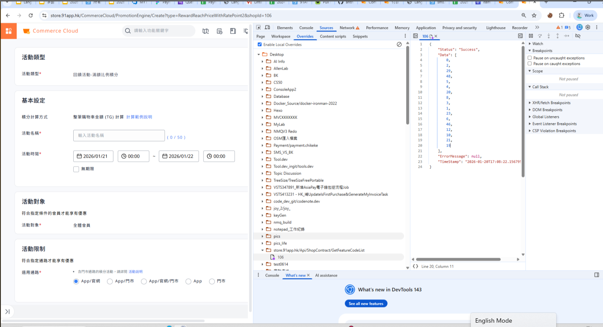

## copy request
request as fetch 對 api copy 貼在 console


## 看記住密碼的密碼

三個點
auto fill


## 建立shortcut


三個點 ==> setting => search engine => add site


http://ci-master.91dev.tw:8080/job/91app/job/%s/


##　devtools

#### 利用 overrides 來實驗不同 response 對前端的影響




## 直接在瀏覽器測試打 api

```javascript
fetch("https://sms.qa1.hk.91dev.tw/Api/RolePermission/GetRolePermission", {
  method: "GET",
  credentials: "include",
})
  .then(async r => ({
    status: r.status,
    ok: r.ok,
    text: await r.text(),
    // 只抓部分 header 看 CORS 是否正確
    allowOrigin: r.headers.get("access-control-allow-origin"),
    allowCred: r.headers.get("access-control-allow-credentials"),
  }))
  .then(console.log)
  .catch(console.error);
```