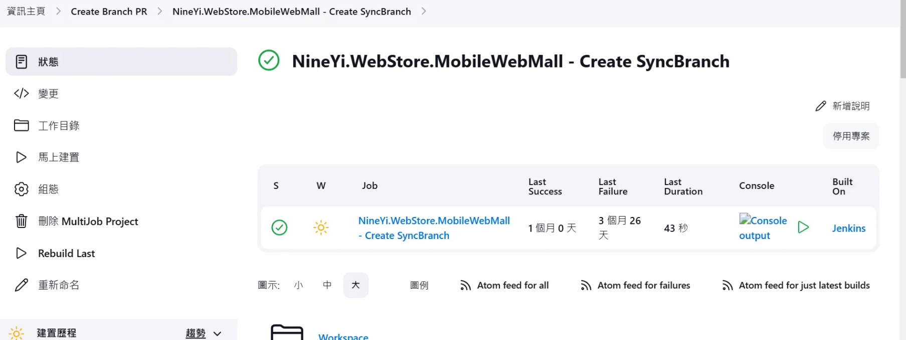

# 🚀 CI/CD 維護文件

<br>

## 📖 目錄

  - [🍰 Cake 建構自動化工具](#-cake-建構自動化工具)
  - [🔍 部署確認方法](#-部署確認方法)
  - [🔗 Jenkins CI 網址](#-jenkins-ci-網址)
  - [☁️ AWS 機器確認方法](#️-aws-機器確認方法)
  - [⚙️ Ops API 操作工具](#️-ops-api-操作工具)
  - [🔧 自動 SyncCode 故障排除](#-自動-synccode-故障排除)
  - [❌ 部署失敗案例紀錄](#-部署失敗案例紀錄)

<br>

---

## 🍰 Cake 建構自動化工具

Cake（全名：C# Make）是一套用 C# 語法撰寫的 Build 自動化工具。

<br>

類似於其他工具像：MSBuild、Make、Grunt、Gulp、Bash script。

<br>

但最大特點是：Cake 是用 C# 寫的！

<br>

所以如果你是 .NET/C# 開發者，你可以用你熟悉的語法撰寫自動化腳本。

<br>

### 使用情境

比方說你每天都要做的事情有：

- 清除舊的 Build 檔案
- 重新編譯專案
- 執行測試
- 發佈到某個資料夾

<br>

你可以用 Cake 寫一個簡單的「Build.cake」腳本，像這樣：

```csharp
// 1. 定義任務
Task("Clean")
    .Does(() =>
{
    CleanDirectory("bin");
    CleanDirectory("obj");
});

Task("Build")
    .IsDependentOn("Clean")  // Build 前要先 Clean
    .Does(() =>
{
    MSBuild("./MyProject.sln");
});

Task("Test")
    .IsDependentOn("Build")
    .Does(() =>
{
    XUnit2("./**/bin/**/*.Tests.dll");
});

Task("Deploy")
    .IsDependentOn("Test")
    .Does(() =>
{
    CopyFiles("./bin/Release/**", "C:/DeployFolder/");
});

// 2. 執行最終任務
RunTarget("Deploy");
```

<br>

按順序執行 Clean → Build → Test → Deploy

<br>

每一個步驟都是自動的，不需要你手動一個個操作

<br>

### 主要優勢

| 優勢 | 說明 |
|------|------|
| ✅ 用 C# 語法撰寫 | 不需要學新的 DSL 語言 |
| ✅ 跨平台 | Windows / Linux / macOS 都能用 |
| ✅ 模組化、可擴充 | 有超多內建套件可以用 |
| ✅ CI/CD 友好 | 很容易整合進 GitHub Actions、Azure DevOps、Jenkins 等工具 |

<br>

---

## 🔍 部署確認方法

### 如何確認哪一台部署哪個 branch

**方法 1：從機台內部查看 branch**

<br>

buildtag 會有 branch name

<br>

**方法 2：使用 servermaps**

<br>

config 可以看到 serverMaps

<br>

---

## 🔗 Jenkins CI 網址

### 一般站台部署

```
http://ci-master.91dev.tw:8080/
```

<br>

---

## ☁️ AWS 機器確認方法

### 如何確認機器是屬於藍綠群

**位置**：Instances --> tags

<br>

---

## ⚙️ Ops API 操作工具

用以操作 EC2 機台開關機：

<br>

**HK**：
```
https://ci.my.91app.io/view/AutoReleaseUnit/job/HK%20Ops%20API/
```

<br>

**MY**：
```
https://ci.my.91app.io/view/AutoReleaseUnit/job/MY%20Ops%20API/
```

<br>

---

## 🔧 自動 SyncCode 故障排除

### 如果自動 SyncCode 沒有正常運行做法

**步驟 1**：到 Jenkins 頁面確認是否 enable


<br>

---

## ❌ 部署失敗案例紀錄

### 案例 1：機器已關機

**異常訊息**：

<br>

```
10:09:44  Connecting to remote server SG-QA1-MWeb failed with the following error message : WinRM cannot complete the operation. 
10:09:44  
10:09:44  Verify that the specified computer name is valid, that the computer is accessible over the network, and that a 
10:09:44  
10:09:44  firewall exception for the WinRM service is enabled and allows access from this computer. By default, the WinRM 
10:09:44  
10:09:44  firewall exception for public profiles limits access to remote computers within the same local subnet. For more 
10:09:44  
10:09:44  information, see the about_Remote_Troubleshooting Help topic.
```

<br>

**解決方法**：

<br>

去 EC2 重開機，可以查看 Config ==> serverMaps.json

<br>
