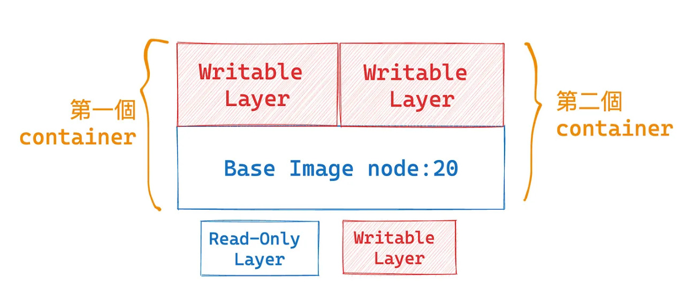
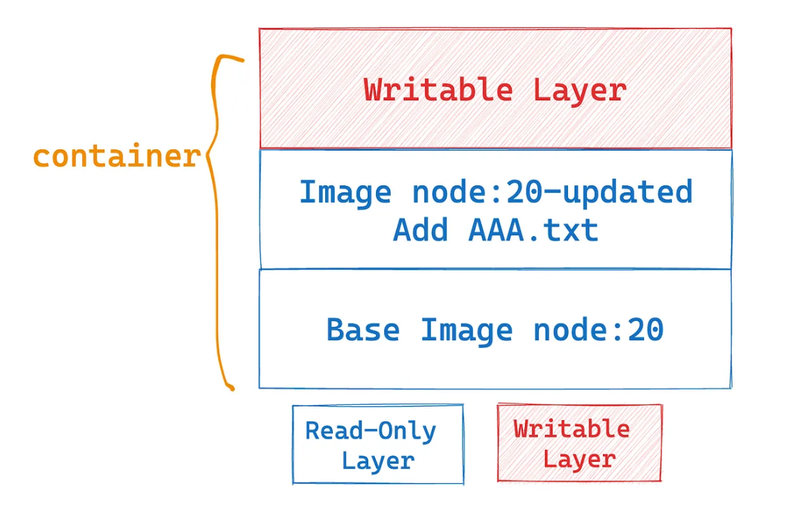
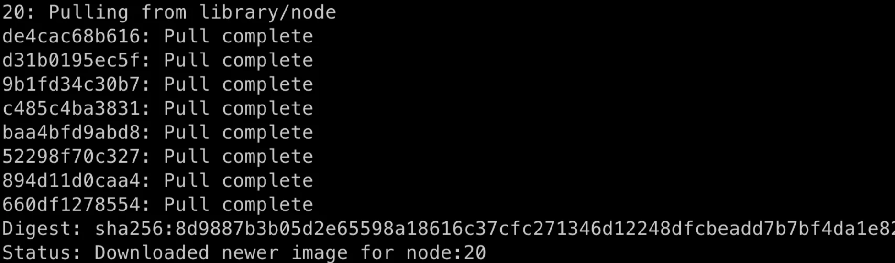
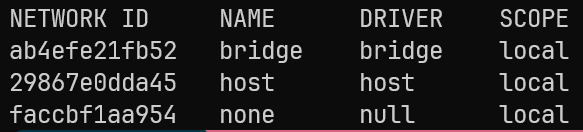
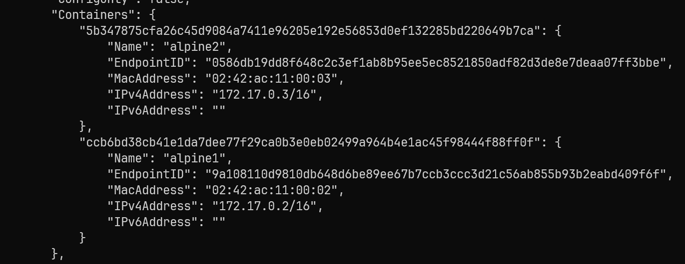
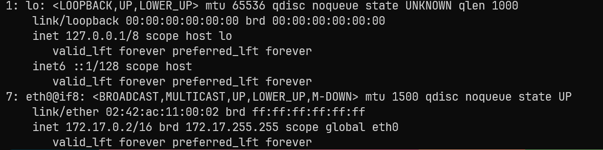
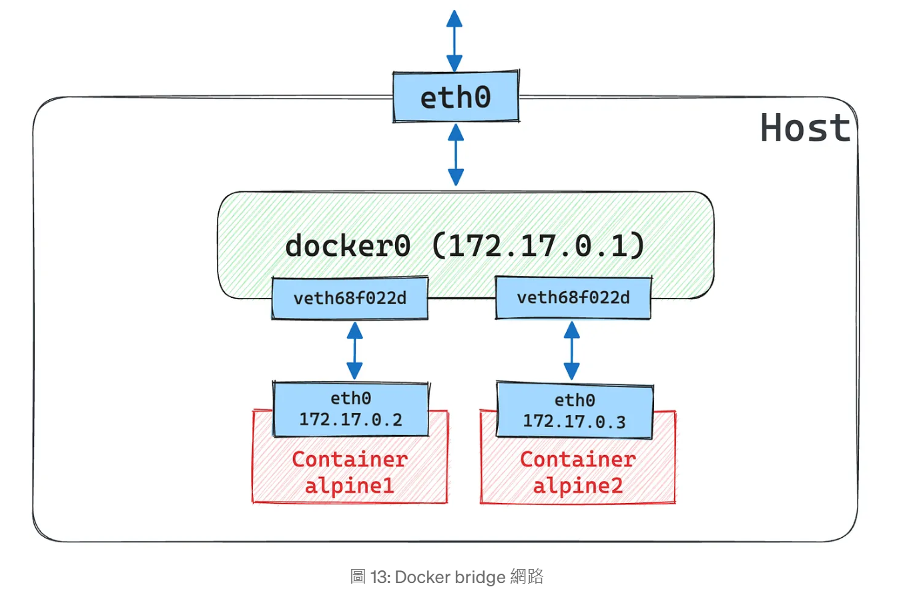

# Docker 概念

## 目錄
- [Image Layer](#image-layer)
- [網路](#網路)
- [Docker 程式語言架構](#docker-程式語言架構)
- [VM vs Docker](#vm-vs-docker)

<br><br>

---

## Image Layer

image 是一個「唯讀」的模板, 所以會發生在第一個 container 中新增了一個 AAA.txt，但後來啟動的第二個 container 中並沒有看到這個檔案

<br>

這是因當我們從 image 啟動一個 container 時候，Docker 會載入這個 image 作為唯讀層，並且在上面加上一個可寫層，而我們在這個 container 中的操作實際上就是發生在這個可寫層中

<br>



<br>

當我們 commit 後會形成新的 layer

<br>

```bash
docker container commit CONTAINER_ID [Repository:[Tag]]
```

<br>



<br>

雖然我們在電腦中目前有 node:20 與 node:20-updated 兩個不同的 image，不過 Docker 並不會重複存兩個 node:20 ，也就是重複的部分 Docker 只會存一個，這樣就大大的節省了空間，此外也可以理解為什麼要作成唯讀了，唯讀能做到共用而不互相影響

<br>

當然，原本我們從 Docker Hub 上拉下來的 node:20 也不會只有單獨一層，所以當我們在 pull 這個 image 時，會看到的畫面是像下面這樣

<br>



<br>

按照這個過程，node:20 至少是由 8 個 layer 構成的。

<br><br>

---

## 網路

### 列出 Docker 網路

docker network ls 這個指令來查看目前的網路有哪些

<br>



<br>

bridge 網路（驅動是 bridge）是 Docker 預設採用的網路，也就是當我們在啟動 container 時，如果沒有指定使用哪一個網路，預設就是用這一個，所以其實我們到目前為止啟動的 container 都是用 bridge 這種網路驅動。

<br>

Docker 在啟動時，會透過 Linux 的 bridge 機制自動建立一個名為 docker0 的虛擬橋接器 (bridge)。所有連到這個預設網路的 Container，會被分配在同一個 Layer-2 区段 (subnet) 中，彼此可直接通訊。

<br>

### 檢視預設 bridge 網路詳細資訊

執行 docker network inspect bridge 可以看到 containers

<br>



<br>

建立的兩個 alpine containers 被列在這裡了。此外，也可以看到其 subnet 為 "172.17.0.0/16"，而我們用 bridge 這個網路建立出來的 container 的 ip 也是在這個 subnet 範圍中

<br>

每個 Container 都在自己的 Network Namespace 中，各自擁有獨立的network stack。

<br>

Docker 會在 Host 上為每個 Container 建立一對 veth pair：

<br>

內側 (veth-container) 放在 Container 的 eth0
外側 (veth-host) 接回到 Host 的 docker0 bridge

<br>

Host 透過 iptables 自動設置 NAT (MASQUERADE) 規則，讓 Container 可以經由 Host 公網介面對外進行封包轉送。

<br>

### 在 Container 內查看網路介面

執行 docker container exec -it alpine1 ip addr 觀察網路介面

<br>



<br>

lo：回環介面，IP 為 127.0.0.1/8
eth0：連到 docker0 的 veth，通常 IP 為 172.17.0.X/16

<br>

eth0 是 Container 中唯一的「外部」網路介面，所有對外流量都須先經由此介面到達 Host 的 docker0，再由 Host 轉送或進行 NAT。

<br>

### 在 Host 上查看整體網路結構



<br>

會藉由 docker0 這個 bridge，讓 container 之間能互相溝通，也讓 container 有了對外部網路進行存取的能力。

<br>

Container 的封包先從 eth0 進入 veth-container，穿過 veth-host 後到達 docker0, 再由 Host 的 iptables NAT 規則將來源 IP 改為 Host 公網 IP，送到外部網路, 回程封包再反方向經過 docker0 → veth → Container eth0

<br><br>

---

## Docker 程式語言架構

### Docker 由 Go 語言撰寫

Docker 最早版本於 2013 年釋出，核心元件（如 Docker Engine、containerd、runc 等）主要都是用 Go 語言撰寫。

<br>

### 選擇 Go 語言的三大原因

#### 1. 跨平台編譯方便

Go 可以很輕鬆地編譯出 Linux、Windows、macOS 等版本的二進位檔案。這稱為**交叉編譯**，就是在一個平台上（例如 Windows 開發機），直接編譯出另一個平台的可執行檔（例如 Linux 或 macOS 的二進位檔）。

<br>

**Go 交叉編譯範例**：
```bash
GOOS=linux   # 目標作業系統
GOARCH=amd64 # 目標 CPU 架構
go build
```

<br>

就可以直接產生 Linux/amd64 可以執行的二進位檔案，完全不需要在 Linux 環境中重新編譯。這讓 Docker、Kubernetes 等專案很容易同時支援多平台發佈。

<br>

**與 C# 的比較**：

| 特性 | Go | C# (.NET) |
|------|-----|-----------|
| 交叉編譯 | 設定環境變數即可 | 需要在目標平台建構或安裝對應 Runtime |
| 編譯產出 | 單一二進位檔案 | 需要 runtime，檔案體積較大 |
| 依賴性 | 完全自包含 | 依賴 .NET runtime |

<br>

雖然現在 .NET 也有 `dotnet publish -r linux-x64 --self-contained true` 這種方式，但產出的檔案體積大（因為要打包 runtime），而且不是完全「免依賴」，不像 Go 那樣天生就是靜態編譯。

<br>

#### 2. 效能與維護性的平衡

**效能優勢**：
- Go 跟 C/C++ 一樣，最後編譯出來是機器碼（native binary），不是像 Java / C# 那樣靠 JIT
- 天生比 JVM/CLR 語言更接近「原生速度」
- 雖然有 GC，但設計得很簡單，專注於「低延遲 + 高併發」

<br>

**記憶體模型簡單**：
- 沒有指標運算
- 沒有多重繼承
- 沒有隱晦的複製語義
- 少了很多 compiler / runtime 要處理的複雜性

<br>

**維護性優勢**：

| Go 特性 | 說明 | 好處 |
|---------|------|------|
| 語言特性刻意「少」 | 只有一種迴圈（for），沒有三元運算子 | 程式碼風格統一 |
| 自動記憶體管理 | GC 自動處理記憶體 | 避免記憶體洩漏、野指標問題 |
| 標準庫齊全 | HTTP 伺服器、JSON、並發支援 | 不用東拼西湊第三方函式庫 |

<br>

#### 3. 靜態編譯優勢

**靜態編譯 vs 動態編譯**：

| 編譯方式 | 說明 | 優點 | 缺點 |
|----------|------|------|------|
| **靜態編譯** | 把程式需要的函式庫通通塞進執行檔 | 完整自足，不依賴外部函式庫 | 檔案體積較大 |
| **動態編譯** | 執行時才去作業系統找函式庫 | 檔案體積小，共用函式庫 | 依賴地獄，缺少依賴就無法執行 |

<br>

**Docker 容器化的完美搭配**：
- Docker 的哲學：「乾淨、可攜、少依賴」
- Go 靜態編譯：可以在最小化的 Linux image 裡只放一個二進位檔案
- 可以丟進 `scratch`（空白 base image）就能執行
- 相比之下，C#/.NET 需要 runtime，容器映像檔較大

<br>

**範例對比**：
```dockerfile
# Go 應用程式
FROM scratch
COPY app /
ENTRYPOINT ["/app"]

# .NET 應用程式  
FROM mcr.microsoft.com/dotnet/runtime:6.0
COPY . /app
ENTRYPOINT ["dotnet", "app.dll"]
```

<br>

### 架構元件說明

| 元件 | 說明 | 用途 |
|------|------|------|
| **Docker Engine** | Docker 的核心守護程式 | 管理容器生命週期 |
| **containerd** | 容器執行時環境 | 處理容器的建立和管理 |
| **runc** | OCI 執行時實作 | 實際執行容器程序 |

<br>

這些元件全部都用 Go 語言撰寫，確保了整個 Docker 生態系統的一致性和效能表現。

<br><br>

---

## VM vs Docker

### 4.1 核心概念差異

| 類型 | 概念比喻 | 實際運作方式 |
|------|----------|-------------|
| **VM（虛擬機）** | 真的「再開一台電腦」出來 | 完整的作業系統虛擬化 |
| **Container（容器）** | 在同一台電腦裡切一個小房間，讓你專心跑某個程式 | 作業系統層級的虛擬化 |

<br>

### 4.2 VM 啟動流程（像你真的開一台新電腦）

#### 🖥️ **完整的電腦開機過程**

**1. 建一台虛擬電腦**
```
Hypervisor（虛擬機管理員）先分配 CPU、記憶體、硬碟，假裝給它一整組硬體
```

**2. 按下電源鈕**
```
虛擬 BIOS/UEFI 開始跑，就像你按桌機的開機鍵
```

**3. 讀硬碟 → 找開機程式**
```
找到 bootloader（開機管理程式），決定要載入哪個作業系統
```

**4. 載入作業系統核心**
```
Windows/Linux 核心開始啟動，初始化驅動程式
```

**5. 開機進程**
```
系統啟動 systemd 之類的「總管」，再一個一個把服務
（網路、登錄系統、時間同步…）拉起來
```

**6. 準備好環境後，才啟動你的應用**
```
比如你要跑 Nginx，它是在完整的作業系統裡面被啟動的
```

<br>

📝 **小結**：VM 就像真的開一台新電腦 → 開機 → 進 OS → 才能跑軟體。

<br>

### 4.3 Container 啟動流程（像在大樓裡切一個新房間）

#### 🏢 **快速空間分割過程**

**1. 下指令要開一個房間**
```bash
你跟 Docker 說「我要一個容器」
docker run …
```

**2. 準備家具（程式和依賴）**
```
從 Image 拉你需要的東西（app + library），疊成一個檔案系統
```

**3. 切一個獨立的空間**
```
Linux 幫你隔出一個小房間（namespace），裡面有自己的行程表、網路、檔案目錄
```

<br>

#### 🔒 **切隔離空間（Namespace）**

系統用 namespace 隔開：

| Namespace 類型 | 功能說明 |
|----------------|----------|
| **PID** | 容器裡只能看到自己的行程 |
| **NET** | 容器有自己的 IP、網卡 |
| **MNT** | 有自己掛載的目錄 |
| **UTS** | 有自己 hostname |
| **IPC** | 跨程式的共享記憶體隔開 |
| **USER** | UID/GID 可獨立對應 |

<br>

#### ⚙️ **設定規則 - 套上 cgroup 限制（資源控管）**

在這個房間外面，系統貼一張「使用規則」：

| 資源類型 | 限制說明 |
|----------|----------|
| **CPU** | 最多用幾顆、多少比例 |
| **Memory** | 最多用多少 RAM |
| **IO** | 磁碟/網路的頻寬限制 |
| **PIDs** | 最多能產生幾個行程 |

<br>

再把不該有的「特權」砍掉，避免容器亂動 Host Kernel。

<br>

**4. 直接把你的程式丟進去跑**
```
容器裡的「第一個程式」就是你要的應用（例如 Nginx），
不需要重新開機一個 OS
```

<br>

📝 **小結**：Container 就像在同一棟大樓（同一個 Linux 核心）裡，快速隔一間房，直接讓你搬進來跑軟體。

<br>

### 4.4 效能與資源比較

| 比較項目 | VM | Container |
|----------|-----|-----------|
| **啟動時間** | 數分鐘（完整 OS 開機） | 數秒（直接執行程式） |
| **記憶體使用** | GB 級別（含完整 OS） | MB 級別（僅應用程式） |
| **隔離程度** | 完全隔離（硬體層級） | 程序隔離（OS 層級） |
| **資源開銷** | 高（每個 VM 都有 OS） | 低（共享 Host OS 核心） |
| **安全性** | 高（完全隔離） | 中等（共享核心） |
| **可攜性** | 中等（依賴 Hypervisor） | 高（容器映像檔標準化） |