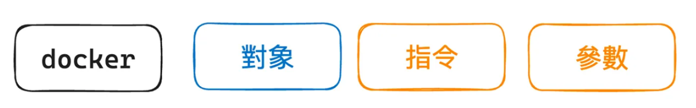
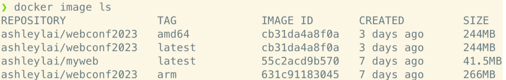
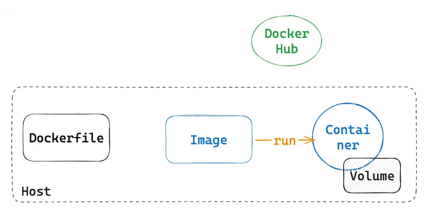
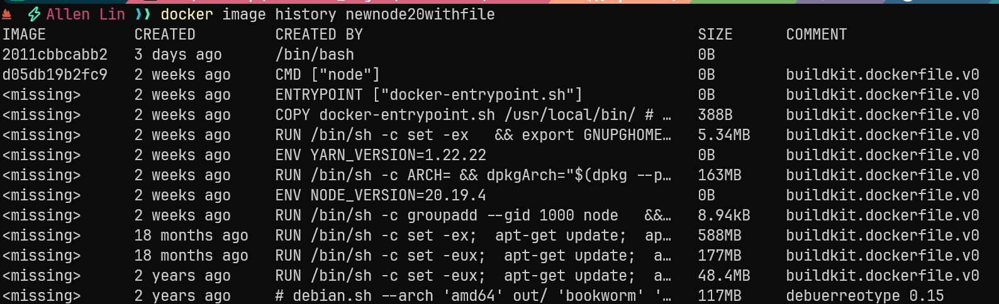

# Docker 實務場景

## 目錄
- [使用 Web Api Server image](#使用-web-api-server-image)
  - [Docker 指令格式](#docker-指令格式)
  - [列出目前本地的資訊](#列出目前本地的資訊)
  - [拉取 api server image](#拉取-api-server-image)
  - [搜尋](#搜尋)
  - [將 server 在本地跑起來](#將-server-在本地跑起來)
  - [測試](#測試)
- [包自己的 REACT 別人用](#包自己的-react-別人用)
  - [撰寫 Dockerfile](#撰寫-dockerfile)
  - [說明](#說明)
  - [建立 Docker image](#建立-docker-image)
- [直接用 Docker 來當作開發環境](#直接用-docker-來當作開發環境)
- [包 .NET 給 PO 使用](#包-net-給-po-使用)
  - [撰寫 Dockerfile](#撰寫-dockerfile-1)
  - [建立 Image](#建立-image)
  - [執行容器](#執行容器)
  - [推到 Docker Hub](#推到-docker-hub)
  - [PO 執行](#po-執行)
- [簡單起一個 Node Container 並觀察 Process](#簡單起一個-node-container-並觀察-process)
- [依據既有的 Image 跑 Container 後再產生新的 Image](#依據既有的-image-跑-container-後再產生新的-image)
  - [先啟動 Container](#先啟動-container)
  - [產一個檔案](#產一個檔案)
  - [開另外一個 CLI 後 Commit](#開另外一個-cli-後-commit)
  - [接著在本機環境就可以看到新的 Image](#接著在本機環境就可以看到新的-image)
- [使用 History 查看 Image 堆疊歷史](#使用-history-查看-image-堆疊歷史)

<br><br>

---

https://azole.medium.com/webconf2023-docker-%E5%85%A5%E9%96%80-101-fae89170553a

https://github.com/azole/docker-ironman-2022/tree/main/web-application

https://github.com/CHI-KEKE/docker-ironman-2022#

## 使用 Web Api Server image

### Docker 指令格式



<br>

### 列出目前本地的資訊

```bash
# 列出目前在執行中的 container
docker container ls

# 列出所有 container
docker container ls -a

# 列出 image
docker image ls
```

<br>

### 拉取 api server image

```bash
# 先把 image 從 DockerHub 或其他 registry 上 pull 下來(namespace/repository:tag)
docker image pull ashleylai/webconf2023
```

<br>

**namespace** 是用來辨認個人或組織的，簡單地說，如果你是用 Docker Hub 的話，那就是你在 Docker Hub 上的帳號。

<br>

沒有加上 namespace，這是因為這時候使用的是預設的 namespace，通常就是很「大咖」、「知名」的組織的 image，例如 node, ubuntu, nginx 等

<br>

**repository** 這是 image 儲存庫的名稱

<br>

**tag** 通常會被用來標註版本，如果沒有寫明，那預設就是 latest

<br>

拉完後列出 image 確認

```bash
# 列出 image 確認
docker image ls
```



<br>

SIZE 這個欄位要特別注意，這是這個 IMAGE 的大小，但不一定是真的佔用你硬碟的空間大小，原因是因為 Docker image 是一層一層疊起來的，而且會讓這些「層」被共用

<br>

### 搜尋

當找不到時也可以嘗試看看直接搜尋

```bash
docker search {keyword}
```

<br>

### 將 server 在本地跑起來

```bash
docker container run -it -p 3001:3000 --rm ashleylai/webconf2023
```

這是啟動 container 的指令，這裡我們用到了幾個參數，這些參數都跟我們要怎麼使用這個 image 有關係：

<br>

**-it**

- i :-interactive 啟動互動模式，保持標準輸入的開放。
- t : -tty讓 Docker 分配一個虛擬終端機(pseudo-TTY)，並且綁定到容器的標準輸出上。

<br>

加上 -it 的啟動方式，應該會讓你的終端機視窗被佔用，但好處是，可以比較方便地看到 container 中的 application 的 log 的顯示。

<br>

**-p**

--publish 通常格式為 -p local port#:container port# ，將 container 中的 port 3000 映射到 Host 中的 3001。container port# 在 image 建立的時候就會決定好了，所以要按照這個 image 的規定、不能修改。但 local port# 就可以自行決定了，

<br>

**--rm** 

停止這個 container 時，就移除掉，通常我在實驗或練習的時候，習慣加上 --rm ，這樣就不用手動去移除停止後、不需要的 container。

<br>

### 測試

web server 提供了兩個 API:

- GET /
- GET /conferences

<br>

都可以用瀏覽器試試看，記得 port number 要換成你啟動 container 指令中的 local port#。

<br><br>

---

## 包自己的 REACT 別人用

### 撰寫 Dockerfile

```dockerfile
# build stage
FROM node:18-alpine as builder

# 建立工作目錄
WORKDIR /app

# 把 package.json 跟 package-lock.json 複製到 image 中
COPY package*.json ./

# 安裝相依套件
RUN npm ci && npm cache clean --force

# 把所有檔案複製到 image 中
COPY . .

# 執行 build
RUN npm run build

#################################
# production stage
FROM nginx:alpine

# 建立工作目錄
WORKDIR /usr/share/nginx/html

# 從 builder 階段裡的 /app/build 複製到目前位置（WORKDIR）
COPY --from=builder /app/build .
```

<br>

### 說明

#### build stage

```dockerfile
FROM node:18-alpine as builder
```

**意義**

FROM：選擇基底映像（base image），這裡用的是官方的 node:18-alpine。

<br>

alpine：表示這是基於 Alpine Linux 的輕量版本，檔案體積小（數 MB 級別）。

<br>

as builder：給這個階段取一個名字叫 builder，後面可以用 COPY --from=builder 來取這個階段的成果。

<br>

**為什麼這樣做？**

第一個階段專門負責「編譯（build）」程式碼，因為 Node.js 開發工具比較重（安裝很多套件），不需要帶到最終生產映像裡。多階段建置可以讓最終 image 更小。

<br>

#### 建立工作目錄

```dockerfile
WORKDIR /app
```

**意義**

設定工作目錄（Working Directory）。後續的 COPY、RUN 指令都會以 /app 為基準，不需要每次都打絕對路徑。

<br>

**為什麼這樣做？**

保持檔案結構整潔，所有檔案都集中在 /app。

<br>

#### 複製相依檔案

```dockerfile
COPY package*.json ./
```

**意義**

把本地端的 package.json 和 package-lock.json 複製進去 container 的 /app 目錄。

<br>

**為什麼這樣做？**

安裝依賴只需要這兩個檔案。提前複製它們（而不是一開始就複製全部檔案）有助於 Docker build cache，避免每次有程式碼變動就重裝依賴。

<br>

#### 安裝相依套件

```dockerfile
RUN npm ci && npm cache clean --force
```

**意義**

npm ci：用 package-lock.json 精準安裝所有相依套件（比 npm install 更確保一致性）。

<br>

npm cache clean --force：清除 npm 的快取，減少映像檔大小。

<br>

**為什麼這樣做？**

- 使用 npm ci 可以確保 build 環境與本地一致，避免版本不符。
- 清 cache 減少不必要的體積。

<br>

#### 複製所有檔案

```dockerfile
COPY . .
```

**意義**

把專案資料夾的所有檔案複製進 container（此時 node_modules 已經裝好了）。

<br>

**為什麼這樣做？**

需要完整的專案檔案（包含 src、public 等）才能執行編譯。

<br>

#### 執行 build

```dockerfile
RUN npm run build
```

**意義**

執行 package.json 裡定義的 build 指令，通常是 react-scripts build 或 Vue/Angular 的 build。

<br>

會在 /app/build（React）或 /app/dist（Vue）等資料夾輸出純靜態檔案。

<br>

**為什麼這樣做？**

這個階段的目的是把程式碼編譯成靜態 HTML/CSS/JS 檔案，生產環境只需要這些檔案，不需要 Node.js。

<br>

#### Production Stage

```dockerfile
FROM nginx:alpine
```

**意義**

選用 nginx:alpine 作為最終的基底 image。Nginx 是高效能 Web Server，適合用來提供靜態檔案。

<br>

**為什麼這樣做？**

我們的 build 輸出已經是純靜態檔案，不需要 Node.js Runtime。把靜態檔案交給 Nginx 來 serve，更輕量也更快。

<br>

#### 建立工作目錄

```dockerfile
WORKDIR /usr/share/nginx/html
```

**意義**

設定工作目錄到 Nginx 預設的靜態檔案路徑 /usr/share/nginx/html。

<br>

**為什麼這樣做？**

讓後面的 COPY 直接複製檔案到正確位置，不需要額外設定。

<br>

#### 複製 build 出來的檔案

```dockerfile
COPY --from=builder /app/build .
```

**意義**

--from=builder：從第一階段（builder）裡複製檔案。

<br>

/app/build 是第一階段的 build 輸出資料夾。

<br>

. 是目前的工作目錄（Nginx 預設靜態檔案路徑）。

<br>

**為什麼這樣做？**

只把最終需要的靜態檔案帶進來，Node.js 和 node_modules 都不會進到最終映像裡，保持映像檔精簡。

<br>

#### 總結

**第一階段（builder）**：

- 安裝套件
- 編譯前端程式
- 輸出靜態檔案

<br>

**第二階段（production）**：

- 只留下靜態檔案
- 用 Nginx 提供服務

<br>

### 建立 Docker image

#### 執行 build

```bash
docker image build -t ashleylai/myweb .
```

-t 是 tag（標籤） 的縮寫。

<br>

建立完成後，可以用 docker image ls 確認看看是否存在。

<br>

#### 試跑

```bash
docker container run -it -p 8081:80 --rm yoyo88147/ashleylaidemoweb
```

<br>

#### 把 image 推送到 Docker Hub

```bash
docker image push yoyo88147/ashleylaidemoweb
```

<br><br>

---

## 直接用 Docker 來當作開發環境



<br>

原本開發專案的工作流程會是：

- 開啟終端機後，將路徑切換至 react 專案
- 在終端機執行 npm start 以啟動開發模式（這邊可以換成你需要的指令）

<br>

用 Docker 來進行上述動作

<br>

### 至容器內部 npm i 產生依賴 /app/node_modules, react-scripts 才能被找到

```bash
docker container run -it -p 3000:3000 -w=/app -v "${PWD}:/app" node:18 bash
```

<br>

### 掛載目錄並啟動

```bash
docker container run -it -p 3000:3000 -w=/app -v "${PWD}:/app" node:18 npm start
```

<br>

至於指令中的 node:18 跟 npm start ，你都可以置換成你需要的 nodejs 版本跟啟動指令，這樣就可以用 Docker container 裡 nodejs 的環境，而不需要在自己的電腦安裝 nodejs 了。

<br>

除了不需要在自己的電腦安裝環境之外，你應該也注意到，要換版本也是很容易的事，只需要換個 image 來用即可。

<br>

**-w=/app**

這個選項設置了容器中的工作目錄。容器啟動後，所有後續命令都會在這個目錄中執行。在這個例子中，我們將工作目錄設定為 /app，這是 React 專案的目錄。

<br>

**-v $(pwd):/app**

這是 Docker 的卷掛載選項，它將當前主機目錄（$(pwd)）掛載到容器的 /app 目錄。$(pwd) 會取得當前工作目錄的絕對路徑，確保容器內部的 /app 目錄與主機上的專案目錄是同步的。

<br>

這樣做的好處是：

使得 React 專案的源代碼可以在容器和主機之間實時同步變更。你不需要將專案代碼複製到容器內部，直接在本機開發並且保持容器內的環境一致性。

<br>

專案在外部, 容器只是給予你這個環境

<br>

### 從頭建立一個 react 專案並且進行開發

```bash
# 切換到你想要放置專案的路徑

# 用 Docker container 來建立 react 的新專案
docker container run \
  -it \
  --rm \
  -w=/app \
  -v $(pwd):/app \
  node:18 \
  npx create-react-app simple-react

# 用 Docker container 來啟動 react 專案的開發模式
docker container run \
  -it \
  --rm \
  -p 3000:3000 \
  -w=/app \
  -v $(PWD)/simple-react:/app \
  node:18 \
  npm start
```

<br><br>

---

## 包 .NET 給 PO 使用

假設你的專案結構

```
MyMvcApp/
  Controllers/
  Views/
  Models/
  MyMvcApp.csproj
```

<br>

### 撰寫 Dockerfile

```dockerfile
# 1. 建立 build 環境 (用 SDK)
FROM mcr.microsoft.com/dotnet/sdk:8.0 AS build
WORKDIR /src
COPY . .
RUN dotnet restore
RUN dotnet publish -c Release -o /app/publish

# 2. 建立執行環境 (用 runtime)
FROM mcr.microsoft.com/dotnet/aspnet:8.0
WORKDIR /app
COPY --from=build /app/publish .
ENTRYPOINT ["dotnet", "MyMvcApp.dll"]
```

<br>

### 建立 Image

```bash
docker build -t mymvcapp .
```

<br>

### 執行容器

```bash
docker run -it -p 5000:8080 mymvcapp
```

<br>

### 推到 Docker Hub

```bash
docker login
docker tag mymvcapp yourdockerhubid/mymvcapp:v1
docker push yourdockerhubid/mymvcapp:v1
```

<br>

### PO 執行

```bash
docker run -it -p 5000:8080 yourdockerhubid/mymvcapp:v1
```

<br><br>

---

## 簡單起一個 Node Container 並觀察 Process

```bash
docker container run -it node:20 /bin/bash
```

<br>

**docker container run** ：啟動一個新的 container，相關的選項還不少，這次會就幾個常用或重要的來練習。

<br>

**-i** :--interactive 啟動互動模式，保持標準輸入的開放。

<br>

**-t** : --tty讓 Docker 分配一個虛擬終端機(pseudo-TTY)，並且綁定到容器的標準輸出上。

<br>

**node:20** : 啟動這個 container 所依據的 image。

<br>

**/bin/bash** ：容器啟動後要執行的命令。

<br>

bash 啟動就是一個 shell 程式 Bash 是一個「命令解譯器」。它會等待你的輸入，解析指令，執行指令，顯示結果。類似 powershell

<br>

這時候我們已經不在我們原本的環境中了，而是「進入」了 container 中，可以在這裡執行 `node -v` 指令，會發現這個環境中已經安裝了 node，且版本是 20.5.1。

<br>

執行 `ps aux` 會看到它 PID 為 1 的 process 就是我們剛剛指定的 `/bin/bash`

<br>

`ps aux` 是 Linux/Unix 系統裡非常常用的一個指令，專門用來查看系統中正在執行的 行程（process）。

<br><br>

---

## 依據既有的 Image 跑 Container 後再產生新的 Image

### 先啟動 Container

```bash
docker container run -it node:20 /bin/bash
```

<br>

### 產一個檔案

```bash
touch AAA.text
```

<br>

### 開另外一個 CLI 後 Commit

```bash
docker ps
docker commit c7fe390323ae newnode20withfile
```

<br>

### 接著在本機環境就可以看到新的 Image

```bash
docker image ls
```

<br><br>

---

## 使用 History 查看 Image 堆疊歷史

```bash
docker image history node:20
```

<br>



<br>

可以看到 先做出來的 image 會比原本的 image 多疊一層