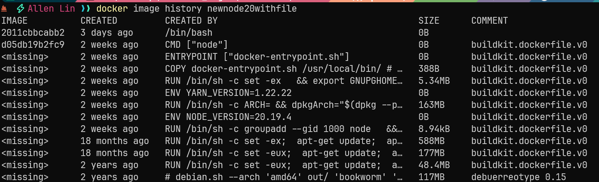

# Docker 實務場景

## 目錄

- [依據既有的 Image 跑 Container 後再產生新的 Image](#依據既有的-image-跑-container-後再產生新的-image)
  - [先啟動 Container](#先啟動-container)
  - [產一個檔案](#產一個檔案)
  - [開另外一個 CLI 後 Commit](#開另外一個-cli-後-commit)
  - [接著在本機環境就可以看到新的 Image](#接著在本機環境就可以看到新的-image)
- [使用 History 查看 Image 堆疊歷史](#使用-history-查看-image-堆疊歷史)
- [觀察生命週期](#觀察生命週期)
  - [啟動 Container](#啟動-container)
  - [進入 Container](#進入-container)
  - [離開後觀察啟動狀態](#離開後觀察啟動狀態)
- [移除 Image & Container](#移除-image--container)
  - [移除 Image 指令](#移除-image-指令)
  - [若 Container 還啟用需要先停止 Container 並移除](#若-container-還啟用需要先停止-container-並移除)
- [停止並移除多個 containers](#停止並移除多個-containers)

<br><br>

---

https://azole.medium.com/webconf2023-docker-%E5%85%A5%E9%96%80-101-fae89170553a

https://github.com/azole/docker-ironman-2022/tree/main/web-application

https://github.com/CHI-KEKE/docker-ironman-2022#


---

## 依據既有的 Image 跑 Container 後再產生新的 Image

### 先啟動 Container

```bash
docker container run -it node:20 /bin/bash
```

<br>

### 產一個檔案

```bash
touch AAA.text
```

<br>

### 開另外一個 CLI 後 Commit

```bash
docker ps
docker commit c7fe390323ae newnode20withfile
```

<br>

### 接著在本機環境就可以看到新的 Image

```bash
docker image ls
```

<br><br>

---

## 使用 History 查看 Image 堆疊歷史

```bash
docker image history node:20
```

<br>



<br>

可以看到 先做出來的 image 會比原本的 image 多疊一層

<br><br>

---

## 觀察生命週期

### 啟動 Container

```bash
docker container start CONTAINER_ID
```

<br>

### 進入 Container

```bash
docker container exec -it CONTAINER_ID /bin/bash
```

<br>

### 離開後觀察啟動狀態

```bash
exit
docker container ls
```

<br>

會發現還活著

<br>

這時再進入 container 後 `ps aux` 發現有兩個 bin/bash

<br>

而我們 exit 的是非 PID = 1 的所以不會關掉 Container

<br><br>

---

## 移除 Image & Container

### 移除 Image 指令

```bash
docker image rm d2c94e258dcb
```

<br>

### 若 Container 還啟用需要先停止 Container 並移除

```bash
docker container stop 8de29200549a
docker container rm 8de29200549a
docker image rm 2011cbbcabb2
```

<br><br>

---

## 停止並移除多個 containers

```bash
docker container stop alpine1 alpine2
docker container rm alpine1 alpine2
```