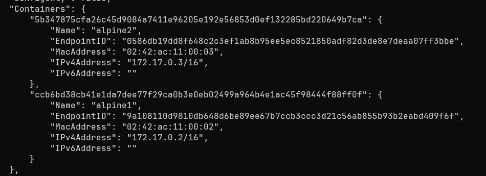
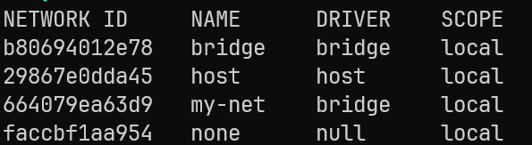
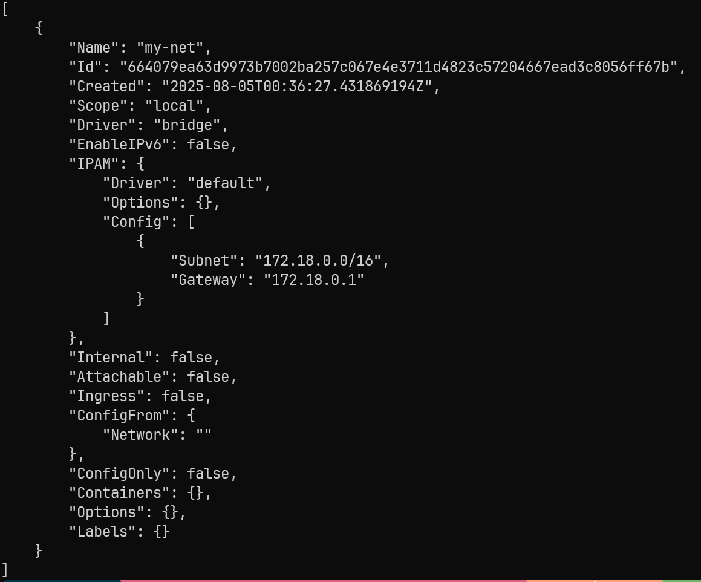
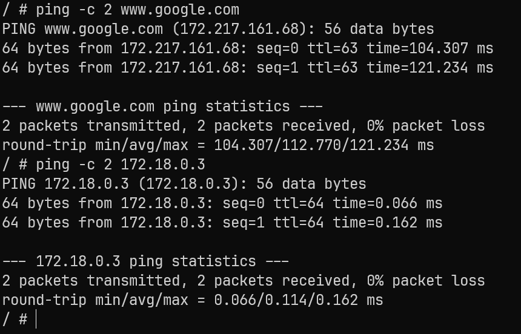

# Docker 實務場景 2

## 目錄
- [起一個 WebServer 指定 Port](#起一個-webserver-指定-port)
  - [啟動一個 Nginx 的 Web Server](#啟動一個-nginx-的-web-server)
  - [測試](#測試)
- [Alpine Container 互 Ping](#alpine-container-互-ping)
  - [執行兩個 Alpine](#執行兩個-alpine)
  - [確認 IP](#確認-ip)
  - [確認對方](#確認對方)
- [啟動本機已經有的 Alpine1 並觀察網路](#啟動本機已經有的-alpine1-並觀察網路)
- [自定義一個 bridge network](#自定義一個-bridge-network)

<br><br>

---

## 起一個 WebServer 指定 Port

### 啟動一個 Nginx 的 Web Server

```bash
docker container run --name allenwebsrv -d -p 9090:80 nginx
```

<br>

**--name** 顧名思義就是幫我們把這個 container 取個名字，它會顯示在我們執行 `docker container ls` 時顯示的最後一個欄位 NAMES

<br>

**-d (--detach)**，這個設置讓我們在啟動 container 後可以停留在本機中，因為這個參數的意思是讓這個 container 在 Host（執行 Docker 的這台電腦）的背景執行，所以執行之後，不會像第一篇那樣進入了一個執行 /bin/bash 的容器之中

<br>

隨時還是可以進入 container

<br>

```bash
docker container exec -it aa9859101db1 /bin/bash
```

<br>

**-p 9090:80 (--publish)**，這個參數意思是說我們將我們本機的 9090 port 映射到 container 開出來的 80 port

<br>

### 測試

用瀏覽器打開 http://localhost:9090

<br>

linux :

```bash
curl localhost:9090
```

<br>

powershell :

```powershell
curl.exe http://localhost:9090
Invoke-WebRequest http://localhost:9090
```

<br><br>

---

## Alpine Container 互 Ping

### 執行兩個 Alpine

```bash
docker container run -dit --name alpine1 alpine ash
docker container run -dit --name alpine2 alpine ash
```

<br>

**-d**

<br>

代表「detached mode」，也就是讓 container 在背景執行。讓你的終端機不會被 container 的輸出占用。

<br>

**-i**

<br>

代表「interactive」，即使沒有附加在 terminal 也保持標準輸入 (STDIN) 開啟。如果沒有 -i，STDIN 會自動關閉，程式如果等著有人輸入時，會立刻結束。

<br>

**-t**

<br>

分配一個 pseudo-TTY（虛擬終端機）。提供一個模擬的終端機環境，讓互動式程式（例如 shell）可以正確顯示 prompt、光標、格式。

<br>

當你執行 /bin/sh 或 ash 的時候，這個 shell 會嘗試進入「互動模式」或「非互動模式」。

<br>

如果它偵測不到一個 TTY（虛擬終端機），也沒有東西從 STDIN 傳進來，它會認為自己在「執行 script」模式。執行完就退出，不會停在那邊等。

<br>

nginx 的 entrypoint 是：

<br>

```bash
nginx -g 'daemon off;'
```

<br>

這是一個 會一直在前台跑的程式，它本身不需要互動，也不會自己退出。

<br>

而 shell 本身是互動式的，如果沒有給它互動環境，它就會立即結束。

<br>

### 確認 IP

```bash
docker container inspect -f '{{range.NetworkSettings.Networks}}{{.IPAddress}}{{end}}' alpine1
```

<br>

```
172.17.0.2
```

<br>

```bash
docker container inspect -f '{{range.NetworkSettings.Networks}}{{.IPAddress}}{{end}}' alpine2
```

<br>

```
172.17.0.3
```

<br>

### 確認對方

```bash
docker container exec -it alpine1 ash
ping -c 2 172.17.0.4
ping -c 2 google.com.tw
```

<br><br>

---

## 啟動本機已經有的 Alpine1 並觀察網路

```bash
docker start alpine1
docker container ls
docker exec -it alpine1 ash
exit
docker network inspect bridge
```

<br>



<br>

建立的兩個 alpine containers 被列在這裡了。此外，也可以看到其 subnet 為 "172.17.0.0/16"，而我們用 bridge 這個網路建立出來的 container 的 ip 也是在這個 subnet 範圍中。

<br><br>

---

## 自定義一個 bridge network

### 建立網路

```bash
docker network create --driver bridge my-net
```

<br>

### 查看網路們

```bash
docker network ls
```

<br>



<br>

### 細看 my-net

```bash
docker network inspect my-net
```

<br>



<br>

自定義的 my-net 網路其 subnet 是 172.18.0.0/16

<br>

### 啟動兩個 container，network 都指定為 my-net

```bash
docker container run -dit  --network my-net  --name alpine1 alpine
docker container run -dit --network my-net --name alpine2 alpine
```

<br>

### 查看網路 ip

```bash
docker container inspect -f '{{range.NetworkSettings.Networks}} {{.IPAddress}}{{end}}' alpine1
```

<br>

結果：172.18.0.2

<br>

```bash
docker container inspect -f '{{range.NetworkSettings.Networks}} {{.IPAddress}}{{end}}' alpine2
```

<br>

結果：172.18.0.3

<br>

會發現 其 IP 會落在新的 subnet 中

<br>

### 進入 alpine1 中, ping google 以及 alpine2

```bash
docker container exec -it alpine1 ash
ping -c 2 www.google.com
ping -c 2 172.18.0.3
ping -c 2 alpine2
```

<br>



<br>

定義的網路可以透過「名字」來進行溝通，這個在預設的 bridge 網路是做不到的