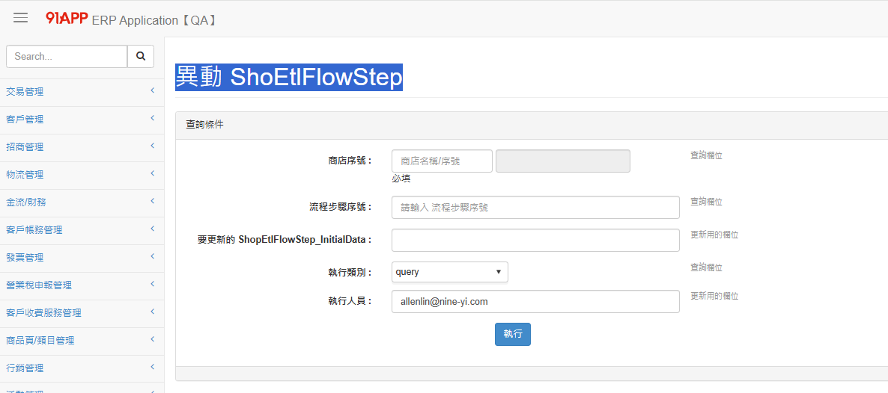

# 📊 ETL 維護文件

<br>

## 📖 目錄
  - [🔍 DB 查找相關](#-db-查找相關)
  - [💾 塞 Step 的語法](#-塞-step-的語法)
    - [案例 2：So Nice 線下訂單回收 ETL 排程](#案例-2so-nice-線下訂單回收-etl-排程)
    - [案例 3：So Nice 線上訂單逆流程 ETL 排程](#案例-3so-nice-線上訂單逆流程-etl-排程)
  - [🔧 OSM Console Service 規範](#-osm-console-service-規範)
    - [ExecuteDbStoredProcedureService](#executedbstoredprocedureservice)
  - [⚙️ ERP ETL 管理](#️-erp-etl-管理)
  - [🖥️ 機器資訊](#️-機器資訊)
  - [📍 Log 查找位置](#-log-查找位置)
  - [⚙️ 系統操作相關](#️-系統操作相關)
  - [🚨 異常案例](#-異常案例)
    - [案例 1：同步 HK 關鍵指標工作階段數據到 NineYiDW 發生錯誤](#案例-1同步-hk-關鍵指標工作階段數據到-nineyidw-發生錯誤)
    - [案例 2：查找排程執行狀況](#案例-2查找排程執行狀況)
    - [案例 3：ETL DataTrans 異常](#案例-3etl-datatrans-異常)
    - [案例 4：Moniter\_UpdateRecurringData 錯誤](#案例-4moniter_updaterecurringdata-錯誤)
    - [ETL.JobsManagement.Model.SQLJobParameter - Exception](#etljobsmanagementmodelsqljobparameter---exception)
    - [沒有相關的 connection 欄位](#沒有相關的-connection-欄位)
    - [No such table](#no-such-table)
    - [SQLite DB 相關問題排查](#sqlite-db-相關問題排查)
  - [📋 建立排程步驟](#-建立排程步驟)

<br>

---

## 🔍 DB 查找相關

**主要資料庫**：ETLDB

<br>

**相關資料表**：ETLFLOWTASKLOG

<br>

**基本查詢語法**：

<br>

```sql
USE EtlDB
GO

SELECT TOP 10
    *
FROM dbo.ShopEtlFlow WITH (NOLOCK)
INNER JOIN dbo.ShopEtlFlowStep WITH (NOLOCK)
    ON ShopEtlFlow_Id = ShopEtlFlowStep_ShopEtlFlowId
WHERE ShopEtlFlow_Id = 332

SELECT TOP 50
    *
FROM dbo.EtlFlowTask WITH (NOLOCK)
INNER JOIN dbo.EtlFlowTaskSlave WITH (NOLOCK)
    ON EtlFlowTask_Id = EtlFlowTaskSlave_EtlFlowTaskId
WHERE EtlFlowTask_ShopEtlFlowId = 332
ORDER BY EtlFlowTask_Id DESC

SELECT
    *
FROM dbo.EtlFlowTaskLog WITH (NOLOCK)
WHERE EtlFlowTaskLog_EtlFlowTaskId = 20214455
```

<br>

**排程執行狀況查詢**：

<br>

```sql
select *
from EtlFlowTask(nolock)
where EtlFlowTask_ValidFlag = 1
and EtlFlowTask_ShopEtlFlowId = 71
and EtlFlowTask_CreatedDateTime between '2024-11-15' and '2024-11-16'
and EtlFlowTask_Status <> 'Finish'
order by EtlFlowTask_CreatedDateTime desc
```

<br>

---

## 💾 塞 Step 的語法

**案例 1：第三方金流狀態檢查排程塞入 QFPay 設定**

<br>

```sql
USE EtlDB 

DECLARE @vsts varchar(50) = 'VSTS413016'
    ,@now datetime = getdate()

DECLARE @flowId BIGINT = (SELECT TOP 1 ShopEtlFlow_Id FROM dbo.ShopEtlFlow(NOLOCK) WHERE ShopEtlFlow_ValidFlag = 1 AND ShopEtlFlow_Name = 'Flow_CheckThirdPartyPaymentOrders');
DECLARE @serviceId BIGINT = (SELECT TOP 1 EtlService_Id FROM dbo.EtlService(NOLOCK) WHERE EtlService_ValidFlag = 1 AND EtlService_Name = 'CheckThirdPartyPaymentBaseService');

--SELECT
SELECT * FROM ShopEtlFlowStep (NOLOCK) WHERE  ShopEtlFlowStep_ShopEtlFlowId = @flowId AND ShopEtlFlowStep_EtlServiceId = @serviceId

-- Insert ShopEtlFlowStep
-- InitialData 參數說明 
--   MonitorInterval: 排程發動時間減1分鐘後，往前抓取的訂單時間長度(分鐘)     ex:如果參數設定30，發動時間為t，抓取的訂單時間為 t-1 ~ t-31
--   PayType: 付款方式 
--   OrderAmount: 最低單量水位 
--   OrderSuccessRate: 付款成功率門檻
INSERT INTO EtlDB.dbo.ShopEtlFlowStep
(
    ShopEtlFlowStep_ShopId,
    ShopEtlFlowStep_ShopEtlFlowId,
    ShopEtlFlowStep_EtlServiceId,
    ShopEtlFlowStep_InitialData,
    ShopEtlFlowStep_Sort,
    ShopEtlFlowStep_Description,
    ShopEtlFlowStep_CreatedUser,
    ShopEtlFlowStep_UpdatedUser,
    ShopEtlFlowStep_CreatedDateTime,
    ShopEtlFlowStep_UpdatedDateTime,
    ShopEtlFlowStep_UpdatedTimes,
    ShopEtlFlowStep_ValidFlag
)
VALUES
(0, @flowId, @serviceId, N'{"MonitorInterval":30,"PayType":"QFPay","Threshold":{"OrderAmount":10,"OrderSuccessRate":0.33}}', 110, N'檢查QFPay訂單狀態', @vsts, @vsts, @now, @now, 0, 1)

--Verify
SELECT * FROM ShopEtlFlowStep (NOLOCK) WHERE  ShopEtlFlowStep_ShopEtlFlowId = @flowId AND ShopEtlFlowStep_EtlServiceId = @serviceId
```

<br>

### 案例 2：So Nice 線下訂單回收 ETL 排程

<br>

**設定語法**：

<br>

```sql
USE EtlDB
GO
DECLARE @flowId BIGINT,
        @shopId BIGINT = 12209, -- SoNice test
        @createdUser VARCHAR(30) = N'VSTS468944',
        @now DATETIME = GETDATE(),
        @ownTeam VARCHAR(30) = N'oversea_brd';
DECLARE @insertedFlowIdTable TABLE (ShopEtlFlow_Id BIGINT);
DECLARE @step1ServiceId BIGINT,
        @step2ServiceId BIGINT,
        @step3ServiceId BIGINT;
-- Insert ShopEtlFlow
INSERT INTO
    dbo.ShopEtlFlow (
        [ShopEtlFlow_ShopId],
        [ShopEtlFlow_Name],
        [ShopEtlFlow_Description],
        [ShopEtlFlow_IsEnabled],
        [ShopEtlFlow_BookingTime],
        [ShopEtlFlow_EtlServerId],
        [ShopEtlFlow_RetryCount],
        [ShopEtlFlow_RetryInterval],
        [ShopEtlFlow_CreatedDateTime],
        [ShopEtlFlow_CreatedUser],
        [ShopEtlFlow_UpdatedTimes],
        [ShopEtlFlow_UpdatedDateTime],
        [ShopEtlFlow_UpdatedUser],
        [ShopEtlFlow_ValidFlag],
        [ShopEtlFlow_EtlCategoryId],
        [ShopEtlFlow_AlertGroups]
    ) OUTPUT INSERTED.ShopEtlFlow_Id INTO @insertedFlowIdTable
VALUES
    (
        @shopId,
        N'OfflineReturnGoodRefundLoyaltyPointTask_12209_D+2',
        N'SoNice線下訂單給點後退貨還點作業',
        1,
        N'',
        1,
        0,--RetryCount
        0,--RetryInterval
        @now,
        @createdUser,
        0,
        @now,
        @createdUser,
        1,
        1,
        @ownTeam
    );
SELECT
    TOP 1 @flowId = ShopEtlFlow_Id
FROM
    @insertedFlowIdTable;
-- Select ServiceId
SELECT
    @step1ServiceId = EtlService_Id
FROM
    dbo.EtlService WITH (NOLOCK)
WHERE
    EtlService_ValidFlag = 1
    AND EtlService_Name = 'ExecuteDbStoredProcedureService';
-- Insert
INSERT INTO
    dbo.ShopEtlFlowStep (
        [ShopEtlFlowStep_ShopId],
        [ShopEtlFlowStep_ShopEtlFlowId],
        [ShopEtlFlowStep_EtlServiceId],
        [ShopEtlFlowStep_InitialData],
        [ShopEtlFlowStep_Sort],
        [ShopEtlFlowStep_DefaultInputChainData],
        [ShopEtlFlowStep_CreatedDateTime],
        [ShopEtlFlowStep_CreatedUser],
        [ShopEtlFlowStep_UpdatedTimes],
        [ShopEtlFlowStep_UpdatedDateTime],
        [ShopEtlFlowStep_UpdatedUser],
        [ShopEtlFlowStep_ValidFlag],
        [ShopEtlFlowStep_Description]
    )
VALUES
    (@shopId,@flowId,@step1ServiceId, N'{
   "ConnectionStringName":"CRMDB",
   "StoredProcedureName":"csp_RecycleCrmSalesOrderNetReturnGoodsLoyaltyPoints",
   "StoredProcedureParams":[
      {
         "ParamName":"startDateTime",
         "ParamType":"DateTime",
         "ParamValue":"%DATEADDDAYS_-1%"
      },
      {
         "ParamName":"endDateTime",
         "ParamType":"DateTime",
         "ParamValue":"%DATEADDDAYS_0%"
      },
      {
         "ParamName":"returnGoodsRewardValidDays",
         "ParamType":"Integer",
         "ParamValue":"1"
      },
      {
         "ParamName":"shopId",
         "ParamType":"Long",
         "ParamValue":"%SHOPID%"
      }
   ],
   "CommandTimeoutSecond":1800,
   "RetryCount":5,
   "RetryIntervalSecond":120
}', 10, N'', @now, @createdUser, 0, @now, @createdUser, 1, N'SoNice線下訂單給點後退貨還點作業');
--SELECT
SELECT * FROM dbo.ShopEtlFlow WITH(NOLOCK)
WHERE ShopEtlFlow_ValidFlag = 1
AND ShopEtlFlow_Id = @flowId;
SELECT * FROM dbo.ShopEtlFlowStep WITH(NOLOCK)
WHERE ShopEtlFlowStep_ValidFlag = 1
AND ShopEtlFlowStep_ShopEtlFlowId = @flowId;
```

<br>

**Task Scheduler 排程設定**：

<br>

```
D:\Batch\EtlConsole\OSMPlusBatchRunFlowById\NineYi.OsmPlus.Batch.RunFlowById.exe
1122
userGroup : SYSTEM
```

<br>

### 案例 3：So Nice 線上訂單逆流程 ETL 排程

<br>

**設定語法**：

<br>

```sql
USE EtlDB
GO
DECLARE @flowId BIGINT,
        @shopId BIGINT = 12209, -- SoNice TEST
        @createdUser VARCHAR(30) = N'VSTS468944',
        @now DATETIME = GETDATE(),
        @ownTeam VARCHAR(30) = N'oversea_brd';
DECLARE @insertedFlowIdTable TABLE (ShopEtlFlow_Id BIGINT);
DECLARE @step1ServiceId BIGINT,
        @step2ServiceId BIGINT,
        @step3ServiceId BIGINT;
-- Insert ShopEtlFlow
INSERT INTO
    dbo.ShopEtlFlow (
        [ShopEtlFlow_ShopId],
        [ShopEtlFlow_Name],
        [ShopEtlFlow_Description],
        [ShopEtlFlow_IsEnabled],
        [ShopEtlFlow_BookingTime],
        [ShopEtlFlow_EtlServerId],
        [ShopEtlFlow_RetryCount],
        [ShopEtlFlow_RetryInterval],
        [ShopEtlFlow_CreatedDateTime],
        [ShopEtlFlow_CreatedUser],
        [ShopEtlFlow_UpdatedTimes],
        [ShopEtlFlow_UpdatedDateTime],
        [ShopEtlFlow_UpdatedUser],
        [ShopEtlFlow_ValidFlag],
        [ShopEtlFlow_EtlCategoryId],
        [ShopEtlFlow_AlertGroups]
    ) OUTPUT INSERTED.ShopEtlFlow_Id INTO @insertedFlowIdTable
VALUES
    (
        @shopId,
        N'OnlineReturnOrderRewardLoyaltyPointTask_12209_D+2',
        N'線上訂單逆流程15天給點發動作業',
        1,
        N'',
        1,
        0,--RetryCount
        0,--RetryInterval
        @now,
        @createdUser,
        0,
        @now,
        @createdUser,
        1,
        1,
        @ownTeam
    );
--取得剛長出來的 flowId
SELECT
    TOP 1 @flowId = ShopEtlFlow_Id
FROM
    @insertedFlowIdTable;
-- 取得可以幫跑csp 的 ServiceId
SELECT
    @step1ServiceId = EtlService_Id
FROM
    dbo.EtlService WITH (NOLOCK)
WHERE
    EtlService_ValidFlag = 1
    AND EtlService_Name = 'ExecuteDbStoredProcedureService';
-- Insert ETLFlowStep
INSERT INTO
    dbo.ShopEtlFlowStep (
        [ShopEtlFlowStep_ShopId],
        [ShopEtlFlowStep_ShopEtlFlowId],
        [ShopEtlFlowStep_EtlServiceId],
        [ShopEtlFlowStep_InitialData],
        [ShopEtlFlowStep_Sort],
        [ShopEtlFlowStep_DefaultInputChainData],
        [ShopEtlFlowStep_CreatedDateTime],
        [ShopEtlFlowStep_CreatedUser],
        [ShopEtlFlowStep_UpdatedTimes],
        [ShopEtlFlowStep_UpdatedDateTime],
        [ShopEtlFlowStep_UpdatedUser],
        [ShopEtlFlowStep_ValidFlag],
        [ShopEtlFlowStep_Description]
    )
VALUES
    (@shopId,@flowId,@step1ServiceId, N'{
   "ConnectionStringName":"NMQV2",
   "StoredProcedureName":"csp_CustomerStoreForCancelLoyaltyPointsTriggerRecalculate",
   "StoredProcedureParams":[
      {
         "ParamName":"startDateTime",
         "ParamType":"DateTime",
         "ParamValue":"%DATEADDDAYS_-1%"
      },
      {
         "ParamName":"endDateTime",
         "ParamType":"DateTime",
         "ParamValue":"%DATEADDDAYS_0%"
      },
      {
         "ParamName":"cancelRewardValidDays",
         "ParamType":"Integer",
         "ParamValue":"1"
      },
      {
         "ParamName":"shopId",
         "ParamType":"Long",
         "ParamValue":"%SHOPID%"
      }
   ],
   "CommandTimeoutSecond":1800,
   "RetryCount":5,
   "RetryIntervalSecond":120
}', 10, N'', @now, @createdUser, 0, @now, @createdUser, 1, N'批次建立取消線上訂單給點Task，客製15天後給點'),
(@shopId,@flowId,@step1ServiceId, N'{
   "ConnectionStringName":"NMQV2",
   "StoredProcedureName":"csp_CustomerStoreForReturnGoodsLoyaltyPointsTriggerRecalculate",
   "StoredProcedureParams":[
      {
         "ParamName":"startDateTime",
         "ParamType":"DateTime",
         "ParamValue":"%DATEADDDAYS_-1%"
      },
      {
         "ParamName":"endDateTime",
         "ParamType":"DateTime",
         "ParamValue":"%DATEADDDAYS_0%"
      },
      {
         "ParamName":"returnGoodsRewardValidDays",
         "ParamType":"Integer",
         "ParamValue":"1"
      },
      {
         "ParamName":"shopId",
         "ParamType":"Long",
         "ParamValue":"%SHOPID%"
      }
   ],
   "CommandTimeoutSecond":1800,
   "RetryCount":5,
   "RetryIntervalSecond":120
}', 20, N'', @now, @createdUser, 0, @now, @createdUser, 1, N'批次建立退貨線上訂單給點Task，客製15天後給點');

--驗證
SELECT * FROM dbo.ShopEtlFlow WITH(NOLOCK)
WHERE ShopEtlFlow_ValidFlag = 1
AND ShopEtlFlow_Id = @flowId;
SELECT * FROM dbo.ShopEtlFlowStep WITH(NOLOCK)
WHERE ShopEtlFlowStep_ValidFlag = 1
AND ShopEtlFlowStep_ShopEtlFlowId = @flowId;
```

<br>

**Task Scheduler 排程設定**：

<br>

```
D:\Batch\EtlConsole\OSMPlusBatchRunFlowById\NineYi.OsmPlus.Batch.RunFlowById.exe
1122
```

<br>

---

## 🔧 OSM Console Service 規範

### ExecuteDbStoredProcedureService

**用途**：塞要跑 csp 的 ETL

<br>

**Service 名稱**：ExecuteDbStoredProcedureService

<br>

**InitialData 結構規範**：

<br>

```csharp
public class InitialExecuteDbStoredProcedureEntity
{
    /// <summary>
    /// /// Initializes a new instance of the <see cref="InitialExecuteDbStoredProcedureEntity"/> class.
    /// </summary>
    public InitialExecuteDbStoredProcedureEntity()
    {
        this.StoredProcedureParams = new List<StoredProcedureParamEntity>();
    }

    /// <summary>
    /// 在 Connection String 中的名稱
    /// </summary>
    /// <remarks>
    /// 初始化時，是根據Connection String 中的名稱進行初始化
    /// 但 Connection String 中的名稱與實際 DB 名稱有不相符的情況
    /// 所以命名用 ConnectionStringName 而不是 Database Name
    /// </remarks>
    public string ConnectionStringName { get; set; }

    /// <summary>
    /// Stored Procedure Name
    /// </summary>
    public string StoredProcedureName { get; set; }

    /// <summary>
    /// StoredProcedureParams
    /// </summary>
    public List<StoredProcedureParamEntity> StoredProcedureParams { get; set; }

    /// <summary>
    /// Command Timeout Second
    /// </summary>
    public int CommandTimeoutSecond { get; set; }

    /// <summary>
    /// retry 次數
    /// </summary>
    public int RetryCount { get; set; }

    /// <summary>
    /// retry 間隔秒數
    /// </summary>
    public int RetryIntervalSecond { get; set; }
}
```

<br>

**Connection String 設定檔位置**：

<br>

```
C:\91APP\Console\nineyi.osmplus.console\NineYi.OsmPlus.Batch.RunFirstFlowTask\ConnectionStrings.config
```

<br>

---

## ⚙️ ERP ETL 管理

**ShopEtlFlowStep 管理位置**：

<br>

可以在 ERP 系統中直接修改 ShopEtlFlowStep 設定：

<br>

**QA 環境 URL**：

<br>

```
https://erp.qa1.hk.91dev.tw/v2/DynamicReport/List?report=ShopEtlFlowStepRepository-QueryOrUpdateShopEtlFlowStep
```

<br>


---

## 🖥️ 機器資訊

**HK Prod**：Pushworker1

<br>

**HK QA**：SG-HK-QA1-SCM2

<br>

**TW_OMO_QA**：TYO-QA-CRM2：10.50.18.184

<br>

**線上異常告警頻道**：overseas_omo

<br>

**ETL Monitor Dashboard 設定教學**：

<br>

https://wiki.91app.com/pages/viewpage.action?pageId=216367274

<br>

---

## 📍 Log 查找位置

**HK Prod**：

<br>

```
D://Files/OsmConsole/:shopId / 日期時間 / by category(要猜一下是哪一個分類) / TASKID / StepId/ 進去看step  每一個step就是一個service / 寫log
D:\Files\Log\NineYi.Common.Console
D:\Files\OsmConsole\17\20241017\Member\363_PaymentFailureMonitor\20850564\0001_SqlQueryToCsvFlowService
D:\Files\OsmConsole\ProgramException
```

<br>

**QA**：

<br>

```
E://
```

<br>

固定時間會壓縮成 zip 節省空間

<br>

**MY Prod**：

<br>

```
C:\Files\Log\NineYi.Common.Console\UpdateRecurringData\202411\20241107
D:\Files\OsmConsole
```

<br>

**HK QA**：

<br>

```
E:\Files\OsmConsole\0\20240805
E:\Files\OsmConsole\0\20240805\Member\244_Campaign_Mission_Present_Reissue
```

<br>

---

## ⚙️ 系統操作相關

**DataTrans 相關排程**：

<br>

DataTrans 相關的排程是 mssql ==> BQuery(資料中心)的功能

<br>

**PowerShell 發版步驟**：

<br>

Repo NAME：Deployments

<br>

審核過後放在：`D://POWERSHELL`

<br>

**OSMPlusBatchRunFlowById 的路徑**：

<br>

**錯誤的路徑**：

<br>

```
D:\Batch\EtlConsole\OSMPlusBatchRunFlowById\NineYi.OsmPlus.Batch.RunFlowById.exe
```

<br>

**正確的路徑**：

<br>

```
D:\Prod\NineYi\EtlConsole\OSMPlusBatchRunFlowById\NineYi.OsmPlus.Batch.RunFlowById.exe
```

<br>

**確認排程是否完成**：

<br>

確認 FLOWTASK 執行狀況是否為 Finish

<br>

**ETL Dashboard 登入方式**：

<br>

```
username: admin
password: admin
```

<br>

**URL**：

<br>

```
http://10.32.11.200:3000/explore?left=%7B%22datasource%22:%22EtlDB%22,%22queries%22:%5B%7B%22alias%22:%22%22,%22datasource%22:%7B%22type%22:%22mssql%22,%22uid%22:%22wGlhbvRnz%22%7D,%22format%22:%22time_series%22,%22rawSql%22:%22USE%20EtlDB%5Cr%5Cn%5Cr%5CnDROP%20TABLE%20IF%20EXISTS%20%23tmpShopEtlFlowIds,%23tmpServerNames,%23tmpMonitorFlow,%23tmpErlFowWithEstinatedTime,%23tmpResult;%5Cr%5Cn%5Cr%5CnCREATE%20TABLE%20%23tmpShopEtlFlowIds(%5Cr%5Cn%5CtId%20BIGINT%5Cr%5Cn);%5Cr%5Cn%5Cr%5CnCREATE%20TABLE%20%23tmpServerNames(%5Cr%5Cn%5CtServerName%20VARCHAR(50)%5Cr%5Cn);%5Cr%5Cn%5Cr%5CnINSERT%20INTO%20%23tmpShopEtlFlowIds%5Cr%5CnSELECT%20DISTINCT%5CtEtlFlowMonitor_ShopEtlFlowId%5Cr%5CnFROM%20dbo.EtlFlowMonitor%20WITH(NOLOCK)%5Cr%5CnWHERE%20EtlFlowMonitor_ValidFlag%20%3D%201%5Cr%5Cn%5CtAND%20EtlFlowMonitor_ShopEtlFlowId%20%3E%200%5Cr%5Cn%5CtAND%20EtlFlowMonitor_ShopEtlFlowId%20NOT%20IN%20(219,250);%5Cr%5Cn%5Cr%5CnINSERT%20INTO%20%23tmpServerNames%5Cr%5CnSELECT%20DISTINCT%20EtlFlowMonitor_Server%5Cr%5CnFROM%20dbo.EtlFlowMonitor%20WITH(NOLOCK)%5Cr%5CnWHERE%20EtlFlowMonitor_ValidFlag%20%3D%201%5Cr%5Cn%5CtAND%20EtlFlowMonitor_Server%20%3D%20%27SG-HK-PushWK1%27;%5Cr%5Cn%5Cr%5CnCREATE%20TABLE%20%23tmpMonitorFlow(%5Cr%5Cn%5CtEtlFlowId%20BIGINT,%5Cr%5Cn%5CtEtlFlowName%20VARCHAR(50),%5Cr%5Cn%5CtServerName%20VARCHAR(50),%5Cr%5Cn%5CtFrequency%20BIGINT%5Cr%5Cn);%5Cr%5Cn%5Cr%5CnINSERT%20INTO%20%23tmpMonitorFlow%5Cr%5CnSELECT%20EtlFlowMonitor_ShopEtlFlowId,%20%5Cr%5Cn%5CtEtlFlowMonitor_ShopEtlFlowName,%5Cr%5Cn%5CtEtlFlowMonitor_Server,%5Cr%5Cn%5CtEtlFlowMonitor_Frequency%5Cr%5CnFROM%20dbo.EtlFlowMonitor%20WITH(NOLOCK)%5Cr%5CnINNER%20JOIN%20%23tmpShopEtlFlowIds%5Cr%5Cn%5CtON%20Id%20%3D%20EtlFlowMonitor_ShopEtlFlowId%5Cr%5CnINNER%20JOIN%20%23tmpServerNames%5Cr%5Cn%5CtON%20ServerName%20%3D%20EtlFlowMonitor_Server%5Cr%5CnWHERE%20EtlFlowMonitor_ValidFlag%20%3D%201;%5Cr%5Cn%5Cr%5CnCREATE%20TABLE%20%23tmpResult%20(%5Cr%5Cn%5CtFlowId%20BIGINT,%5Cr%5Cn%5CtFlowName%20VARCHAR(50),%5Cr%5Cn%5CtFlowStatus%20VARCHAR(50),%5Cr%5Cn%5CtUpdatedDateTime%20DATETIME,%5Cr%5Cn);%5Cr%5Cn%5Cr%5CnINSERT%20INTO%20%23tmpResult%5Cr%5CnSELECT%20FlowId,%5Cr%5Cn%5CtFlowName,%5Cr%5Cn%5Ctt.EtlFlowTask_Status,%5Cr%5Cn%5CtUpdatedDateTime%5Cr%5CnFROM%20(%5Cr%5Cn%5CtSELECT%20EtlFlowTask_ShopEtlFlowId%20AS%20%27FlowId%27,%5Cr%5Cn%5Ct%5CtEtlFlowName%20AS%20%27FlowName%27,%5Cr%5Cn%5Ct%5CtMAX(EtlFlowTask_StatusUpdatedDateTime)%20AS%20%27UpdatedDateTime%27%5Cr%5Cn%5Ct%5CtFROM%20dbo.EtlFlowTask%20WITH(NOLOCK)%5Cr%5Cn%5CtRIGHT%20JOIN%20%23tmpMonitorFlow%5Cr%5Cn%5Ct%5CtON%20EtlFlowId%20%3D%20EtlFlowTask_ShopEtlFlowId%5Cr%5Cn%5Ct%5Ct%5CtAND%20EtlFlowTask_ValidFlag%20%3D%201%5Cr%5Cn%5Ct%5Ct%5CtAND%20EtlFlowTask_CreatedDateTime%20%3E%3D%20DATEADD(SECOND,%20-Frequency%20-%20500,%20GETDATE())%5Cr%5Cn%5Ct%5Ct%5CtAND%20EtlFlowTask_CreatedDateTime%20%3C%3D%20DATEADD(SECOND,%20Frequency%20%2B%20500,%20GETDATE())%5Cr%5Cn%5CtGROUP%20BY%20EtlFlowTask_ShopEtlFlowId,EtlFlowName%5Cr%5Cn%5Ct)%20r%5Cr%5CnINNER%20JOIN%20dbo.EtlFlowTask%20t%20WITH(NOLOCK)%20%5Cr%5Cn%5CtON%20t.EtlFlowTask_ShopEtlFlowId%20%3D%20r.FlowId%20%5Cr%5Cn%5CtAND%20t.EtlFlowTask_StatusUpdatedDateTime%20%3D%20r.UpdatedDateTime;%5Cr%5Cn%5Cr%5Cn%5Cr%5CnSELECT%20%5Cr%5Cn%5CtCast(EtlFlowId%20as%20varchar)%2B%27%20%27%2BEtlFlowName%20AS%20metric,%5Cr%5Cn%5CtCASE%20%5Cr%5Cn%5Ct%20%20WHEN%20FlowStatus%20%3D%20%27Error%27%20THEN%200%5Cr%5Cn%5Ct%20%20WHEN%20FlowStatus%20%3D%20%27Finish%27%20THEN%201%5Cr%5Cn%5Ct%20%20WHEN%20FlowStatus%20%3D%20%27Pass%27%20THEN%201%5Cr%5Cn%5Ct%20%20WHEN%20FlowStatus%20%3D%20%27Ready%27%20THEN%201%5Cr%5Cn%5Ct%20%20WHEN%20FlowStatus%20%3D%20%27Running%27%20THEN%201%5Cr%5Cn%5Ct%20%20ELSE%20%200%5Cr%5Cn%5CtEND%20AS%20value,%5Cr%5Cn%5CtCASE%20%5Cr%5Cn%5Ct%5CtWHEN%20UpdatedDateTime%20IS%20NULL%20THEN%20GETDATE()%5Cr%5Cn%5Ct%5CtELSE%5Cr%5Cn%5Ct%5Ct%5CtUpdatedDateTime%20%5Cr%5Cn%5CtEND%20AS%20time%5Cr%5CnFROM%20%23tmpMonitorFlow%5Cr%5CnLEFT%20JOIN%20%23tmpResult%5Cr%5Cn%5CtON%20EtlFlowId%20%3D%20FlowId%5Cr%5Cn%5CtAND%20EtlFlowName%20%3D%20FlowName%5Cr%5CnORDER%20BY%20time%20ASC;%22,%22refId%22:%22A%22,%22rawQuery%22:true%7D%5D,%22range%22:%7B%22from%22:%22now-12h%22,%22to%22:%22now%22%7D%7D&orgId=1
```

<br>

**Monitor Dashboard**：

<br>

```
http://10.32.11.200:3000/d/u1_4pOR7k/hk-new-etl-monitor?tab=alert&viewPanel=4&orgId=1&from=now-12h&to=now
```

<br>

---

## 🚨 異常案例

### 案例 1：同步 HK 關鍵指標工作階段數據到 NineYiDW 發生錯誤

<br>

**錯誤描述**：

<br>

同步 HK 關鍵指標工作階段數據到 NineYiDW 發生錯誤!! (ShopId:0, TaskId:15444611, ServiceName:ExternalProcessService, TaskSlaveId:22319841, FlowStepId:11, Description)

<br>

**機器位置**：Prod.PushWorker11

<br>

**問題類型**：TimeOut

<br>

**解決方案**：可以進行 redo

<br>

**Slack 討論串**：https://91app.slack.com/archives/C01LQ9A3BMW/p1701714657738039

<br>

**在機器內執行 redo**：

<br>

```
D:\Batch\EtlConsole\OSMPlusBatchRunFlowById\NineYi.OsmPlus.Batch.RunFlowById.exe --redo 15444611
```

<br>

**執行完成訊息**：

<br>

```
[SG-HK-PUSHWK1][Prod][DataTransFlow] Flow:1-同步 HK 關鍵指標工作階段數據到 NineYiDW 執行完成!! (ShopId:0, TaskId:15444611, 2023-12-05 02:30:14 ~ 2023-12-05 11:30:42)

[HK] Shop 28 eCom 會員註冊數量(當日): 48 11:31
[HK] Shop 17 eCom 會員註冊數量(當日): 520 11:31
[HK] Shop 36 eCom 會員註冊數量(當日): 24
```

<br>

### 案例 2：查找排程執行狀況

<br>

**範例**：71 UpdateTrialAndLiteMemberDataToCRMDB_Minute_17

<br>

**Log 路徑**：

<br>

```
D/Files/OsmConsole/17/20240328/Member/71_UpdateTrialAndLiteMemberDataToCRMDB_Minute_17
```

<br>

**查詢語法**：

<br>

```sql
select *
from EtlFlowTask(nolock)
where EtlFlowTask_ValidFlag = 1
and EtlFlowTask_ShopEtlFlowId = 71
and EtlFlowTask_CreatedDateTime between '2024-11-15' and '2024-11-16'
and EtlFlowTask_Status <> 'Finish'
order by EtlFlowTask_CreatedDateTime desc
```

<br>

### 案例 3：ETL DataTrans 異常

**異常描述**：批次執行失敗，疑似 BigQuery 回應 503 錯誤

<br>

**發生時間**：2025-06-13 02:21:27.430 ~ 2025-06-13 04:34:26.817

<br>

**Slack 討論串**：

<br>

- https://91app.slack.com/archives/G06A3GDC7/p1749775235728749
- https://91app.slack.com/archives/C3DB30C3T/p1749763900602679

<br>

**Google Service Health**：

<br>

https://status.cloud.google.com/incidents/ow5i3PPK96RduMcb1SsW

<br>

**影響時間**：台灣時間 (UTC+8): 2025-06-13 01:51 ~ 05:23

<br>

**錯誤訊息**：

<br>

```
The service bigquery has thrown an exception: Google.GoogleApiException: Google.Apis.Requests.RequestError Visibility check was unavailable. Please retry the request and contact support if the problem persists [503] Errors [ Message[Visibility check was unavailable. Please retry the request and contact support if the problem persists] Location[ - ] Reason[backendError] Domain[global] ]
```

<br>

**排查方法**：

<br>

1. 透過撈 ETLFlowTask 確認執行是否正常
2. 在 task scheduler 直接根據 Last Run Result 排序檢查狀況

<br>

### 案例 4：Moniter_UpdateRecurringData 錯誤

**錯誤來源**：SG-PushWorker1 的 Task Scheduler -> Monitor -> Moniter_UpdateRecurringData

<br>

**Slack 討論串**：https://91app.slack.com/archives/C7T5CTALV/p1739087097174379

<br>

**排查步驟**：

<br>

1. **檢查警報來源**：警報來自 SG-PushWorker1 的 Task Scheduler -> Monitor -> Moniter_UpdateRecurringData（警報邏輯可以進裡面看）

<br>

2. **查看 Log 檔案**：到 PushWorker 機器上找 `C:\Files\Log\NineYi.Common.Console\UpdateRecurringData`

<br>

3. **確認問題原因**：找到對應警報的 Log 確認裡面問題的原因並做處理

<br>

**實際執行位置**：

<br>

實際執行綁卡的程式位於：`D:\Console\UpdateRecurringData\Prod`

<br>

### ETL.JobsManagement.Model.SQLJobParameter - Exception

**錯誤原因**：參數設定錯誤

**解決方法**：
```
檢查 parameter 設定是否正確
```

<br>

### 沒有相關的 connection 欄位

**錯誤原因**：connection 設定問題

**解決方法**：
```
檢查資料庫連線設定
確認 connection string 是否正確
```

<br>

### No such table

**錯誤原因**：資料表不存在

**解決方法**：
```
確認資料表名稱是否正確
檢查資料庫是否包含該資料表
```

<br>

### SQLite DB 相關問題排查

**檢查步驟**：
1. 確認 SQLite 資料庫檔案路徑
2. 檢查檔案權限設定
3. 驗證資料表結構是否正確

<br>

---

## 📋 建立排程步驟

**DB Operation repository 發版**：

<br>

https://bitbucket.org/nineyi/nineyi.database.operation/pull-requests/19168

<br>

**Task Scheduler 設定**：

<br>

在 task scheduler 設定排程時 Group 設定 SYSTEM

<br>

**名稱範例**：ETL_BatchCreateOnlineOrderRewardLoyaltyPoint_12209

<br>

**開發環境告警**：

<br>

開發環境看到告警：rd-sg-slacktest 可以看到 Exception

<br>