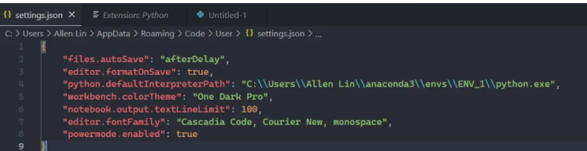
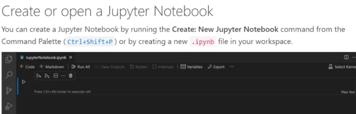
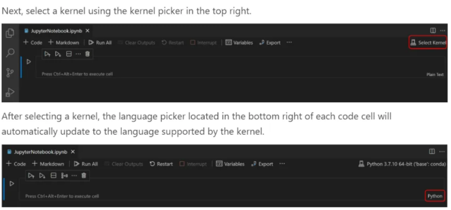

# VS Code 指南

## 目錄
- [Format](#format)
- [MarkDown](#markdown)
- [Run](#run)
- [直接去到檔案位置](#直接去到檔案位置)
- [Shortcut](#shortcut)
- [JSON Settings](#json-settings)
- [VS Code Run Notebook](#vs-code-run-notebook)
- [User Snippet](#user-snippet)
- [Live Server](#live-server)

<br><br>

---

## Format

Ctrl + Shift + P on Windows or Cmd + Shift + P on macOS.

<br>

Type "Format Document" and select the corresponding option.

<br>

The entire document will be automatically formatted according to the default settings.

<br>

ctrl + shift + p → default : prettier → formatons : check

<br>

create a .prettierrc file and follow docs to setting : 範例 :

<br>

```json
{
    "singleQuote": false
}
```

<br><br>

---

## MarkDown

MarkDown Preview Enchanced

<br>

MarkDown All in One

<br><br>

---

## Run

Ctrl + F5

<br><br>

---

## 直接去到檔案位置

ctrl + shift + P

<br>

Go To Files...

<br>

貼上路徑

<br><br>

---

## Shortcut

| 功能 | 快捷鍵 |
|------|-------|
| 複製到下一行 | Alt + Shift + ↑ or ↓ |
| 換行 | Alt + Z |
| 選取整行 | Ctrl + L |
| 放大縮小 | Ctrl + +/- |
| 關閉 TAB | Ctrl + W |
| 切換 TAB | Ctrl + Tab |
| 註解 | Ctrl + / |
| 選取多個同名 | Alt + Click 滑鼠選取多個位置，手動選擇多個位置時超好用 |
| 復原頁面 | Ctrl + Shift + T |

<br><br>

---

## JSON Settings



<br><br>

---

## VS Code Run Notebook



<br>



<br><br>

---

## User Snippet

preferences → user snippet → new global snippets file

<br>

```json
"Print to console": {
    "scope": "javascript,typescript",
    "prefix": "cl",
    "body": ["console.log();"],
    "description": "Log output to console"
}
```

<br><br>

---

## Live Server

extension

<br>

go life button on the bottom right

<br>

install node in web and you can use :

<br>

```bash
node -v
```

<br>

in the command line

<br>

```bash
npm install live-server -g
```

<br>

(globally)

<br>

```bash
liveserver
```
