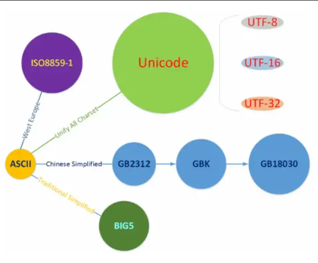

# 編碼指南

## 目錄
- [編碼的本質](#編碼的本質)
- [亂碼的本質](#亂碼的本質)
- [編碼的種類](#編碼的種類)

  

---

## 編碼的本質

電腦其實只懂「數字」（二進位）

 

電腦儲存資料最基本的單位是 byte（位元組），也就是 8 個 bits。

 

比如儲存一段文字 "你好"，在電腦裡就是一連串的 byte 值：

 

範例 `0xE4 0xBD 0xA0 0xE5 0xA5 0xBD`（UTF-8 表示法）

 

但是——這些數字到底是什麼字？

 

電腦本身不知道，它只會把數字交給「編碼解譯器」解釋。

 

### 編碼是「對照表」：數字 ↔ 文字

就像翻譯字典一樣：

 

| byte 值 | 編碼 | 解譯結果 |
|---------|------|----------|
| 0xE4BD... | UTF-8 | 你 |
| 0xC4E3 | GB2312 | 你 |
| 0xA7DA | BIG5 | 妳 |
| 0xA7DA（在 UTF-8） | UTF-8 | ❌亂碼 |

 

這代表：同一串二進位資料，套用不同的「字典」，會解譯出完全不同的結果。

  

---

## 亂碼的本質

解錯字典了！

 

你看到亂碼時，其實是因為：

 

原始文字是用某一種編碼儲存的，但你電腦或程式用錯了另一種編碼去讀它。

 

原本存的是「你好」→ 用 UTF-8 存 → 用 BIG5 讀 → 出現亂碼

  

---

## 編碼的種類

### ASCII（美國標準資訊交換程式碼）

最早的字元編碼系統之一，用 7 位元（bits）表示字元，共可表達 128 個符號。

 

包含：英文字母、數字、標點符號與控制字元。

 

限制：只支援英文，無法顯示中文、日文等非拉丁文字。

 

### ISO8859-1（Latin-1）

基於 ASCII 擴展而來，使用 8 位元（1 byte）可表達 256 個字元。

 

加入了西歐語系常用字元（如德文、法文變音字）。

 

代表這套編碼主要服務於西歐語言。

 

### 中文簡體編碼演進（GB 系列）

這一支線是中國大陸為支援中文簡體而發展的一系列標準。

 

**GB2312**

 

最早的中文簡體編碼標準（1980年代）。

 

支援約 7,000 多個簡體字與常見符號。

 

基於 ASCII 擴展（前128字元與 ASCII 相容）。

 

**GBK（擴展 GB2312）**

 

為支援更多中文字（包含部分繁體、日文假名）而誕生。

 

K = 擴展（Kuozhan），支援 2 萬多個字。

 

**GB18030**

 

國家強制標準，為支援所有中文與 Unicode 的整合版本。

 

支援超過 27000 多個漢字，與 Unicode 全面對應。

 

### BIG5（繁體中文編碼）

台灣與香港地區主流的繁體中文編碼。

 

也是基於 ASCII 擴展，支援繁體中文字集。

 

與 GB 系列是平行發展的分支。

 

### Unicode：統一所有文字編碼的標準

出現目的就是：整合所有語言的文字到一個編碼系統。

 

不再需要因語言切換編碼，每個字在全世界都是唯一的碼點。

 

所有上述編碼（ASCII、ISO8859-1、GB2312、BIG5…）都可以對應到 Unicode。

 

### Unicode 的實際編碼方式（UTF）

Unicode 是一種「字碼表」，而 UTF 是「如何實際儲存」這些字的編碼方式。

 

**UTF-8**

 

可變長度編碼：1~4 bytes。

 

優點：

 

與 ASCII 完全相容（前 128 字元相同）。

 

節省空間（英文只佔 1 byte，中文通常 3 bytes）。

 

網路與儲存最常用格式（如 HTML、JSON 預設都是 UTF-8）。

 

**UTF-16**

 

使用 2 或 4 bytes。

 

適合表示亞洲語系，因為大量漢字可在 2 bytes 內完成。

 

很多作業系統（如 Windows）內部使用 UTF-16。

 

**UTF-32**

 

固定 4 bytes，轉換最簡單但空間浪費。

 

### 整合說明

從早期的單一語言編碼（如 ASCII、西歐 ISO、BIG5、GB2312）一路發展到能支援全球語言的 Unicode。

 

Unicode 不再區分語言、地區或字型，所有字都有統一碼點。

 

而 UTF-8、UTF-16、UTF-32 是它的實作方式。

 

