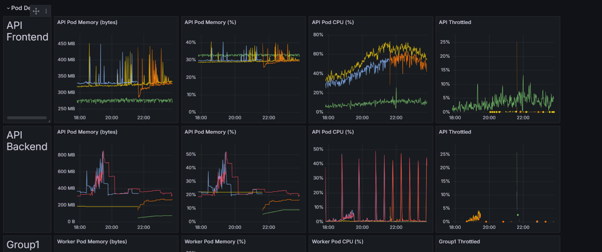
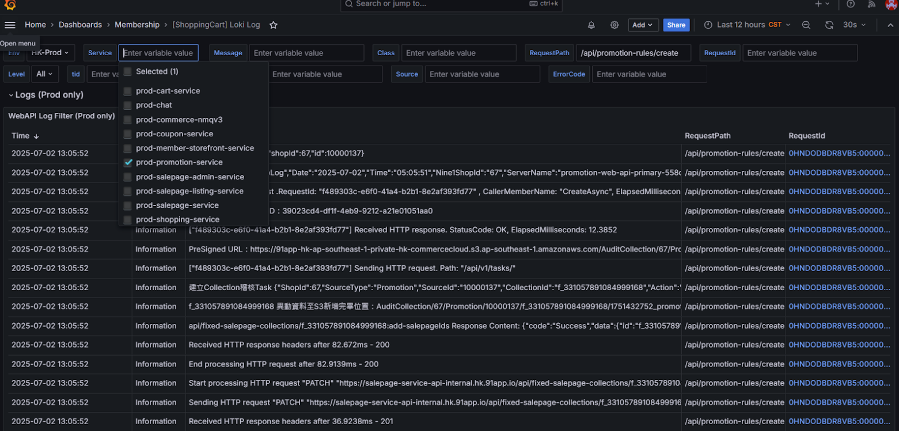
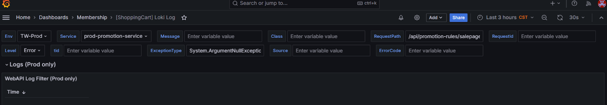
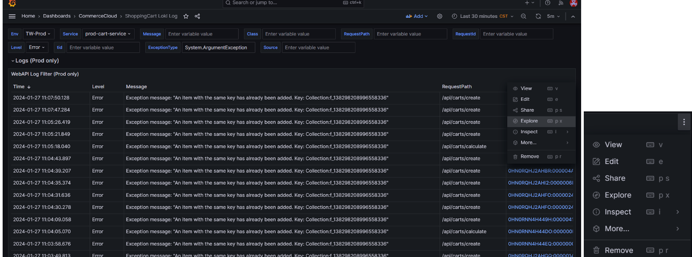
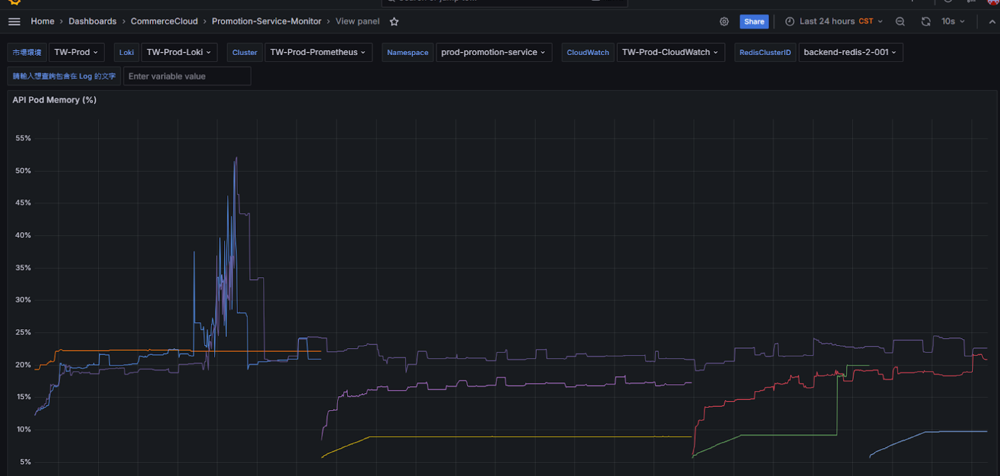
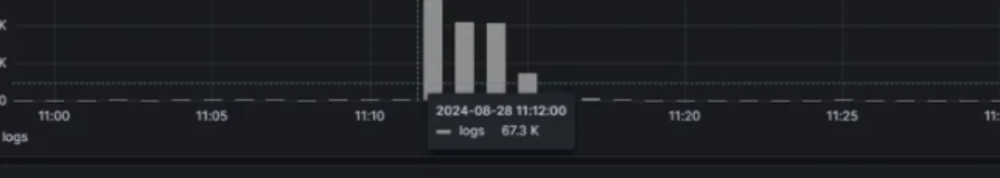
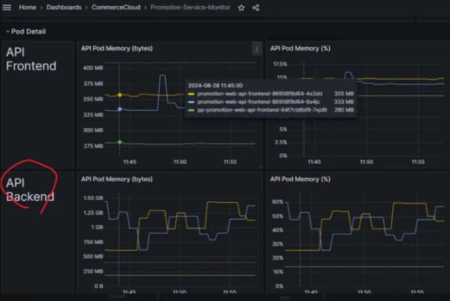
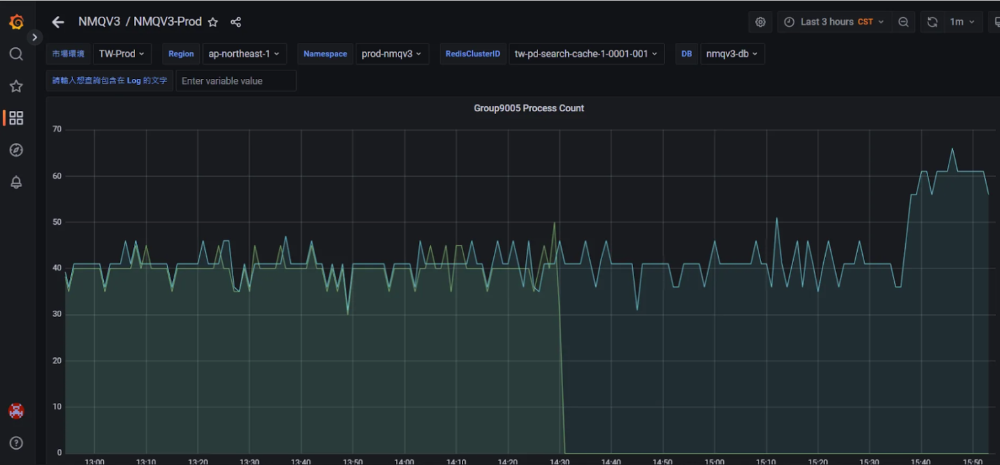
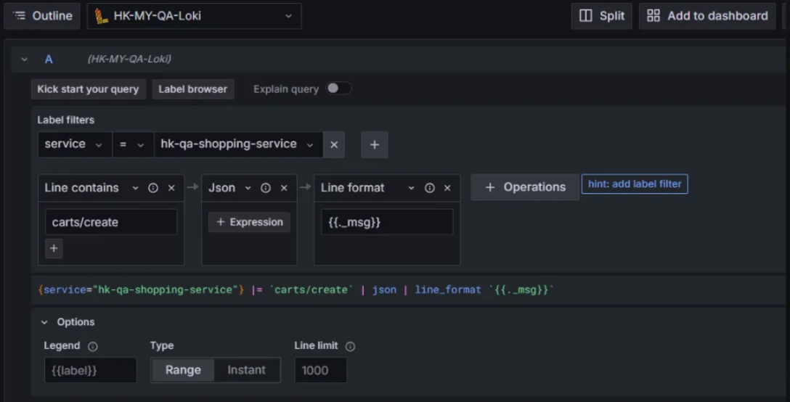

# 📊 Grafana 查詢語法指南

<br>

## 📖 目錄
  - [🔍 關鍵字相關查詢](#-關鍵字相關查詢)
  - [🛠️ Promotion Backend API 相關](#️-promotion-backend-api-相關)
  - [🎯 Promotion Frontend API 相關](#-promotion-frontend-api-相關)
  - [⚙️ Promotion Worker 系列](#️-promotion-worker-系列)
  - [🏪 CommerceCloud Worker](#-commercecloud-worker)
  - [🚨 NMQ 本身的異常紀錄](#-nmq-本身的異常紀錄)
  - [📊 監控 Dashboard](#-監控-dashboard)
  - [🔧 資源監控](#-資源監控)
  - [📥 匯出 Log 的方法](#-匯出-log-的方法)
  - [🔨 Builder Mode](#-builder-mode)
  - [📄 格式相關語法](#-格式相關語法)
  - [❌ 錯誤提示查詢](#-錯誤提示查詢)
  - [🌐 IP 位址查詢](#-ip-位址查詢)
  - [⏱️ 效能監控查詢](#️-效能監控查詢)
  - [📈 Latency 面板監控](#-latency-面板監控)
  - [🚨 Alarm 監控中心](#-alarm-監控中心)

<br>

---

## 🔍 關鍵字相關查詢

**TraceId 查詢**：

```
|= `2c652230-17ad-496e-b8d4-090fb8ec7ed0`
```

**請求內容查詢**：

```
|=`Request content: {\\\"promotionRules\\\`
```

**API 請求追蹤**：

```
\"POST\" https://promotion-api-internal.qa1.hk.91dev.tw/api/promotion-rules/rule-record
```

**請求與回應追蹤**：

<br>

```
"request - traceId
End processing HTTP request after 815.1365ms - 500
Response Status:
Response Data:
::Received data :
Response Status:
request - traceId:  | 
response - traceId:  |
```

<br>

---

## 🛠️ Promotion Backend API 相關

**建立活動規則**：

```
api/promotion-rules/create
```

**驗證錯誤回應範例**：

```
"_msg": "response - traceId:  | {\"errorCode\":\"ValidationException\",\"message\":\" 訂單完成後給點不支援給點效期為「指定到期年 / 月 / 日」\",\"detailErrors\":
[{\"errorCode\":\"NotEqualValidator\",\"message\":\" 訂單完成後給點不支援給點效期為「指定到期年 / 月 / 日」\",\"data\":{\"entity.PeriodType.RewardPointPeriodType\":[\" 訂單完成後給點不支援給點效期為「指定到期年 / 月 / 日」\"]}}]}"
```

**常用 API 端點**：

- `api/promotion-rules/update` - 更新活動規則
- `api/promotion-rules/delete` - 刪除活動規則
- `api/promotion-rules/salepage-list` - 銷售頁列表
- `api/promotion-rules/productsku-outerid-list` - 商品料號外部ID列表
- `api/promotion-rules/productsku-outerid-count` - 商品料號外部ID計數
- `api/promotion-rules/salepage-update` - 銷售頁更新
- `api/promotion-rules/productsku-outerid-update` - 商品料號外部ID更新
- `promotion-rules/category-update` - 分類更新
- `api/promotion-rules/rule-record` - 活動規則記錄

<br>


**DashBoard Source**
source : promotion-web-api-primary-77dbcb65fc-whtwb

https://monitoring-dashboard.91app.io/d/3dSbCsL4k/shoppingcart-loki-log?orgId=2&refresh=30s&var-MarketENV=HK-Prod&var-Service=prod-promotion-service&var-Message=&var-Class=&var-RequestPath=&var-RequestId=&var-Level=All&var-Loki=RjRcuuN4k&var-Cluster=dfHnWT74z&var-tid=&var-ExceptionType=&var-Source=promotion-web-api-primary&var-ErrorCode=

https://monitoring-dashboard.91app.io/d/3dSbCsL4k/shoppingcart-loki-log?orgId=2&from=now-1h&to=now&var-MarketENV=TW-Prod&var-Message=&var-Class=&var-RequestPath=&var-RequestId=&var-Level=Error&var-Loki=ZIOlfD44k&var-Cluster=hxdP8t7Vz&var-tid=&var-ExceptionType=&var-Source=promotion-web-api-primary&var-Service=prod-promotion-service&refresh=30s&var-ErrorCode=


<br>

---


## 🎯 Promotion Frontend API 相關

**購物車計算**：

```
/api/cart-calculate
/api/carts/create
2 Calculate Data:
```

Response Data
```JSON

{
  "Shop": {
    "Id": 2,
    "Tags": [
      "EnableAddOns"
    ]
  },
  "User": {
    "Id": "33132",
    "Tags": [
      "AllUserScope",
      "CrmShopMemberCard:5"
    ],
    "OuterId": "tina20241018",
    "ShopMemberCode": "syKJM0lLY09hSeIEGA6U2Q=="
  },
  "Shipping": {
    "ShippingProfileTypeDef": "Oversea",
    "ShippingAreaId": 0,
    "CountryProfileId": 1,
    "LocationId": 0
  },
  "Payment": {
    "PayProfileTypeDef": "CreditCardOnce_Stripe"
  },
  "Channel": "Web",
  "CurrencyDecimalDigits": 2,
  "SalepageSkuList": [
    {
      "SalepageId": 61041,
      "SkuId": 84791,
      "Price": 20,
      "SuggestPrice": 25,
      "Qty": 10,
      "Flags": [],
      "OuterId": "",
      "Tags": null,
      "OptionalTypeDef": "",
      "OptionalTypeId": 0,
      "CartExtendInfoItemGroup": 0,
      "CartExtendInfoItemType": "Major",
      "PointsPayPair": null,
      "CartExtendInfos": [],
      "CartId": 43561
    }
  ],
  "FeeList": [
    {
      "Id": 409,
      "Type": "ShippingFee",
      "Price": 30,
      "Payment": 0,
      "ExtendInfo": {
        "ShippingProfileTypeDef": "Oversea",
        "IsDomesticWeightPricing": false,
        "TemperatureTypeDef": "Normal",
        "ShippingType": "409",
        "ShippingAreaId": 1,
        "IsLocal": false
      }
    }
  ],
  "Promotion": {
    "Code": null,
    "PromoCodePoolGroupId": null,
    "SelectedDesignatePaymentPromotionId": 0
  },
  "CouponSetting": {
    "MultipleRedeem": {
      "Discount": {
        "IsMultiple": true,
        "Qty": 10
      },
      "Gift": {
        "IsMultiple": true,
        "Qty": 9999
      },
      "Shipping": {
        "IsMultiple": false,
        "Qty": 1
      }
    },
    "CouponList": [],
    "Options": {
      "IsVerbose": false,
      "IsCouponPreSelect": false,
      "IncludeRecordDetail": false
    },
    "LoyaltyPoint": {
      "CheckoutPoint": 0,
      "CheckoutDiscountPrice": 190,
      "IsSelected": false,
      "IsSetDiscountPrice": false,
      "TotalPoint": 865483
    }
  }
}

```


**購物籃計算**：

```
/api/basket-calculate 
2 Basket Data: 
CalculateByProcessGroup
RuleList Count: 1
```

**銷售頁服務呼叫**：

```
Start processing HTTP request \"POST\" https://salepage-service-api-internal.qa1.hk.91dev.tw/api/salepage-collections:match\
.GetMatchedSalepageCollectionFromCustomRuleAsync() 回傳結果為空
```

**S3 資料處理流程**：


```
S3 取得商品與商品料號的標籤對應關係, 開始
S3 檔案 SaleProducts 節點為空
比對活動圈選料號結果為空
S3 取得門市資訊, 開始
S3 取得門市資訊, 結束
```

<br>

**活動規則處理**：

```
RuleId: 5728, Type: RewardReachPriceWithRatePoint, Priority: 90000 -> 90000
活動序號 \"\" GetPromotionListAsync() 回傳結果為空
"PromotionRuleIds\":[6886]
"CartExtendInfoItemGroup\":82774
```


---

## ⚙️ Promotion Worker 系列

**關鍵字**：

```
PromotionRewardLoyaltyPointsV2
RecycleLoyaltyPointsV2

|=`Request content: {\\\"promotionRules\\\`

::Received data

```

**BY TS 看 Recycle 跑幾次要對應 promotionId**

```
{service="hk-qa-promotion-service"}
|json
|_props_JobName = `RecycleLoyaltyPointsV2`
|=`TS250710P000006`
|=`items:\"[]\`
|=`訂單編號:TS250710P000006，回饋活動序號：7541`
```

**by TaskId**
```
{service="hk-qa-promotion-service"}
|json
| _props_TaskId = `ec72d512-a629-4478-b8b3-5e7275da2b98`


{service="prod-promotion-service"} 
|json
| _props_TaskId = `bf0f43ae-b413-4340-8585-14c6023799eb`
|json
| line_format "{{._msg}}"
```

<br>


---

## 🏪 CommerceCloud Worker

**角標封存作業**：

<br>

```
角標封存job 關鍵字
正在處理角標ID
```

<br>

---

## 🚨 NMQ 本身的異常紀錄

### 1. Job 無法啟動，出現 [null]

**可能原因**：可能沒有加 Job 進 Dashboard 會沒上程式碼

<br>

**正常 log 範例示意圖**：

<br>

### 2. NMQ 卡住 Ready

**解決方法**：到 Rancher 對該 Group 執行 Redeploy

<br>

---

## 📊 監控 Dashboard

### 1. PromotionService

**URL**：https://monitoring-dashboard.91app.io/d/kJHAWhwVk/promotion-service-monitor?orgId=2



<br>

**LOKI LOG**:https://monitoring-dashboard.91app.io/d/3dSbCsL4k/shoppingcart-loki-log?orgId=2&var-Level=All&var-Message=&var-RequestPath=%2Fapi%2Fpromotion-rules%2Fcreate&var-RequestId=&var-Class=&var-Loki=RjRcuuN4k&var-MarketENV=HK-Prod&var-Cluster=dfHnWT74z&var-tid=&from=now-12h&to=now&var-ExceptionType=&var-Source=&var-ErrorCode=&var-Service=prod-promotion-service&refresh=30s



<br>

### 2. ShoppingCart

**ShoppingCart Loki Log**：https://monitoring-dashboard.91app.io/d/3dSbCsL4k/shoppingcart-loki-log?orgId=2&refresh=30s&var-MarketENV=TW-Prod&var-Service=prod-promotion-service&var-Message=&var-Class=&var-RequestPath=%2Fapi%2Fpromotion-rules%2Fsalepage-update&var-RequestId=&var-Level=Error&var-Loki=ZIOlfD44k&var-Cluster=hxdP8t7Vz&var-tid=&var-ExceptionType=System.ArgumentNullException&var-Source=&var-ErrorCode=&from=now-3h&to=now



<br>

**篩選方式範例**：
- Service：`prod-cart-service`
- Level：`Error`
- ExceptionType：`System.ArgumentException`




<br>

---

## 🔧 資源監控

### 1. API Pod Memory

**URL**：https://monitoring-dashboard.91app.io/d/kJHAWhwVk/promotion-service-monitor?orgId=2&refresh=10s&from=now-24h&to=now&viewPanel=182




<br>

### 2. 哪一支 API 高峰

```
sum by(_props_RequestPath) ( count_over_time(
{service="prod-promotion-service",container="promotion-web-api"}
| json
|  line_format "{{._props_RequestPath}}" [1m])
)
```




<br>

### 3. Job 處理狀況

**關鍵字**：
```
group9005
SendTemplateMailShopMemberPresent
```



<br>

---

## 📥 匯出 Log 的方法

**操作步驟**：Query inspector > Data > CSV

<br>

小技巧

```
{service="prod-promotion-service"}
|json
| _props_TaskId = `2a5661bb-6e78-4d4a-850e-b05b4c6c4435`
```

直接包 csv 出來


---

## 🔨 Builder Mode

可以選擇 **Builder Mode** 或 **Code Mode**



<br>

---

## 📄 格式相關語法

**JSON 格式查詢**：

```
|json
|line_format "{{._msg}}"
```

<br>

**任務ID 查詢**：

```
| _props_TaskId = `ba742916-6b34-44d2-83e7-fb89426cb9ca`
```

<br>

**追蹤ID 查詢**：

```
_tid
Root=1-67dbdc15-1fbb2f51540973ad1a5bea5a
```

<br>

**工作名稱查詢**：

```
|_props_JobName = `RecycleLoyaltyPointsV2`
```

<br>

**Output 所有錯誤 Task**

```
{service="prod-promotion-service", container="promotion-console-nmqv3worker-group3"} 
|json
|= `TaskProcess is FAILED.`
```

```
{service="prod-promotion-service", container="promotion-console-nmqv3worker-group3"} 
|json
|= `查無有效的訂單資料`
```

---

## ❌ 錯誤提示查詢

**服務暫時不可用**：

<br>

```
<head><title>503 Service Temporarily Unavailable</title></head>
unable to resolve service
```

<br>

**稽核錯誤**：

```
|= `稽核時發生錯誤`
```

<br>

---

## 🌐 IP 位址查詢

**錯誤請求來源 IP 追蹤**：

<br>

```
{service=~"prod-cart-service", container=~".*api.*|.*nmqv3worker.*", container!~".*pp-.*|monitor|aws-config-loader"}
|~ `Error`
| json
| line_format "{{._msg}}"
| json
| line_format "{{._props_RemoteAddress}} {{_props_RequestPath}}"
```

<br>

**查詢說明**：

| 項目 | 語法 | 說明 |
|------|------|------|
| 服務篩選 | `service=~"prod-cart-service"` | 指定購物車服務 |
| 容器篩選 | `container=~".*api.*\|.*nmqv3worker.*"` | 包含 API 或 NMQ Worker 容器 |
| 容器排除 | `container!~".*pp-.*\|monitor\|aws-config-loader"` | 排除特定容器類型 |
| 錯誤過濾 | `\|~ \`Error\`` | 僅顯示包含錯誤的日誌 |
| JSON 解析 | `\| json` | 解析 JSON 格式日誌 |
| 訊息格式化 | `\| line_format "{{._msg}}"` | 格式化顯示訊息內容 |
| IP 位址提取 | `\| line_format "{{._props_RemoteAddress}}"` | 提取遠端 IP 位址資訊 |

<br>

**實際應用場景**：

- **異常流量分析**：識別產生大量錯誤請求的 IP 來源
- **安全監控**：追蹤可疑的請求來源位址
- **負載分析**：了解不同 IP 的請求分布情況
- **問題排查**：定位特定 IP 的錯誤模式

<br>

---

## ⏱️ 效能監控查詢

**每一步的耗時分析**：

<br>

```
{service="prod-shopping-service"}
|=`Nine1HttpLog`
|json
| line_format "{{._msg}}"
| json
| line_format "{{.UriStem}} {{.TimeTaken}}"
```

<br>

**查詢說明**：

| 項目 | 語法 | 說明 |
|------|------|------|
| 服務指定 | `service="prod-shopping-service"` | 指定購物服務 |
| 日誌類型 | `\|=\`Nine1HttpLog\`` | 篩選 HTTP 請求日誌 |
| JSON 解析 | `\| json` | 解析 JSON 格式的日誌資料 |
| 訊息提取 | `\| line_format "{{._msg}}"` | 提取主要訊息內容 |
| 效能資訊 | `\| line_format "{{.UriStem}} {{.TimeTaken}}"` | 顯示 API 路徑和執行時間 |

<br>

**輸出格式範例**：
```
/api/shopping/cart/calculate 1250ms
/api/shopping/order/create 875ms
/api/shopping/product/search 320ms
```

<br>

**實際應用場景**：

- **API 效能分析**：識別執行時間較長的 API 端點
- **瓶頸定位**：找出系統效能瓶頸所在
- **效能基準**：建立 API 回應時間的基準值
- **效能監控**：持續監控系統效能變化

<br>

---

## 📈 Latency 面板監控

**Shopping Service Alert Dashboard**：

<br>

**監控面板 URL**：
```
https://monitoring-dashboard.91app.io/d/aen3tgg0mmvpcd/shopping-service-alert?viewPanel=panel-256&orgId=2&from=2025-08-29T02:45:41.388Z&to=2025-08-29T03:19:24.317Z&timezone=Asia%2FTaipei&var-MarketENV=TW-Prod&var-Loki=ZIOlfD44k&var-Cluster=hxdP8t7Vz&var-Namespace=prod-shopping-service&var-Sandbox_Namespace=sandbox-api-gateway&var-CacheClusterID=backend-redis-2-001&var-CloudWatch=kYZD-B7Vk&var-LOG_CONTAIN_STRING=&var-topk_1_node=ip-10-2-218-109.ap-northeast-1.compute.internal&var-Quey_Taints=sg&var-Service_Catalog=appgen
```

<br>

**面板參數說明**：

| 參數 | 值 | 說明 |
|------|-----|------|
| `viewPanel` | `panel-256` | 指定顯示的面板 ID |
| `MarketENV` | `TW-Prod` | 台灣生產環境 |
| `Namespace` | `prod-shopping-service` | 購物服務命名空間 |
| `Cluster` | `hxdP8t7Vz` | 叢集識別碼 |
| `CloudWatch` | `kYZD-B7Vk` | CloudWatch 資料源 |
| `timezone` | `Asia/Taipei` | 台北時區 |

<br>

**監控重點項目**：

- **Latency 分布**：查看 API 回應時間分布情況
- **異常峰值**：識別異常的延遲峰值
- **趨勢分析**：觀察延遲時間的變化趨勢
- **SLA 監控**：確保服務符合 SLA 要求

<br>

**使用建議**：

1. **時間範圍調整**：根據需要調整 `from` 和 `to` 參數
2. **環境切換**：修改 `MarketENV` 切換不同環境
3. **叢集監控**：透過 `Cluster` 參數監控特定叢集
4. **即時監控**：定期檢查面板以監控系統健康狀態

<br>

---

## 🚨 Alarm 監控中心

**Shopping Service Alert 完整監控面板**：

<br>

**監控中心 URL**：
```
https://monitoring-dashboard.91app.io/d/aen3tgg0mmvpcd/shopping-service-alert?orgId=2&from=now-6h&to=now&timezone=Asia%2FTaipei&var-MarketENV=TW-Prod&var-Loki=ZIOlfD44k&var-Cluster=hxdP8t7Vz&var-Namespace=prod-shopping-service&var-Sandbox_Namespace=sandbox-api-gateway&var-CacheClusterID=backend-redis-2-001&var-CloudWatch=kYZD-B7Vk&var-LOG_CONTAIN_STRING=&var-topk_1_node=ip-10-2-218-109.ap-northeast-1.compute.internal&var-Quey_Taints=sg&var-Service_Catalog=appgen
```

<br>

**監控面板特色**：

| 監控類型 | 說明 | 功能 |
|----------|------|------|
| **服務健康度** | 整體服務狀態監控 | 即時查看服務可用性狀態 |
| **效能指標** | API 回應時間和吞吐量 | 監控系統效能表現 |
| **錯誤追蹤** | 錯誤率和異常事件 | 快速識別系統問題 |
| **資源使用** | CPU、記憶體、網路使用率 | 監控基礎設施資源 |
| **警報管理** | 自動警報和通知機制 | 主動通知系統異常 |

<br>

**關鍵監控指標**：

- **🔴 Critical Alerts**：需要立即處理的緊急警報
- **🟡 Warning Alerts**：需要關注的警告事件
- **📊 Performance Metrics**：效能相關指標趨勢
- **📈 Traffic Analysis**：流量分析和模式識別
- **🔧 Infrastructure Health**：基礎設施健康狀態

<br>

**使用場景**：

1. **日常監控**：作為日常運維的主要監控面板
2. **故障排查**：快速定位和分析系統問題
3. **效能優化**：基於監控資料進行效能調優
4. **容量規劃**：根據趨勢資料進行容量規劃
5. **SLA 管理**：確保服務符合 SLA 要求

<br>

**操作建議**：

- **定期檢查**：建議每天至少檢查 2-3 次
- **設定書籤**：將此 URL 加入瀏覽器書籤便於快速存取
- **客製化時間範圍**：根據需要調整 `from` 和 `to` 參數
- **多環境監控**：透過修改 `MarketENV` 監控不同環境

<br>
