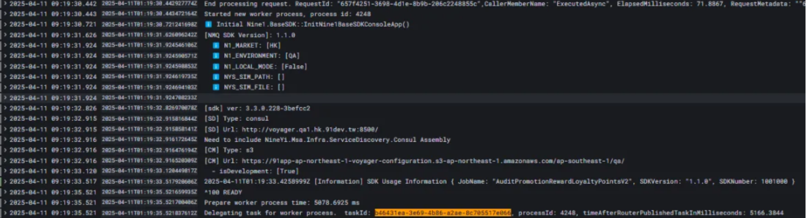
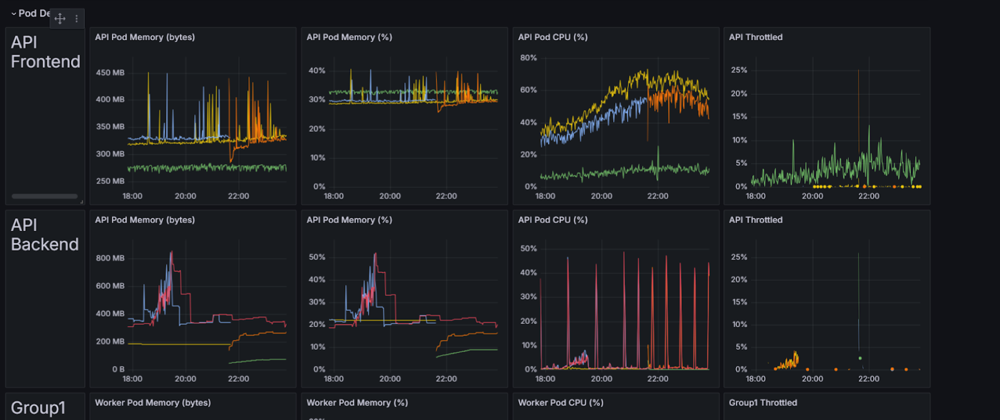
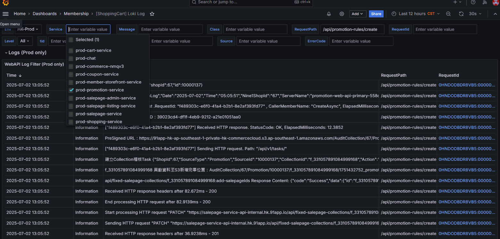
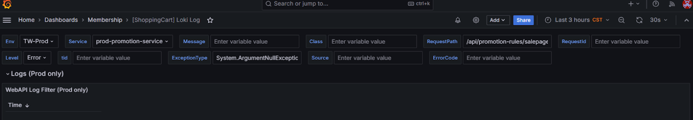
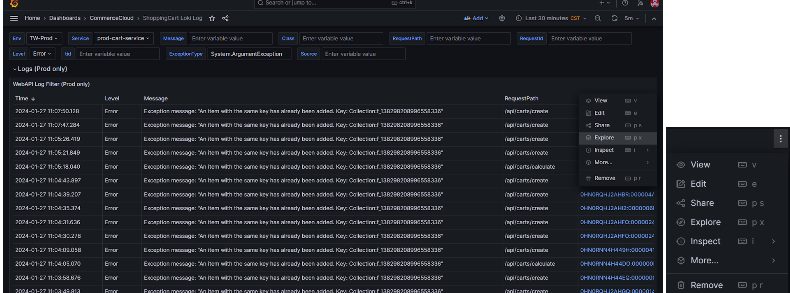
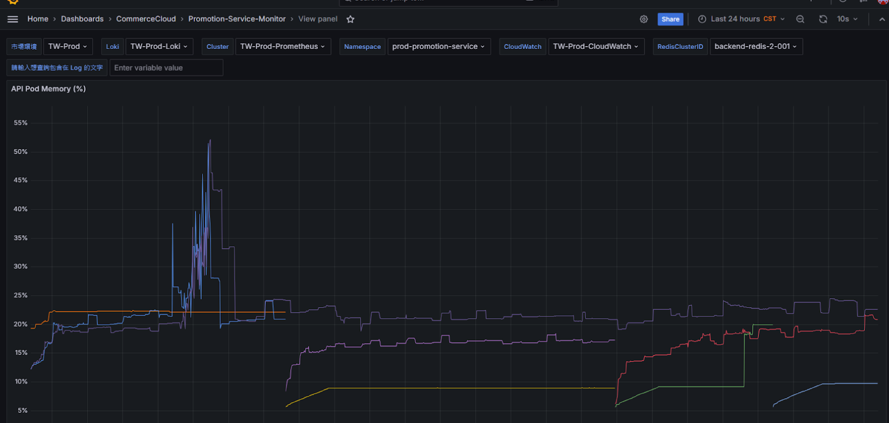
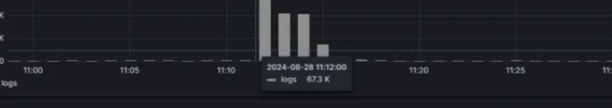
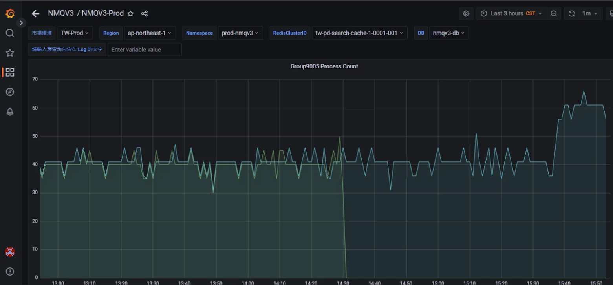
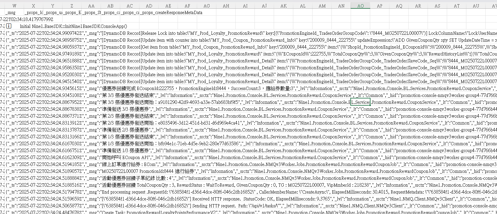

# 📊 Grafana 查詢語法指南

<br>

## 📖 目錄

### 🔧 基礎查詢語法
- [1. 關鍵字與語法](#1-關鍵字與語法)

### 🐛 故障排除
- [2. Job 無法啟動出現null](#2-job-無法啟動出現null)
- [3. NMQ 卡住 Ready](#3-nmq-卡住-ready)

### 📊 監控面板
- [4. 監控 Dashboard](#4-監控-dashboard)
- [5. API Pod Memory](#5-api-pod-memory)
- [6. 哪一支 API 高峰](#6-哪一支-api-高峰)

### 📋 Job 處理
- [7. Job Group 處理狀況](#7-job-group-處理狀況)

### 📥 資料匯出與操作
- [8. 匯出 Log 的方法](#8-匯出-log-的方法)
- [9. Builder Mode](#9-builder-mode)

### 🔍 查詢與分析
- [10. IP 位址查詢](#10-ip-位址查詢)
- [11. 效能監控查詢](#11-效能監控查詢)
- [12. API Latency by ingress](#12-api-latency-by-ingress)

### 🚨 監控中心
- [13. Shopping Service Alert 完整監控面板](#13-shopping-service-alert-完整監控面板)

<br>

---

## 1. 關鍵字與語法

- request - traceId
- Request content
- \"POST\"
- End processing
- Response Status
- ::Received data :
- response - traceId

```plaintext
|json
|line_format "{{._msg}}"
```

```plaintext
| _props_TaskId = `ba742916-6b34-44d2-83e7-fb89426cb9ca`
```

```plaintext
_tid
Root=1-67dbdc15-1fbb2f51540973ad1a5bea5a
```

```plaintext
|_props_JobName = `RecycleLoyaltyPointsV2`
```

```plaintext
{service="prod-promotion-service", container="promotion-console-nmqv3worker-group3"} 
|json
|= `TaskProcess is FAILED.`
```

```plaintext
{service="prod-promotion-service", container="promotion-console-nmqv3worker-group3"} 
|json
|= `查無有效的訂單資料`
```

```plaintext
<head><title>503 Service Temporarily Unavailable</title></head>
unable to resolve service
```

```
|= `稽核時發生錯誤`
```

<br>
<br>

---

## 2. Job 無法啟動出現null

**可能原因**：可能沒有加 Job 進 Dashboard 或沒上程式碼
**正常 log 範例示意圖**：


<br>
<br>

## 3. NMQ 卡住 Ready

**解決方法**：到 Rancher 對該 Group 執行 Redeploy

<br>
<br>

## 4. 監控 Dashboard

### PromotionService

**URL**：https://monitoring-dashboard.91app.io/d/kJHAWhwVk/promotion-service-monitor?orgId=2



<br>

**LOKI LOG**:https://monitoring-dashboard.91app.io/d/3dSbCsL4k/shoppingcart-loki-log?orgId=2&var-Level=All&var-Message=&var-RequestPath=%2Fapi%2Fpromotion-rules%2Fcreate&var-RequestId=&var-Class=&var-Loki=RjRcuuN4k&var-MarketENV=HK-Prod&var-Cluster=dfHnWT74z&var-tid=&from=now-12h&to=now&var-ExceptionType=&var-Source=&var-ErrorCode=&var-Service=prod-promotion-service&refresh=30s



<br>

### ShoppingCart

**ShoppingCart Loki Log**：https://monitoring-dashboard.91app.io/d/3dSbCsL4k/shoppingcart-loki-log?orgId=2&refresh=30s&var-MarketENV=TW-Prod&var-Service=prod-promotion-service&var-Message=&var-Class=&var-RequestPath=%2Fapi%2Fpromotion-rules%2Fsalepage-update&var-RequestId=&var-Level=Error&var-Loki=ZIOlfD44k&var-Cluster=hxdP8t7Vz&var-tid=&var-ExceptionType=System.ArgumentNullException&var-Source=&var-ErrorCode=&from=now-3h&to=now



<br>

**篩選方式範例**：
- Service：`prod-cart-service`
- Level：`Error`
- ExceptionType：`System.ArgumentException`



<br>
<br>

## 5. API Pod Memory

**URL**：https://monitoring-dashboard.91app.io/d/kJHAWhwVk/promotion-service-monitor?orgId=2&refresh=10s&from=now-24h&to=now&viewPanel=182




<br>

## 6. 哪一支 API 高峰

```
sum by(_props_RequestPath) ( count_over_time(
{service="prod-promotion-service",container="promotion-web-api"}
| json
|  line_format "{{._props_RequestPath}}" [1m])
)
```



<br>
<br>

## 7. Job Group 處理狀況

**關鍵字**：
```
group9005
SendTemplateMailShopMemberPresent
```



<br>
<br>

## 8. 匯出 Log 的方法

**操作步驟**：Query inspector > Data > CSV

<br>

小技巧

```
{service="prod-promotion-service"}
|json
| _props_TaskId = `2a5661bb-6e78-4d4a-850e-b05b4c6c4435`
```

直接包 csv 出來


<br>
<br>

## 9. Builder Mode

可以選擇 **Builder Mode** 或 **Code Mode**


<br>
<br>

## 10. IP 位址查詢

**錯誤請求來源 IP 追蹤**：

<br>

```
{service=~"prod-cart-service", container=~".*api.*|.*nmqv3worker.*", container!~".*pp-.*|monitor|aws-config-loader"}
|~ `Error`
| json
| line_format "{{._msg}}"
| json
| line_format "{{._props_RemoteAddress}} {{_props_RequestPath}}"
```

<br>
<br>

## 11. 效能監控查詢

### 每一步的耗時分析

```plaintext
{service="prod-shopping-service"}
|=`Nine1HttpLog`
|json
| line_format "{{._msg}}"
| json
| line_format "{{.UriStem}} {{.TimeTaken}}"
```

**輸出格式範例**：
```
/api/shopping/cart/calculate 1250ms
/api/shopping/order/create 875ms
/api/shopping/product/search 320ms
```

<br>
<br>

## 12. API Latency by ingress

<br>

**監控面板 URL**：
```
https://monitoring-dashboard.91app.io/d/aen3tgg0mmvpcd/shopping-service-alert?viewPanel=panel-256&orgId=2&from=2025-08-29T02:45:41.388Z&to=2025-08-29T03:19:24.317Z&timezone=Asia%2FTaipei&var-MarketENV=TW-Prod&var-Loki=ZIOlfD44k&var-Cluster=hxdP8t7Vz&var-Namespace=prod-shopping-service&var-Sandbox_Namespace=sandbox-api-gateway&var-CacheClusterID=backend-redis-2-001&var-CloudWatch=kYZD-B7Vk&var-LOG_CONTAIN_STRING=&var-topk_1_node=ip-10-2-218-109.ap-northeast-1.compute.internal&var-Quey_Taints=sg&var-Service_Catalog=appgen
```

<br>

---

## 13. Shopping Service Alert 完整監控面板

**監控中心 URL**：
```
https://monitoring-dashboard.91app.io/d/aen3tgg0mmvpcd/shopping-service-alert?orgId=2&from=now-6h&to=now&timezone=Asia%2FTaipei&var-MarketENV=TW-Prod&var-Loki=ZIOlfD44k&var-Cluster=hxdP8t7Vz&var-Namespace=prod-shopping-service&var-Sandbox_Namespace=sandbox-api-gateway&var-CacheClusterID=backend-redis-2-001&var-CloudWatch=kYZD-B7Vk&var-LOG_CONTAIN_STRING=&var-topk_1_node=ip-10-2-218-109.ap-northeast-1.compute.internal&var-Quey_Taints=sg&var-Service_Catalog=appgen
```