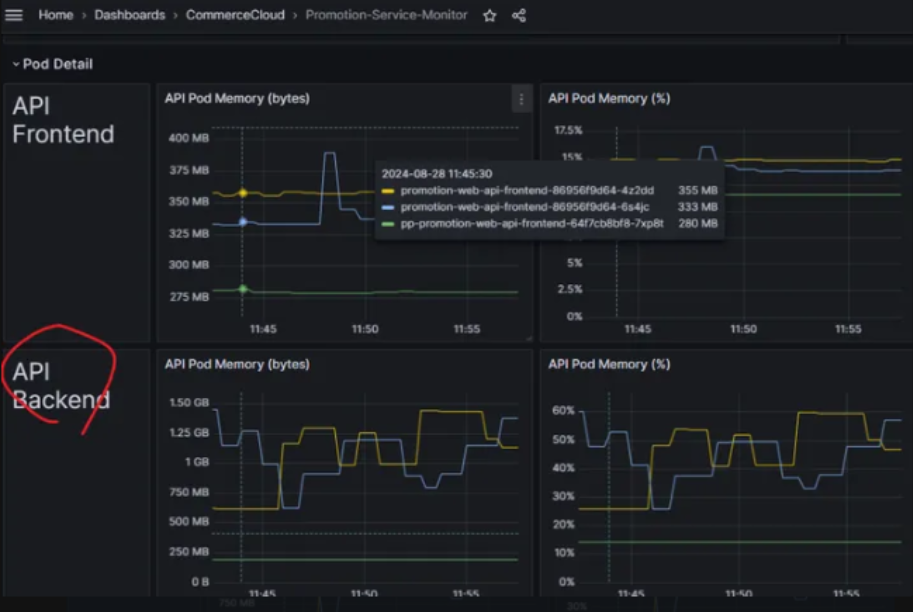

## 基本

```bash
|json
|line_format "{{._msg}}"
```


## API

```bash
request - traceId
Request content
\"POST\"
End processing
Response Status
::Received data :
response - traceId


_tid
Root=1-67dbdc15-1fbb2f51540973ad1a5bea5a
```


## 計算 API Request 分布

```BASH
sum by(_props_RequestPath) ( count_over_time(
{service="prod-promotion-service",container="promotion-web-api"}
| json
|  line_format "{{._props_RequestPath}}" [1m])
)
```





## Nine1HttpLog 算秒數

```bash
{service="prod-shopping-service"}
|=`Nine1HttpLog`
|json
| line_format "{{._msg}}"
| json
| TimeTaken > 24000
| line_format "{{.UriStem}} {{.TimeTaken}}"
```