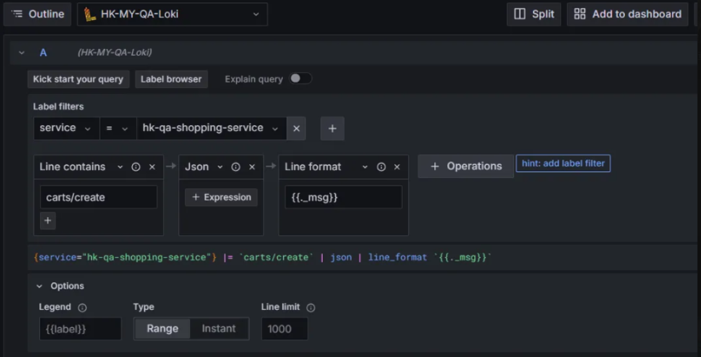

## tips


grafana 要拉 stacktrace 不能太格式化


## 匯出 Log 的方法

Query inspector > Data > CSV

```
{service="prod-promotion-service"}
|json
| _props_TaskId = `2a5661bb-6e78-4d4a-850e-b05b4c6c4435`
```

直接包 csv 出來


## Builder Mode

可以選擇 **Builder Mode** 或 **Code Mode**


