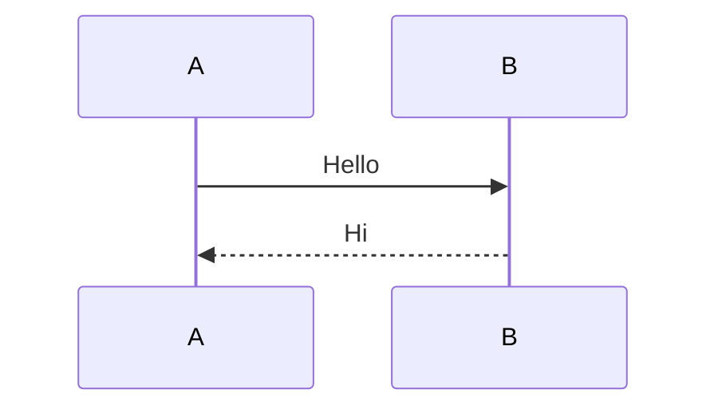

# Hexo Butterfly：Mermaid 圖表無法渲染 — Plugin 與主題 Selector 衝突

## 問題描述

在 Hexo 文章中使用 ` ```mermaid ``` ` 語法撰寫流程圖，`hexo deploy` 後網頁上只顯示原始的程式碼文字，沒有渲染成 SVG 圖表。

---

## 環境

- Hexo 7.2.0
- 主題：Butterfly
- 已安裝：`hexo-filter-mermaid-diagrams@1.0.5`
- Butterfly `_config.yml`：`mermaid.enable: true`、`mermaid.code_write: true`

---

## 根本原因（完整鏈條）

```
使用者寫 ```mermaid```
    ↓
hexo-filter-mermaid-diagrams（已安裝的 plugin）
    將 code fence 轉成 <pre class="mermaid">...</pre>
    ↓
Butterfly 的 mermaid.pug 只查詢 .mermaid-wrap
    （這是  tag 才會產生的 class）
    → 找不到任何元素 → 直接 return
    → mermaid.js 根本沒被載入
    ↓
<pre class="mermaid"> 被當成普通 code block 顯示 ❌
```

| 語法 | Plugin 產生的 HTML | Butterfly JS 能找到？ |
|------|-------------------|----------------------|
| ` ```mermaid``` ` | `<pre class="mermaid">` | ❌ 找不到 |
| `` | `<div class="mermaid-wrap">` | ✅ 找得到 |

---

## 撞牆經歷

### 誤判一：以為是 highlight.js 的問題
`_config.yml` 已設定 `exclude_languages: ['mermaid']`，理論上 mermaid code block 不會被 highlight.js 上色處理，方向是對的，但這不是「為何沒渲染」的根本原因。

### 誤判二：改用 `` tag 後整個區塊消失
將語法從 ` ```mermaid``` ` 改成 `...` 後，發現區塊在畫面上完全消失（空白）。

**原因：** `` 產生的 HTML 是：
```html
<div class="mermaid-wrap">
  <pre class="mermaid-src" hidden>...</pre>
</div>
```

`<pre>` 上有 `hidden` 屬性、外層 `div` 沒有任何 fallback 樣式，等到 mermaid.js 渲染完才會插入 SVG。如果 mermaid.js 沒成功載入或執行，畫面就是一片空白。

---

## 解法：修改 mermaid.pug，讓兩種來源都能被處理

**修改檔案：** `themes/butterfly/layout/includes/third-party/math/mermaid.pug`

**改動重點：**
1. querySelector 從只找 `.mermaid-wrap` 改為**同時找** `.mermaid-wrap` 和 `pre.mermaid`
2. 根據元素類型決定如何取得 mermaid 原始碼（`firstElementChild` vs 元素本身）
3. plugin 產生的 `<pre class="mermaid">` 渲染完後用 `display:none` 隱藏原始 `<pre>`

```diff
- const $mermaid = document.querySelectorAll('#article-container .mermaid-wrap')
+ const $mermaid = document.querySelectorAll('#article-container .mermaid-wrap, #article-container pre.mermaid')

  Array.from($mermaid).forEach((item, index) => {
-   const mermaidSrc = item.firstElementChild
+   const isMermaidWrap = item.classList.contains('mermaid-wrap')
+   const mermaidSrc = isMermaidWrap ? item.firstElementChild : item
    ...
+   const insertSvg = (svg) => {
+     item.insertAdjacentHTML('afterend', svg)
+     if (!isMermaidWrap) item.style.display = 'none'
+   }
  })
```

---

## 文章語法不需要修改

使用 ` ```mermaid``` ` code fence 語法即可，`hexo-filter-mermaid-diagrams` plugin 會自動轉換：

````markdown

````

---

## 相關檔案

| 檔案 | 說明 |
|------|------|
| `themes/butterfly/layout/includes/third-party/math/mermaid.pug` | **修改點**：新增 `pre.mermaid` selector |
| `themes/butterfly/scripts/tag/mermaid.js` | Butterfly 內建 tag 產生 `.mermaid-wrap` 的邏輯 |
| `node_modules/hexo-filter-mermaid-diagrams/lib/render.js` | Plugin 將 code fence 轉成 `<pre class="mermaid">` 的邏輯 |
| `themes/butterfly/_config.yml` | `mermaid.enable: true` 必須開啟 |
| `_config.yml` | `exclude_languages: ['mermaid']` 避免 highlight.js 干擾 |

---

## 核心觀念

> **`hexo-filter-mermaid-diagrams` 和 Butterfly 內建 mermaid 是兩套平行機制**，兩者產生不同的 HTML class，JS 渲染端只認識自己那套。只要讓 `mermaid.pug` 的 querySelector 也認識 plugin 產生的 `pre.mermaid`，兩種語法就都能正確渲染。
