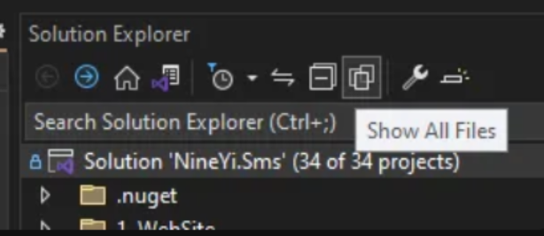
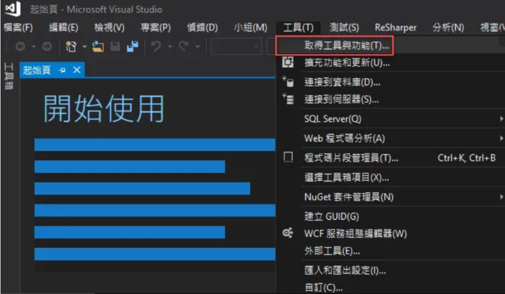
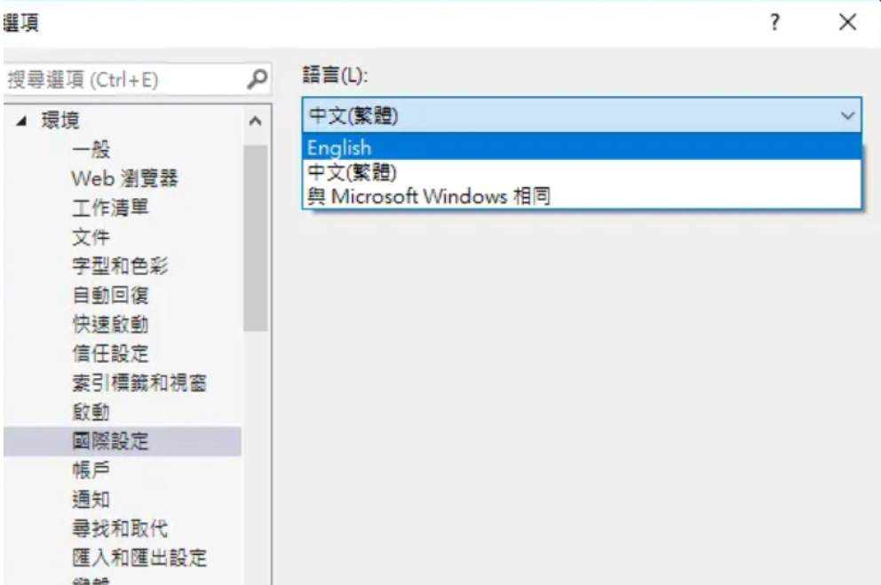
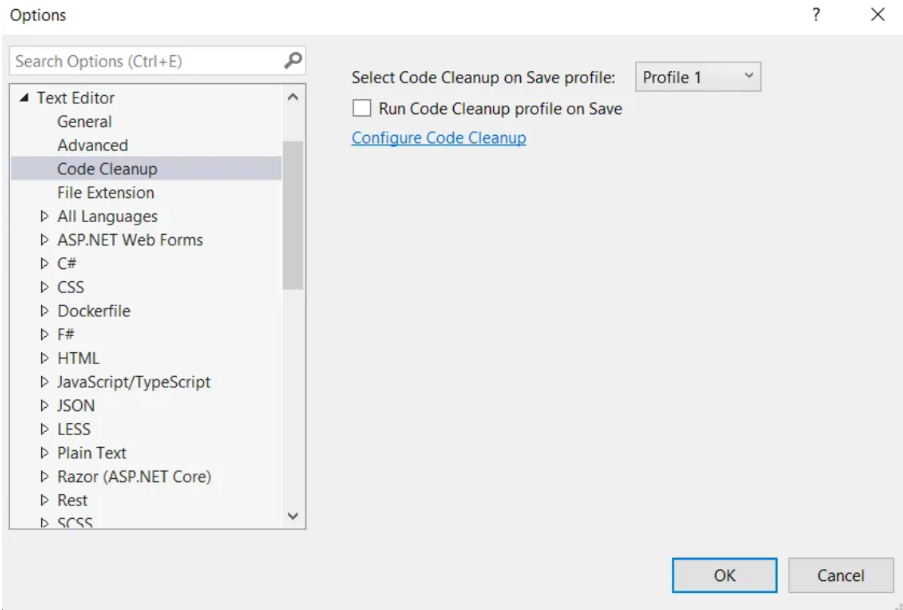
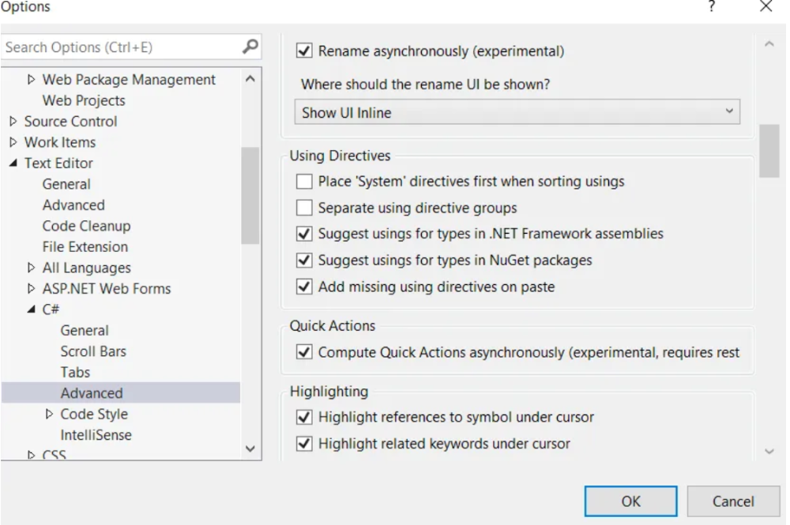
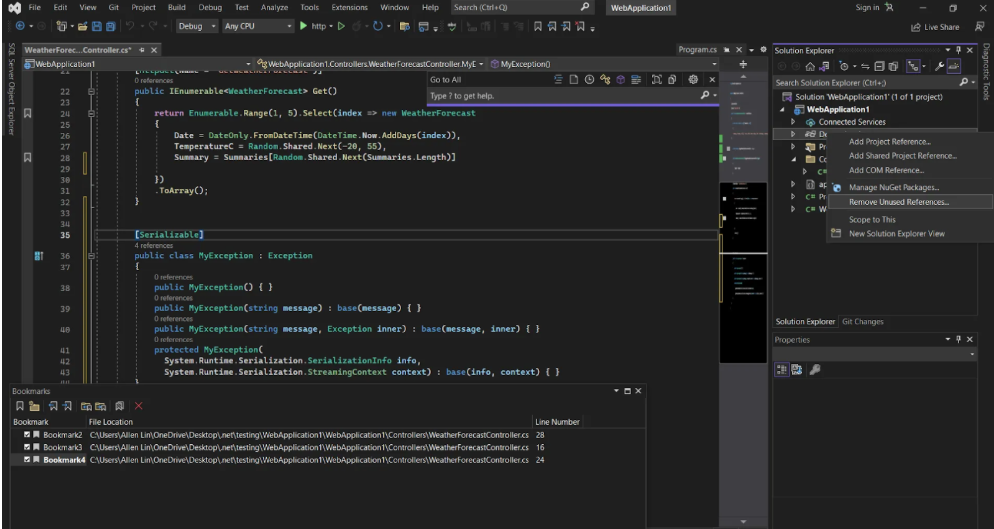
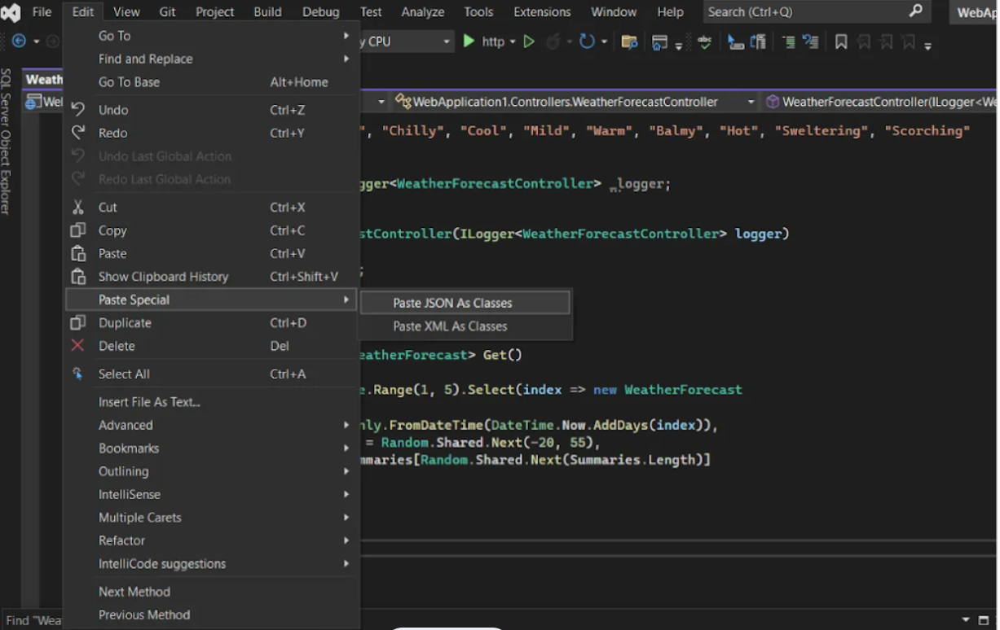
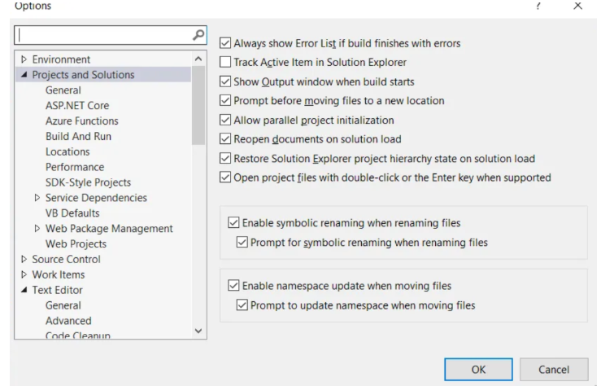

# Visual Studio 指南

## 目錄
- [快捷鍵](#快捷鍵)
- [Show Files 找不到問題](#show-files-找不到問題)
- [Build 卡死](#build-卡死)
- [Show All Files](#show-all-files)
- [Load / Unload Project](#load--unload-project)
- [語言設定](#語言設定)
- [整理整個專案的程式碼 (Code Cleanup)](#整理整個專案的程式碼-code-cleanup)
- [Using](#using)
- [Package](#package)
- [GIT](#git)
- [Immediate Window](#immediate-window)
- [Local Window](#local-window)
- [JSON 轉 C# 技巧](#json-轉-c-技巧)
- [Extension](#extension)
- [General Setting](#general-setting)
- [錯誤排除](#錯誤排除)

<br><br>

---

## 快捷鍵

| 功能 | 快捷鍵 |
|------|-------|
| 註解 | Ctrl + K, Ctrl + C |
| 取消註解 | Ctrl + K, Ctrl + U |
| 摺疊 | Ctrl + M |
| 除錯模式 | F5 |
| 重新命名 | Ctrl + R |
| 例外類別產生 | Exception + Tab |
| 自動產生 for 迴圈 | for + Tab + Tab |
| 檔案切換 | Ctrl + Tab |
| 定義 | F12 |
| 返回 | Ctrl + - |
| 前進 | Ctrl + Shift + - |
| CodeMaid | Ctrl + Shift + M |

<br><br>

---

## Show Files 找不到問題

當資料夾有檔案但 show files 找不到時，需要手動將專案加入 VS。

<br>

### 解決步驟

1. 右鍵點選 Solution
2. 選擇 Add
3. 選擇 Add Existing Projects

<br><br>

---

## Build 卡死

Build 卡死有時候是觸發不了登入機制，需要登入公司網站。

<br>

### 解決方法

確認已登入公司網站並重新嘗試建構。

<br><br>

---

## Show All Files



<br>

Show all files 功能可以顯示所有檔案（範例如用 custom tools 抓下來的檔案可能 VS IDE 認不得，要把它加進來）。

<br><br>

---

## Load / Unload Project

### 什麼是 Load / Unload Project？

在 Visual Studio 中，Load（載入）/ Unload（卸載）Project 是用來暫時啟用或停用某個專案（Project）的功能。

<br>

**Load Project** → 將專案載入 Solution，參與編譯、執行與 IntelliSense

<br>

**Unload Project** → 將專案從 Solution 暫時卸載，不參與編譯，節省資源

<br>

### 什麼時候該用 Unload Project？

以下是最常見的 4 大情境：

<br>

**加速 Visual Studio 開啟速度**

<br>

使用時機：大型 Solution 中有很多專案，但你只需要其中一部分時

<br>

好處：減少記憶體占用與載入時間，編輯或除錯時效能更好

<br>

**避免影響其他專案**

<br>

使用時機：A 專案依賴 B 專案，但你目前只要維護 A

<br>

好處：Unload B 可以避免因為 B 的編譯失敗或相依性改動導致額外錯誤

<br>

**切換不同版本的專案**

<br>

使用時機：需要在同一個 Solution 裡測試多組組合，範例如：

<br>

- ProjectA (Debug) + ProjectB (Release)
- ProjectA (Debug) + ProjectC (Debug)

<br>

好處：卸載不需要的版本，避免重複載入相同相依元件造成衝突

<br>

**編輯專案檔（.csproj）**

<br>

使用時機：需要手動編輯 *.csproj 設定（範例如變更 Build 設定、條件式相依）

<br>

操作流程：

<br>

1. 在 Solution Explorer 中右鍵點專案 → Unload Project
2. 再次右鍵 → Edit {ProjectName}.csproj
3. 編輯完成後儲存並關閉
4. 右鍵 → Reload Project

<br>

### Load / Unload Project 操作方法

| 操作 | 說明 |
|------|------|
| Unload Project | Solution Explorer → 右鍵專案 → Unload Project |
| Reload Project | 卸載後 → 右鍵專案（顯示為灰色）→ Reload Project |
| 編輯專案檔 | 卸載後 → 右鍵 → Edit .csproj |

<br><br>

---

## 語言設定

若沒有想要的語言，先關閉視窗。點選 **工具 / 取得工具與功能 (Tools/Get Tools and Features)**，開啟安裝程式。

<br>

選擇**語言套件 (Language Packs)**，勾選要安裝語言，點選右下角**修改 (Modify)** 按鈕。

<br>



<br>


<br>



<br><br>

---

## 整理整個專案的程式碼 (Code Cleanup)

Analyze → Code Cleanup

<br>

用來自動化程式碼格式化與最佳化，提升程式碼的可讀性並確保符合團隊的編碼規範。

<br>

Run code cleanup on save 設定

<br>



<br><br>

---

## Using

### using 設定 (C# Advanced)



<br>

### Remove Unused reference



<br><br>

---

## Package

驚嘆號 => NuGet 未正確安裝

<br><br>

---

## GIT

紅色叉叉 => 右鍵 --> Git Undo Changes

<br><br>

---

## Immediate Window

### 什麼是 Immediate Window？

Immediate Window（即時視窗）是 Visual Studio 除錯工具的一部分，主要用於：

<br>

- 即時執行程式碼片段（C#、VB.NET）
- 檢查或修改變數值
- 呼叫方法
- 執行表達式運算
- 快速測試 API 或小段邏輯

<br>

在偵錯模式（Debugging）下，Immediate Window 可以幫助你避免重複編輯程式碼並重啟程式，極大提升除錯效率。

<br>

### Immediate Window 的主要功能

| 功能 | 說明 |
|------|------|
| 監看值 | 即時查看變數、屬性或表達式的結果 |
| 執行語句 | 可以在執行緒暫停時執行程式語句 |
| 呼叫方法 | 可以直接執行方法來觀察結果 |
| 設定值 | 可以直接修改變數的值以測試不同情境 |
| Evaluate & Execute | 與 Watch/Locals 視窗不同，Immediate Window 可以執行不僅僅是監看 |

<br>

### 如何開啟 Immediate Window

1. 啟動偵錯 → 進入中斷點或手動暫停程式執行
2. 點選 Debug > Windows > Immediate
3. 快捷鍵：Ctrl + Alt + I

<br>

### Immediate Window 的基本用法範例

**查看變數**

<br>

```
? myVariable
```

<br>

? 是 Debug.EvaluateStatement 的縮寫。也可以直接輸入 myVariable，結果相同。

<br>

**執行程式碼**

<br>

```
myList.Add("NewItem")
```

<br>

直接執行邏輯，會對執行緒產生實際影響。

<br>

**修改變數值**

<br>

```
myNumber = 42
```

<br>

**呼叫方法**

<br>

```
myObject.CalculateTotal()
```

<br>

### Immediate Window 常用指令

| 指令 | 說明 |
|------|------|
| ? expression | 計算並顯示 expression 的值 |
| Debug.Print expression | 同上，但更舊的寫法 |
| cls | 清除 Immediate Window 的內容 |
| #help | 顯示 Immediate Window 的指令幫助（部分版本支援） |
| !command | 執行 Debug 命令，如 !clrstack（較常在 WinDbg 使用） |

<br>

### Immediate Window vs Watch vs Locals

| 特點 | Immediate | Watch | Locals |
|------|-----------|-------|--------|
| 可執行程式碼 | ✅ | ❌ | ❌ |
| 可即時修改值 | ✅ | ✅ | ✅ |
| 可儲存多筆表達式 | ❌ | ✅ | ❌ |
| 自動顯示作用域變數 | ❌ | ❌ | ✅ |

<br><br>

---

## Local Window

### 什麼是 Locals Window（區域變數視窗）？

Locals Window 是 Visual Studio 除錯工具的一部分，用來顯示當前程式碼區塊中的所有區域變數的值，包括參數、回傳值與自動建立的臨時變數。

<br>

它的用途：

<br>

- 檢視目前函式內的所有變數（不需手動輸入）
- 快速追蹤變數值是否如預期
- 對比不同變數的變化（包含巢狀物件）

<br>

### 如何開啟 Locals Window？

| 方法 | 操作說明 |
|------|----------|
| 菜單路徑 | 點選上方選單：Debug > Windows > Locals |
| 快捷鍵 | Ctrl + Alt + V 然後按 L（兩次） |
| 條件 | 必須在偵錯模式中，並且程式碼暫停中（Hit Breakpoint） |

<br>

### Locals Window 會顯示什麼？

| 欄位 | 說明 |
|------|------|
| Name | 區域變數名稱（如 user, total, items） |
| Value | 當前值（如 123, "Allen", [3 items]） |
| Type | 資料型別（如 int, string, List<string>） |

<br>

若變數是複雜物件或陣列，可以點開小箭頭展開查看內容（像是物件內的屬性、欄位等）。

<br>

### Locals Window 什麼時候最好用？

| 使用場景 | 為什麼好用？ |
|----------|-------------|
| 逐步執行（Step Over/Into）時 | 可觀察變數值逐步變化 |
| 偵錯迴圈、條件判斷時 | 看每次迴圈變數是否符合邏輯 |
| 測試方法輸入參數與回傳值 | 不需額外列印，可以即時查看 |
| 變數值錯誤或為 null 時 | 可快速定位是哪個變數異常 |

<br>

### 小技巧與注意事項

**小技巧**

<br>

- 支援展開巢狀物件屬性（範例：user.Address.Street）
- 支援物件 ToString() 顯示（若物件有實作 ToString() 方法，會顯示該字串）
- 可在視窗中右鍵 → Add Watch，將該變數加入 Watch 視窗，持續追蹤

<br>

**注意事項**

<br>

- 只會顯示目前作用域（Scope）的變數 → 不會顯示類別層級的欄位，請改用 Autos 或 Watch 視窗看
- 程式必須處於暫停中，才會更新內容
- 無法修改變數值（要修改請用 Immediate Window）

<br>

### Locals vs Watch vs Immediate 差異比較

| 特性 | Locals | Watch | Immediate |
|------|--------|-------|-----------|
| 自動列出所有變數 | ✅ | ❌ | ❌ |
| 手動輸入變數 | ❌ | ✅ | ✅ |
| 執行程式碼 | ❌ | ❌ | ✅ |
| 修改變數值 | ❌ | ✅ | ✅ |
| 可展開巢狀屬性 | ✅ | ✅ | ✅ |

<br>

### 範例展示

假設你在執行以下 C# 程式：

<br>

```csharp
public void Calculate(int a, int b)
{
    int total = a + b;
    string message = $"Total is {total}";
}
```

<br>

當你在 total 那行打斷點並進入除錯時，Locals Window 會顯示：

<br>

| Name | Value | Type |
|------|-------|------|
| a | 5 | int |
| b | 10 | int |
| total | 15 | int |
| message | "Total is 15" | string |

<br><br>

---

## JSON 轉 C# 技巧



<br><br>

---

## Extension

### 必裝擴充功能

**CodeMaid**

<br>

### 推薦擴充功能

- Productivity Power Tools 2022
- Indent Guilds
- GhostDoc
- EF Core Power Tools

<br>

### 安裝步驟

1. 關閉 Visual Studio 2022，並等待擴充功能安裝完成
2. 啟動 Visual Studio 2022
3. 調整 CodeMaid 設定（可參考 CodeMaid 與 StyleCop 設定）

<br><br>

---

## General Setting



<br>

### 建置失敗時，自動顯示錯誤清單

**Always show Error List if build finishes with errors** ✅

<br>

當建置失敗時，自動顯示錯誤清單（Error List）視窗。

<br>

這個選項可以幫助開發者立即查看錯誤，而不需要手動開啟 Error List。

<br>

### 方案總管中自動追蹤目前開啟的檔案

**Track Active Item in Solution Explorer** ⬜

<br>

是否在方案總管（Solution Explorer）中自動追蹤目前開啟的檔案。

<br>

若勾選，每當你在編輯器中切換檔案，Solution Explorer 也會自動選中該檔案。

<br>

優點：方便查看當前檔案的路徑與位置

<br>

缺點：在大型專案中可能會影響效能，因此預設未勾選

<br>

### 建置開始時顯示輸出視窗

**Show Output window when build starts** ⬜

<br>

建置開始時，是否自動顯示 Output（輸出）視窗。

<br>

若勾選，每次建置專案時，Output 視窗會自動彈出，顯示建置日誌。

<br>

### 移動檔案確認對話框

**Prompt before moving files to a new location** ✅

<br>

移動檔案時，是否顯示確認對話框。

<br>

防止誤移動檔案，避免影響專案結構。

<br>

### 平行初始化專案

**Allow parallel project initialization** ✅

<br>

允許平行初始化專案，提高載入速度。

<br>

在開啟大型解決方案（Solution）時，Visual Studio 會嘗試同時載入多個專案，提高效能。

<br>

### 重新開啟文件

**Reopen documents on solution load** ✅

<br>

重新載入解決方案時，開啟上次關閉時仍在編輯的檔案。

<br>

若未勾選，每次開啟解決方案時，所有編輯器都會是空的。

<br>

### 恢復 Solution Explorer 狀態

**Restore Solution Explorer project hierarchy state on solution load** ✅

<br>

重新載入解決方案時，恢復 Solution Explorer 的展開 / 摺疊狀態。

<br>

若未勾選，每次載入解決方案時，Solution Explorer 會全部摺疊。

<br>

### 開啟檔案方式

**Open project files with double-click or the Enter key when supported** ✅

<br>

允許透過雙擊或 Enter 鍵開啟檔案。

<br>

如果未勾選，可能需要手動點擊 "Open" 才能開啟檔案。

<br>

### 檔案重新命名設定

**Enable symbolic renaming when renaming files** ✅

<br>

重新命名檔案時，允許符號（Symbolic）重命名。

<br>

這意味著當你改變檔案名稱時，相關的類別名稱、方法名稱等也會自動同步更新。

<br>

**Prompt for symbolic renaming when renaming files** ✅

<br>

重新命名檔案時，是否顯示確認對話框。

<br>

避免不小心更改檔名，影響程式碼結構。

<br>

### 命名空間更新設定

**Enable namespace update when moving files** ✅

<br>

當移動檔案時，是否自動更新 namespace（命名空間）。

<br>

範例：

<br>

- 原檔案 MyProject/Models/User.cs 內的 namespace MyProject.Models
- 移動到 MyProject/Entities/User.cs 後，namespace 自動改為 MyProject.Entities

<br>

**Prompt to update namespace when moving files** ✅

<br>

移動檔案時，是否顯示確認對話框，詢問是否更新 namespace。

<br>

避免 namespace 錯誤，影響程式碼編譯。

<br>

### 建議設定

- 開啟 Always show Error List，避免錯過錯誤
- 關閉 Track Active Item in Solution Explorer（若專案過大，以提升效能）
- 開啟 Allow parallel project initialization，加快載入速度
- 開啟 Enable symbolic renaming 和 Enable namespace update，減少手動更改的工作量
- 若擔心誤操作，可開啟所有 Prompt 選項，以確保 Visual Studio 會詢問你是否要執行變更

<br><br>

---

## 錯誤排除

### 展開

有時候發現有少程式碼可能只是因為沒有展開。