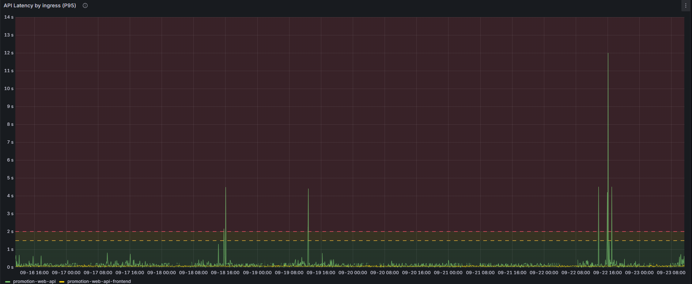

# K8S 系統觀察與分析

## 目錄
- [API 效能監控](#api-效能監控)
- [Task 建立狀況分析](#task-建立狀況分析)
- [Pod 縮放行為觀察](#pod-縮放行為觀察)
- [容器重啟監控](#容器重啟監控)
- [記憶體不足問題分析](#記憶體不足問題分析)
  - [問題現象](#問題現象)
  - [影響分析](#影響分析)
  - [記憶體配置問題](#記憶體配置問題)

<br><br>

---

## API 效能監控

### 觀察 API 回應時間是否明顯增高

**監控指標：API Latency by ingress (P95)**



<br>

**分析重點**

| 監控項目 | 說明 |
|----------|------|
| P95 延遲時間 | 95% 的請求回應時間 |
| 異常峰值 | 識別延遲時間突然增高的時間點 |
| 趨勢變化 | 觀察整體延遲時間的趨勢變化 |

<br><br>

---

## Task 建立狀況分析

### Task 數量統計

**時間區間分析**

| 時間段 | Task 數量 | 狀態 |
|--------|-----------|------|
| 05:00~06:00 | 61萬 | 正常建立 |
| 06:00~07:00 | 65萬 | 數量無減少 |

<br>

**關鍵觀察**

- Task 建立數量持續增長，沒有減少趨勢
- 需要進一步分析是否有積壓情況
- 確認 Task 處理能力是否足夠

<br><br>

---

## Pod 縮放行為觀察

### Pod 數量變化

**Pod 縮減現象**

Pod 數量有減少，但這是 HPA (Horizontal Pod Autoscaler) 根據 CPU 使用率自動調整的結果。

<br>

**HPA 自動調整機制**

| 調整因素 | 說明 |
|----------|------|
| CPU 使用率 | HPA 判斷 CPU 使用率不高 |
| 自動縮放 | 系統自動減少 Pod 數量 |
| 資源最佳化 | 避免資源浪費 |

<br>

**注意事項**

- 需要檢查 HPA 設定是否合理
- 確認縮放策略符合實際需求
- 監控縮放過程中是否影響服務品質

<br><br>

---

## 容器重啟監控

### Restarted Container Count

監控容器重啟次數，以識別潛在的穩定性問題。

<br>

**重啟原因分析**

| 可能原因 | 影響 | 處理建議 |
|----------|------|----------|
| 記憶體不足 | 服務中斷 | 調整記憶體配置 |
| 健康檢查失敗 | 自動重啟 | 檢查健康檢查設定 |
| 應用程式錯誤 | 服務異常 | 檢查應用程式日誌 |

<br><br>

---

## 記憶體不足問題分析

### 問題現象

記憶體不足已經影響到 HTTP 連線的建立。

<br>

### 影響分析

**連線問題連鎖反應**

```
記憶體不足 → HTTP 連線數耗盡 → 無法及時開啟新連線
    ↓
CreateTask 請求無法處理 → 請求排隊等待
    ↓
5秒後 nmqv3 API 收到呼叫 → HttpClient 已判斷逾時
    ↓
連線被切斷 → 後續一連串失敗
```

<br>

**問題時序圖**

| 時間點 | 事件 | 狀態 |
|--------|------|------|
| T0 | 記憶體不足 | 🔴 系統資源緊張 |
| T1 | HTTP 連線數耗盡 | 🔴 無法建立新連線 |
| T2 | CreateTask 請求進入 | 🟡 請求排隊 |
| T3 | 請求排隊等待 | 🟡 等待可用連線 |
| T4 | 5秒後 API 收到請求 | 🔴 HttpClient 已逾時 |
| T5 | 連線被切斷 | 🔴 請求失敗 |

<br>

**補償機制**

雖然出現連線問題，但系統具備錯誤補償機制：

- ✅ 最終 apimin 有收到訊息
- ✅ 發出的 Task 應該都有建立成功
- 📋 建議確認 Task 建立的完整性

<br>

### 記憶體配置問題

**當前配置分析**

| 配置項目 | 設定值 | 問題分析 |
|----------|--------|----------|
| Memory Request | 1G | 保證最小記憶體 |
| Memory Limit | 2G | 最大可用記憶體 |
| 配置特性 | 變動的 | 可能導致資源競爭 |

<br>

**問題點**

```
Request 1G, Limit 2G 的變動配置
    ↓
系統當下會有搶奪資源的狀況
    ↓
記憶體不足時影響服務穩定性
```

<br>

**建議改善方案**

| 改善項目 | 建議作法 | 預期效果 |
|----------|----------|----------|
| 記憶體配置 | 調整為固定值或適當範圍 | 減少資源競爭 |
| 監控強化 | 增加記憶體使用率監控 | 提前發現問題 |
| 連線池設定 | 最佳化 HTTP 連線池配置 | 提高連線效率 |
| 逾時設定 | 調整 HttpClient 逾時時間 | 減少逾時失敗 |

<br>

**後續追蹤事項**

- [ ] 確認 Task 建立完整性
- [ ] 檢討記憶體配置策略
- [ ] 最佳化 HTTP 連線管理
- [ ] 強化系統監控機制