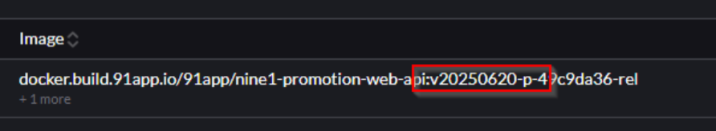
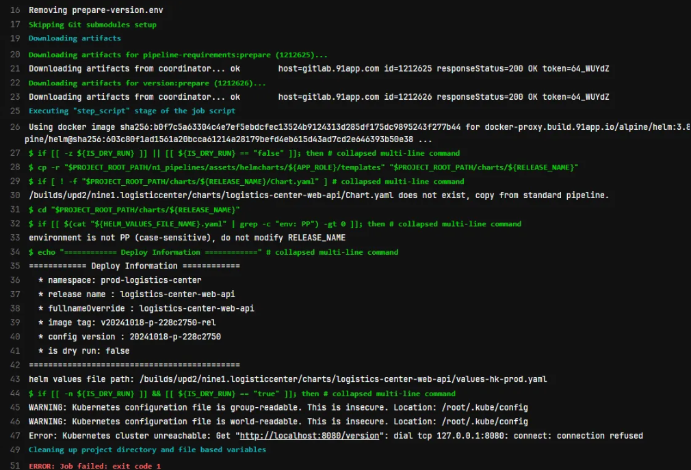
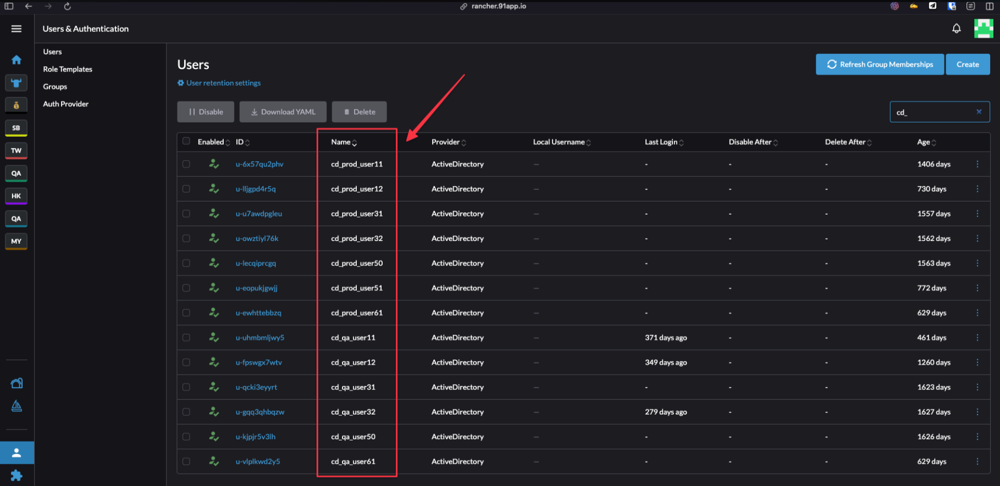

# 🚀 NYP 維護文件

## 📖 目錄

1. [📋 EKS 資源申請流程](#3--eks-資源申請流程)
2. [🚀 GitLab-CI 專案前置作業](#4--gitlab-ci-專案前置作業)
3. [📁 Deployments 內部檔案查看](#7--deployments-內部檔案查看)
4. [⚙️ 建置專案時的配置](#8-️-建置專案時的配置)
5.  [📚 NYP 文件](#12--nyp-文件)
6.  [🌍 Translation 服務調整紀錄](#13--translation-服務調整紀錄)
7.  [🏷️ TAG_ID 標籤管理](#14-️-tag_id-標籤管理)
8.  [📊 Log 查看](#15--log-查看)
9.  [🌐 Ingress 網路入口](#16--ingress-網路入口)
10. [🔍 如何查看部署版本](#17--如何查看部署版本)
11. [❌ Pipeline 錯誤處理紀錄](#18--pipeline-錯誤處理紀錄)
12. [🔒 Protected GroupVariable](#19--protected-groupvariable)
13. [👤 CD_User 權限管理](#20--cd_user-權限管理)
14. [🔑 Image Pull Secrets](#21--image-pull-secrets)

<br>

---

## 3. 📋 EKS 資源申請流程

### 為專案申請 EKS + Monitoring + KP ServiceAccount 基本權限資源做法

**開申請單**：https://teamroom.91app.biz/issues/23598


強調須建立 NKP ServiceAccount 基本權限

經確認 Translation 在 NKP IRSA 不與 AKSK 的權限相同，調整如下:

僅需要 NY-QA-S3-TranslationService CRUD 權限
不需要 NY-TW-Deny-Not-In-VPC-NAT-TPE-Office-IP


<br>

### 申請將 kubeconfig 設置於 Gitlab Group Variables

**開申請單**：https://teamroom.91app.biz/issues/22565

<br>

<br>

### IAM Role 要有存 secret 的權限

**開申請單**：https://teamroom.91app.biz/issues/24100

<br>

---

## 4. 🚀 GitLab-CI 專案前置作業

### 開新的 GitLab-CI 專案的前置動作

**步驟 1**：BaseSDK 安裝

<br>

**步驟 2**：安裝 N1 CLI

參考文件：http://www.91dev.tw/nineyi.general/v1beta/dev-guide/n1cli/quickstart/

<br>

---

<br>

---

## 7. 📁 Deployments 內部檔案查看

### 如何查看 Deployments 的內部檔案

**路徑**：Deployments > Execute Shell

<br>

**舉例**：查看多語系資訊

```bash
cat ./i18n/Nine1.Cart/backend.entity.cart_processor.shopping_cart_client_pay_type_entity/zh-TW.json
```

<br>

**舉例**：查看配置

```bash
cd config
cat settings.json
```

<br>

**舉例**：測試網路連線與環境變數

```bash
# 打 curl 看連得到外網嗎
curl -I https://www.google.com

# 打 db 連線測試
curl -I your-database-endpoint

# 讀取環境變數
env | grep YOUR_VAR_NAME
```

<br>

---

## 8. ⚙️ 建置專案時的配置

### 1. UI

#### 1.1 需設定 branch 為 protected 才能正常跑 pipeline, 否則可能佈署會吃不到KUBE_CONFIG

**路徑**：settings > repository > protected

<br>

#### 1.2 KUBE_CONFIG_ENV_NAME 設定正確

<br>

### 2. gitlab-ci.yml 設定

#### 2.1 pipeline 版本升級為最新版

<br>

#### 2.2 GLCI__NYS_FQDN 要對齊 sdm.json

**範例**：C:\91APP\Cart\nine1.cart\src\Web\Nine1.Cart.Web.Api\.manifest\sdm.json

<br>

| 設定項目 | 值 |
|----------|-----|
| GLCI__NYS_FQDN | Nine1.Cart.Web.Api |
| sdm.json | Nine1.Cart.Web.Api |

<br>

#### 2.3 RELEASE_NAME 不可以有 dot


RELEASE_NAME , ingressname  要正式一點

<br>

### 3. charts.yaml

#### 3.1 s3 存取 config 路徑需與實際 config 路徑對齊

暫時無須設為 `files: []`

<br>

secret 存取路徑需與實際 secretManager 路徑對齊，暫時無須設為 `files: []`

<br>

#### 3.2 路徑與 gitlanci.yaml Release Name 對齊

<br>

#### 3.3 - charts 下面一層的資料夾要跟 releasename 一樣但小寫

#### 3.4 repository 為 image 名稱

charts : repository: docker-dev.build.91app.io/91app/ny-payment-middleware


### 4. build-config.sh

#### 4.1 確認 Build BASE_IMAGE 版本是要是 91app proxy 的

**範例**：`docker.build.91app.io/91app/dotnet-sdk-base:8`

<br>

#### 4.2 確認 deploy BASE_IMAGE 版本是正確 aspnet 版本

<br>

### 5. 檔案結構 + DockerFile + deployments + FQDN 設定對齊

#### 5.1 CronJob

**deployments.json 的 APP_ROLE**：scheduler

<br>

**DockerFile**：
```dockerfile
WORKDIR /worker
COPY ./src/Nine1.Promotion.CreateTask .
```

<br>

#### 5.2 WebAPI

**deployments.json 的 APP_ROLE**：api

<br>

**DockerFile**：

Building：
```dockerfile
WORKDIR /src
COPY --from=buildTranslation ./src .
COPY ./workdir/${NYP_JOBNAME}/releng.json .
RUN cat ./releng.json
```

<br>

Deploy：
```dockerfile
WORKDIR /app
COPY --from=dotnet-build-env /out .
```

<br>

**檔案結構**：
```
./src/Web/{{FQDN}}/csproj
./src/sln
```

<br>

#### 5.3 Worker

**deployments.json 的 APP_ROLE**：worker

<br>

**DockerFile**：
```dockerfile
WORKDIR /worker
COPY --from=dotnet-build-env /app/out .
```

<br>

**檔案結構**：
```
./src/sln
```

<br>

#### 5.4 Console

**deployments.json 的 APP_ROLE**：scheduler

<br>

**DockerFile**：

Build：
```dockerfile
COPY ./Nine1.Payment.Middleware.ConsoleApp.sln ./
COPY ./src ./src
```

<br>

Deploy：
```dockerfile
WORKDIR /app
COPY --from=dotnet-build-env /out .
```

<br>

**檔案結構**：
```
./src/{{FQDB}}/csproj
sln
```

<br>

### 6. WebAPI 需在 ./src/Web/{{FQDN}}/.manifest 配置

**必要檔案**：
- releng.json
- sdm.json

<br>

### 7. .dockerignore

要加上：
- `**/settings.*.json`
- `**/secrets.*.json`

<br>

### 8. .gitignore

需配置

<br>

### 9. 專案內設定

可以先用 `launchsettings.json` 來設定依照環境變數執行程式

<br>

專案要配置 Health check endpoint 否則在 rancher 的 recent event 會看到：

```
Readiness probe failed: Get "http://10.50.231.179:50350/_hc": dial tcp 10.50.231.179:50350: connect: connection refused
```

<br>

### 10. releasename 及為 deployment 看到的 name


<br>

### 11. Schema.json 配置

填 `schema.json` 才會有節點 pipeline 長出來

<br>


---

<br>

---

## 12. 📚 NYP 文件

**官方文件連結**：https://www.infra.91dev.tw/nkp/
**錯誤排除**:https://www.infra.91dev.tw/nkp/docs/troubleshooting/troubleshoot-failed-pipeline/#error-1-%E6%8B%BF%E4%B8%8D%E5%88%B0-kube-config
<br>

---

## 13. 🌍 Translation 服務調整紀錄

### 調整內容

**1. 在 yaml 手動移除掉 v2 host 設定 (ingress 中)**

原因是 gitlab ci 沒有真正在使用 ingress yaml 佈署檔案

<br>

**2. Domain 導向設定**

目前 translation domain 有 v1 / v2 都導向相同服務

<br>

但目前只有在使用 v1 的服務，因此 V2 給新的架構使用

<br>

### 配置路徑

**Config 路徑**：
```
91app-ap-northeast-1-private-conf/TW-QA/Translation/API/LATEST-p-5ac80600/settings.TW-QA.json
```

<br>

**Secret 路徑**：
```
/TW-QA/Translation/API/secret
```

<br>

---

## 14. 🏷️ TAG_ID 標籤管理

TAG_ID 是一個用來標記 Docker 映像（image）的『版本標籤』，通常用來唯一識別一個 build 出來的版本。

<br>

📦 每次包裝一個產品（映像檔），你都貼上一張獨一無二的標籤：這是什麼版本、什麼時候做的、出自哪個分支和 commit。

<br>

### TAG_ID 組成範例

```bash
TAG_ID=$(echo $CI_BUILD_REF_NAME | cut -d'/' -f 2)_\
$(cat package.json | jq -r '.version')_\
$(TZ=Asia/Taipei date '+%y%m%d%H%M')_\
$(echo $CI_BUILD_REF | cut -c 1-7)
```

<br>

**生成結果**：`feature-login_1.2.3_2507201012_ab12cd3`

<br>

### TAG_ID 各部分說明

| 部分 | 說明 |
|------|------|
| feature-login | 分支名稱（例如 feature/login，取 / 後面） |
| 1.2.3 | 專案版本（從 package.json 讀出 .version 欄位） |
| 2507201012 | 建構時間：2025年07月20日 10:12（Asia/Taipei 時區） |
| ab12cd3 | Git commit 的前 7 碼，用來追蹤是誰提交的 |

<br>

### ⚠️ 如果不使用 TAG_ID，會有什麼問題？

很多人習慣直接用：

```bash
docker tag my-app:latest
```

<br>

但這會造成：

- ⛔ 看不出來這是哪次 build 的
- ⛔ 不小心覆蓋掉別人的版本
- ⛔ 難以追蹤 bug 來源或復原版本

<br>

---

## 15. 📊 Log 查看

### 1. Rancher Recent Event

可以在 rancher 的 recent event 看到服務為什麼啟動失敗

<br>

### 2. View Log

可以看到 app 已經起來了的詳細記錄

<br>

### 3. 本機連接 Event Log

可以在本機連 event log

<br>

---

## 16. 🌐 Ingress 網路入口

Ingress 是一個資源物件，允許你定義如何將外部的 HTTP 和 HTTPS 流量導向到你的應用程式服務。

<br>

Ingress 提供了一個入口點，將外部的網路請求導向到你的應用程式中的不同服務。

<br>

### 比喻說明

想像你的 Kubernetes 集群是一個大型商場，裡面有很多家商店（你的應用程式服務）。每家商店都有自己的門口，但是商場入口卻只有一個。Ingress 就像是商場入口的大門警衛，負責引導和控制進出商場的人流。

<br>

---

## 17. 🔍 如何查看部署版本



<br>

---

## 18. ❌ Pipeline 錯誤處理紀錄

### 案例 1：docker auth config / am user / am password 相關權限錯誤

**解決步驟**：

<br>

1. 確認 protected branch 是否已設定，這樣才會去抓 auth config

<br>

2. 確認 variables 是否有正確設定相關權限參數

<br>

3. 向 [@zhongkuo](https://91app.slack.com/team/U05KFQBPD8E), [@kylechang](https://91app.slack.com/team/U07UPKU0GN6) 確認 ciuser 會 variables 是否正確設定

加 release/* Branch 當 Protected Branch

<br>

### 案例 2：SyncFromServiceBaseUrl 配置問題

**問題描述**：有些 controller 會掛掉讀到 v2 config 但打不通，因為 domain 被搬走了

https://91app.slack.com/archives/G04TVB3KW/p1746421134276869

<br>

**相關連結**：
- QA：https://gitlab.91app.com/translation/NineYi.Translation/-/merge_requests/270/diffs
- PP：https://gitlab.91app.com/translation/NineYi.Translation/-/merge_requests/269

<br>

**Exception 查詢**：[監控面板連結](https://monitoring-dashboard.91app.io/explore?schemaVersion=1&panes=%7B%22ih6%22:%7B%22datasource%22:%22ZIOlfD44k%22,%22queries%22:%5B%7B%22datasource%22:%7B%22type%22:%22loki%22,%22uid%22:%22ZIOlfD44k%22%7D,%22editorMode%22:%22code%22,%22expr%22:%22%7Bservice%3D%5C%22pp-translation%5C%22%7D%20%7C%3D%60Exception%60%22,%22maxLines%22:100,%22queryType%22:%22range%22,%22refId%22:%22A%22%7D%5D,%22range%22:%7B%22from%22:%22now-3h%22,%22to%22:%22now%22%7D%7D%7D&orgId=2)

<br>

### 案例 3：GitLab CI 檔案命名問題

**問題描述**：`gitlabci.yaml.bk` 像這樣的其他檔案會導致 pipeline 死掉

<br>

### 案例 4：Image Pull 失敗

**問題描述**：Image pull 不到可能因為 servicename 沒有對應

<br>

### 案例 5：Deprecated Build CI 參數

**錯誤訊息**：
```
ERROR: Job failed: failed to pull image "docker-proxy.build.91app.io/alpine/git:v2.34.2" with specified policies [always]: Error response from daemon: Head "https://docker-proxy.build.91app.io/v2/alpine/git/manifests/v2.34.2": no basic auth credentials (manager.go:237:0s)
```

<br>

**解決方法**：

修正 Deprecated Build CI 參數

<br>

**範例**：

❌ **錯誤寫法**：
```bash
VER_SUFFIX=$(if [ "$(echo $CI_BUILD_REF_NAME | cut -d'/' -f 2)" = "master" ]; then echo ""; else echo "-dev"; fi)
```

<br>

✅ **正確寫法**：
```bash
VER_SUFFIX=$(if [ "$(echo $CI_COMMIT_REF_NAME | cut -d'/' -f 2)" = "master" ]; then echo ""; else echo "-dev"; fi)
```

<br>

**參考資料**：https://gitlab.com/gitlab-org/gitlab/-/issues/352957

<br>

---

## 19. 🔒 Protected GroupVariable

### 問題描述

groupVariable 被掛上 protected，打 tag 也綁上 protected，可能造成無法正常取得 KUBE CONFIG 導致佈署失敗。

<br>

### 影響範圍

當 GitLab 中的 Group Variables 被設定為 protected 時，會限制只有 protected branches 和 protected tags 才能存取這些變數。

<br>

**可能的問題情況**：

| 情況 | 問題 | 結果 |
|------|------|------|
| 非 protected branch | 無法存取 KUBE_CONFIG | Pipeline 佈署失敗 |
| 非 protected tag | 無法取得部署權限變數 | 權限不足錯誤 |
| CI/CD Pipeline | 取不到必要的環境設定 | 建置或部署中斷 |

<br>

### 解決方案

**步驟 1：檢查 Variable 設定**

確認 Group Variables 中的 protected 設定：
- KUBE_CONFIG 相關變數
- 部署權限相關變數
- 環境設定變數

<br>

**步驟 2：調整 Branch/Tag 保護設定**

根據需求調整以下設定：
- 將必要的 branch 設為 protected
- 或者取消不必要的 variable protected 限制

<br>

**步驟 3：權限對齊**

確保：
- Pipeline 執行的 branch/tag 狀態
- Variable 的 protected 設定
- 兩者權限等級一致

<br>

---

## 20. 👤 CD_User 權限管理

### 概念說明

每個團隊服務會有專用的 CD_User，用於處理持續部署（Continuous Deployment）的權限管理。

<br>

### CD_User 功能架構

**權限配置流程**：

1. **建立專用 CD_User**
   - 每個團隊服務擁有獨立的 CD_User
   - 遵循最小權限原則設計

<br>

2. **K8s 權限授予**
   - 給予 CD_User 必要的 Kubernetes 權限
   - 允許執行 K8s Yaml 的 Apply 操作

<br>

3. **Token 提供**
   - 提供 CD_User 的 Token 給團隊
   - 團隊將 Token 設定在 GitLab 中使用

<br>

### Token 特性

**重要特性**：
- Token **理論上應該不會過期**
- 提供長期穩定的部署權限
- 減少因 Token 過期導致的部署中斷

<br>



<br>

### 使用流程

| 步驟 | 操作 | 負責方 |
|------|------|--------|
| 1 | 建立 CD_User | Infrastructure 團隊 |
| 2 | 配置 K8s 權限 | Infrastructure 團隊 |
| 3 | 生成 Token | Infrastructure 團隊 |
| 4 | 提供 Token | Infrastructure 團隊 |
| 5 | 設定 GitLab Variables | 開發團隊 |
| 6 | 配置 CI/CD Pipeline | 開發團隊 |

<br>

### 安全考量

**權限隔離**：
- 每個團隊擁有獨立的 CD_User
- 避免權限交叉污染
- 便於權限追蹤和管理

<br>

**Token 管理**：
- 定期檢查 Token 有效性
- 必要時進行 Token 輪換
- 監控 Token 使用狀況

<br>

### 故障排除

**常見問題**：

| 問題 | 可能原因 | 解決方案 |
|------|----------|----------|
| 部署權限不足 | CD_User 權限配置錯誤 | 檢查 K8s RBAC 設定 |
| Token 無效 | Token 過期或被撤銷 | 重新申請 Token |
| Pipeline 失敗 | GitLab 中 Token 設定錯誤 | 確認 Variable 設定正確 |

<br>

---

## 21. 🔑 Image Pull Secrets

### 問題描述

佈署 Translation 新服務時發生 **"no basic auth credential to pull image"** 錯誤，原因是 Kubernetes 無法正確讀取 ImagePullSecrets 來存取私有 Docker Registry。

<br>

### 問題原因

當 Kubernetes 嘗試從私有 Docker Registry (如 `docker-dev.build.91app.io`) 拉取映像時，需要使用 ImagePullSecrets 來進行身份驗證。如果 Secrets 設定不正確或遺失，就會出現權限錯誤。

<br>

### 解決方案

#### 步驟 1：檢查 ImagePullSecrets 設定

確認 Kubernetes Deployment 或 Pod 設定中的 ImagePullSecrets 配置：


<br>

**重要設定項目**：

| 項目 | 說明 |
|------|------|
| Secret Name | 指向包含 Registry 認證資訊的 Secret |
| Registry URL | 私有 Docker Registry 的位址 |
| 認證資料 | Docker Registry 的使用者名稱和密碼 |

<br>

#### 步驟 2：調整 YAML 配置

透過修改 Kubernetes YAML 檔案來正確設定 ImagePullSecrets：


<br>

**YAML 範例配置**：

```yaml
apiVersion: apps/v1
kind: Deployment
metadata:
  name: translation-service
spec:
  template:
    spec:
      imagePullSecrets:
      - name: docker-registry-secret
      containers:
      - name: translation
        image: docker-dev.build.91app.io/91app/translation:latest
```

<br>

#### 步驟 3：重新部署服務

**自動重新部署**：
- 修改設定檔後，系統會自動觸發重新部署

**手動重新部署**：
- 如果沒有修改設定檔，需要手動執行重新部署


<br>

### 常見錯誤類型

| 錯誤訊息 | 可能原因 | 解決方案 |
|----------|----------|----------|
| `no basic auth credentials` | ImagePullSecret 不存在或格式錯誤 | 檢查 Secret 設定和引用 |
| `pull access denied` | Registry 權限不足 | 確認 Registry 認證資料正確 |
| `image not found` | 映像路徑或標籤錯誤 | 驗證映像名稱和版本標籤 |
| `timeout` | 網路連線問題 | 檢查 Registry 網路可達性 |

<br>

### 最佳實務

**Secret 管理**：
- 使用 Kubernetes Secret 儲存敏感的認證資料
- 定期輪換 Registry 認證資訊
- 避免在 YAML 中明文儲存密碼

<br>

**部署流程**：
- 在每個 Namespace 中建立對應的 ImagePullSecret
- 確保 ServiceAccount 有正確的 Secret 關聯
- 使用 Helm 或其他工具統一管理 Secret 配置

<br>

### 驗證步驟

**檢查 Secret 是否存在**：
```bash
kubectl get secrets -n <namespace>
kubectl describe secret docker-registry-secret -n <namespace>
```

<br>

**檢查 Pod 狀態**：
```bash
kubectl get pods -n <namespace>
kubectl describe pod <pod-name> -n <namespace>
```

<br>

**查看詳細錯誤**：
```bash
kubectl logs <pod-name> -n <namespace>
kubectl get events -n <namespace> --sort-by=.metadata.creationTimestamp
```

<br>

---
