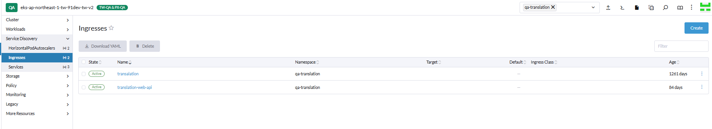

# Translation Web 服務切換計畫

## 目錄
- [Ingress 資源設定現狀](#ingress-資源設定現狀)
- [切換計畫](#切換計畫)
- [實作步驟](#實作步驟)

<br><br>

---

## Ingress 資源設定現狀



<br>

### 目前服務配置狀況

| 服務類型 | Ingress 名稱 | Domain | 資源導向 | 狀態 |
|----------|-------------|--------|----------|------|
| 舊版 Web API | `translation` | `http://translation.qa.91dev.tw/api` | `translation` | 運行中 |
| 舊版 Web | `translation` | `http://translation.qa.91dev.tw/` | `translation-web` | 運行中 |
| 新版 Web API | `translation-web-api` | 尚未設定主要 domain | 新版服務 | 待切換 |
| 新版 Web | 尚未建立 | 尚未建立 | 尚未建立 | 待建立 |

<br>

### 現狀說明

目前系統存在新舊版本並行的狀況：

<br>

- **舊版系統**：使用 `translation` Ingress 資源，同時處理 Web API 和 Web 的請求
- **新版系統**：Web API 已部署但尚未指向主要 domain，Web 服務尚未建立

<br><br>

---

## 切換計畫

### 切換目標

將現有的 Web 前端服務切換至使用新版 Web API，確保服務穩定運行且新舊版本不會發生 domain 衝突。

<br>

### 切換前後對比

**切換前：**

```
http://translation.qa.91dev.tw/api → 舊版 Web API
http://translation.qa.91dev.tw/    → 舊版 Web
```

<br>

**切換後：**

```
http://translation.qa.91dev.tw/api → 新版 Web API
http://translation.qa.91dev.tw/    → 舊版 Web (使用新版 API)
http://translationv2.qa.91dev.tw/api → 舊版 Web API (備用)
```

<br><br>

---

## 實作步驟

### 步驟 1：更新新版 Web API Domain

將新版 Web API 的 Ingress 資源 `translation-web-api` 的 domain 設定為主要服務位址。

<br>

```yaml
# 修改 translation-web-api Ingress
spec:
  rules:
  - host: translation.qa.91dev.tw
    http:
      paths:
      - path: /api
        pathType: Prefix
        backend:
          service:
            name: new-web-api-service
            port:
              number: 80
```

<br>

### 步驟 2：更新舊版 Web API Domain

將舊版 Web API 的 Ingress 資源 `translation` 的 domain 改為備用位址，避免 domain 衝突。

<br>

```yaml
# 修改 translation Ingress
spec:
  rules:
  - host: translationv2.qa.91dev.tw
    http:
      paths:
      - path: /api
        pathType: Prefix
        backend:
          service:
            name: old-web-api-service
            port:
              number: 80
```

<br>

### 步驟 3：驗證切換結果

切換完成後，驗證各服務是否正常運作：

<br>

| 驗證項目 | URL | 預期結果 |
|----------|-----|----------|
| 新版 Web API | `http://translation.qa.91dev.tw/api` | 正常回應 |
| 舊版 Web | `http://translation.qa.91dev.tw/` | 正常回應（使用新版 API） |
| 舊版 Web API（備用） | `http://translationv2.qa.91dev.tw/api` | 正常回應 |

<br>

### 注意事項

1. **服務連續性**：確保切換過程中服務不中斷
2. **回滾計畫**：如發現問題，可快速回滾到原始設定
3. **監控告警**：切換後密切監控服務狀態和效能指標
4. **使用者通知**：如有必要，提前通知使用者服務更新時間

<br>

### 切換時序圖

```
時間軸：
T0: 目前狀態 - 舊版系統運行
T1: 執行步驟1 - 新版 API 指向主要 domain
T2: 執行步驟2 - 舊版 API 移至備用 domain  
T3: 驗證階段 - 確認所有服務正常
T4: 切換完成 - 新舊版本穩定運行
```