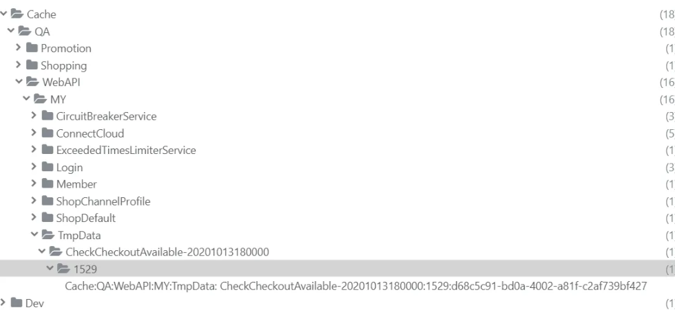

# Cache

  - [📂 AWS UI 確認位置](#-AWS-UI-確認位置)
  - [📂 Redis 設定檔路徑](#-redis-設定檔路徑)
  - [🌐 連線字串設定](#-連線字串設定)
  - [🧹 清除快取方法](#-清除快取方法)
  - [🔑 常見 Redis Key 範例](#-常見-redis-key-範例)
  - [⚙️ OutputCache 設定](#️-outputcache-設定)
  - [🛠️ Nine1.Utility.Cache 使用說明](#️-nine1utilitycache-使用說明)
  - [🔄 Redis 換 Server 確認流程](#-redis-換-server-確認流程)
  - [🚨 異常紀錄](#-異常紀錄)
    - [案例 1：Elmah 一直出現 ConnectTimeout](#案例-1elmah-一直出現-connecttimeout)

---

## AWS UI 確認位置


ElastiCache >> Redis OSS caches >> hk-backend-redis-2

<br>

## 📂 Redis 設定檔路徑

**機器 Redis 設定檔位置**：

<br>

```
C:\Windows\Microsoft.NET\Framework64\v4.0.30319\Config\ConnectionStrings.txt
```

<br>

---

## 🌐 連線字串設定


#### MY_Prod

<br>

**Prod.Redis.Cache**：
```xml
<add name="Prod.Redis.Cache" connectionString="data-cache2.my.91app.io:6379,ssl=false,password=,allowAdmin=false,connectTimeout=5000,syncTimeout=2000"/>
<add name="Prod.Redis.Data" connectionString="data-cache2.my.91app.io:6379,ssl=false,password=,allowAdmin=false,connectTimeout=5000,syncTimeout=2000"/>
<add name="Prod.Redis.ImageQueue" connectionString="data-cache2.my.91app.io:6379,abortConnect=false,ssl=false,password=,allowAdmin=false,connectTimeout=5000,syncTimeout=2000"/>
<add name="Prod.Redis.Data2" connectionString="data-cache2.my.91app.io:6379,ssl=false,password=,allowAdmin=false,connectTimeout=5000,syncTimeout=2000"/>
<add name="Prod.Redis.LineUp" connectionString="data-cache2.my.91app.io:6379,ssl=false,password=,allowAdmin=false,connectTimeout=5000,syncTimeout=2000"/>
<add name="Prod.Redis.FileCache" connectionString="data-cache2.my.91app.io:6379,ssl=false,password=,allowAdmin=false,connectTimeout=5000,syncTimeout=2000"/>
<add name="Prod.Redis.Sequence" connectionString="sequence-cache.my.91app.io:6379,ssl=false,password=,allowAdmin=false,connectTimeout=5000,syncTimeout=2000"/>
```

<br>

#### MWEB_MY_PROD

```xml
<add name="Prod.Redis.Cache" connectionString="cache2.my.91app.io:6379,ssl=false,password=,allowAdmin=false,connectTimeout=5000,syncTimeout=2000"/>
```

<br>

#### HK_PROD_MWEB

```xml
<add name="Prod.Redis.Cache" connectionString="cache-redis.hk.91app.io:6379,ssl=false,password=,allowAdmin=false,connectTimeout=5000,syncTimeout=2000"/>
```

<br>

#### HK_QA

HK.Debug.Config == > 10.51.101.129:6379

<br>

#### MWEB_HK_QA

```xml
<add name="Dev.Redis.Cache" connectionString="10.51.106.123:6379,ssl=false,password=,allowAdmin=false,connectTimeout=50000"/>
```

<br>

#### MWEB_MY_QA

```xml
<add name="Dev.Redis.Cache" connectionString="10.51.12.199:6379,ssl=false,password=,allowAdmin=false,connectTimeout=50000"/>
```

<br>

#### MWEB_TW_QA

```xml
<add name="Dev.Redis.Cache" connectionString="qa-backend-redis-2.e9s1dj.ng.0001.apne1.cache.amazonaws.com:6379,qa-backend-redis-2-ro.e9s1dj.ng.0001.apne1.cache.amazonaws.com:6379,ssl=false,password=,allowAdmin=false,connectTimeout=5000"/>
```

<br>

#### SMS_HK_QA

```xml
<add name="Dev.Redis.Cache" connectionString="10.51.106.123:6379,ssl=false,password=,allowAdmin=false,connectTimeout=5000"/>
```

<br>

---

## 🧹 清除快取方法

### 方法 1：Querystring 參數

在 URL 後面加上參數：
```
r=t
```

---

## 🔑 常見 Redis Key 範例

**Checkout UK Redis Key**：
```
Cache:QA:WebAPI:MY:TmpData:CheckCheckoutAvailible-2020101318000:1529
```


---

## ⚙️ OutputCache 設定

OutputCache 可以通過查看 Web.config 進行設定：

- Web.config 有一個 `<outputCacheSettings>` 區段
- Cache.Config 會設定快取持續時間 (duration，以秒為單位)

### 範例

**券列表**：
```
"WebAPI.OfficialECouponList"
```

---

## 🛠️ Nine1.Utility.Cache 使用說明

**專案連結**：https://gitlab.91app.com/nine1.utility/nine1.utility.cache

### CacheService

#### RedisCacheProvider

### IDatabase

`IDatabase` 是 StackExchange.Redis 函式庫中用來與 Redis 進行交互的主要介面。它提供了一組方法來執行 Redis 命令，允許應用程式對 Redis 資料庫執行讀寫操作。這個介面適用於 Standalone Redis 和 Redis Cluster 環境。

**IDatabase 功能**：
- 讀寫鍵值 (GET, SET)
- 操作集合 (SADD, SREM)
- 交易 (MULTI, EXEC)
- 批次處理 (Batch)
- 鎖機制 (Lock)
- 地理空間數據操作 (GEOADD, GEODIST)
- Key 遷移 (MIGRATE)

**取得 IDatabase 物件**：
```csharp
ConnectionMultiplexer redis = ConnectionMultiplexer.Connect("localhost");
IDatabase db = redis.GetDatabase();
```

> **注意**：IDatabase 是 Thread Safe 的，因為 ConnectionMultiplexer 本身是設計為共享連線的，而 IDatabase 只是該連線的一個抽象接口，所有的操作仍然是透過 ConnectionMultiplexer 來執行的。

### IServer

`IServer` 是 StackExchange.Redis 函式庫中的一個介面，提供 Redis 伺服器級別的操作。與 IDatabase 主要用來操作資料不同，IServer 主要用來執行管理伺服器的相關命令。

**IServer 功能**：
- 取得 Redis 伺服器資訊 (INFO, PING, CONFIG GET)
- 清除特定資料庫或所有資料 (FLUSHDB, FLUSHALL)
- 管理 Key 空間 (SCAN, KEYS, TTL)
- 查看與管理 Redis 叢集 (Cluster) 與副本 (Replica) 配置
- 檢視連線狀態 (CLIENT LIST, CLIENT KILL)
- 監控 Redis 伺服器的效能與狀態 (SLOWLOG, LATENCY DOCTOR)

> **區別**：與 IDatabase 不同，IServer 主要針對伺服器級別的操作，而 IDatabase 則是針對資料庫層級的操作。

### GetAsync 方法範例

```csharp
public async Task<T?> GetAsync<T>(string group,
                                  string feature,
                                  string key,
                                  TimeSpan expireTime,
                                  Func<Task<T?>> getDataAsyncFunc,
                                  CommandFlags flags = CommandFlags.None) where T : class
{
    string cacheKey = GetCacheKey(group, feature, key);
    CacheEntity<T> cacheData = await CacheProvider.GetAsync<CacheEntity<T>>(cacheKey, flags);
    if (cacheData == null)
    {
        return await SetCacheDataAsync(cacheKey, expireTime, getDataAsyncFunc);
    }

    if (cacheData.ExpireTime >= DateTime.Now)
    {
        return cacheData.Data;
    }

    try
    {
        return await UpdateCacheDataAsync(cacheKey, expireTime, getDataAsyncFunc);
    }
    catch (CacheStatusException)
    {
        return cacheData.Data;
    }
}
```

### Client 端相關指令

- 取得 Redis 伺服器資訊 (INFO, PING, CONFIG GET)
- 清除特定資料庫或所有資料 (FLUSHDB, FLUSHALL)
- 管理 Key 空間 (SCAN, KEYS, TTL)
- 查看與管理 Redis 叢集 (Cluster) 與副本 (Replica) 配置
- 檢視連線狀態 (CLIENT LIST, CLIENT KILL)
- 監控 Redis 伺服器的效能與狀態 (SLOWLOG, LATENCY DOCTOR)

---

## � Redis 換 Server 確認流程

**參考紀錄**：https://91app.slack.com/archives/G06A3GDC7/p1748858094370239

<br>

### 操作步驟

**步驟 0**：Infra 備份 Snapshot hk-backend-redis-2 舊資料後長在新 server 上

<br>

**步驟 1**：RD 確認新 Server 有資料

<br>

**步驟 2**：RD 確認 Grafana 有出現新的 server
監控儀表板連結：
```
https://monitoring-dashboard.91app.io/d/G0HDCHQ4k/elasticache-monitoring?orgId=2&refresh=30s&var-ENV=TW-Prod&var-AWS=TW-Prod-CloudWatch&var-RedisCluster=repl-web-redis-1-001&var-RedisCluster=repl-web-redis-1-003&from=now-7d&to=now
```

<br>

**步驟 3**：Infra 切換 DNS backend-redis.hk.91app.io 指向
```
hk-backend-redis-1.ql9kn1.ng.0001.apse1.cache.amazonaws.com
```

<br>

**步驟 4**：RD client list 確認有哪些連線

<br>

**步驟 5**：剔除一台 CLIENT client kill SG-MY-MWEB1 確認連到新 SERVER

<br>

**步驟 6**：剔除全部
```
client kill SKIPME yes
```

<br>

**步驟 7**：確認功能皆正常

<br>

---

## �🚨 異常紀錄

### 案例 1：Elmah 一直出現 ConnectTimeout

**異常訊息**：

<br>

```
It was not possible to connect to the redis server(s). Error connecting right now. To allow this multiplexer to continue retrying until it's able to connect, use abortConnect=false in your connection string or AbortOnConnectFail=false; in your code. ConnectTimeout
```

<br>

**案例資訊**：

<br>

- **發生頁面**：/SalePage/Index/221011
- **ShopId**：200057

<br>

**StackTrace 觀察**：

<br>

錯誤都發生在以下位置：

<br>

```
at NineYi.WebStore.Frontend.BL.Member.MemberManager.IsLogin(Boolean isCheckRedisLoginStatus, Int64 shopId) in D:\ws\workspace\yi.webstore.mobilewebmall_master\WebStore\Frontend\BL\Member\MemberManager.cs:line 791
```

<br>

**問題釐清**：

<br>

1. 本機連線測試可正常連接 Redis Server
2. 商品頁面和首頁皆正常顯示

<br>

**根本原因**：

<br>

特定 ASG 機器 MY-MWG1-10-219 無法連接到 Redis Server

<br>

**解決方案**：

<br>

聯繫相關團隊協助下架該問題 ASG 機器

<br>