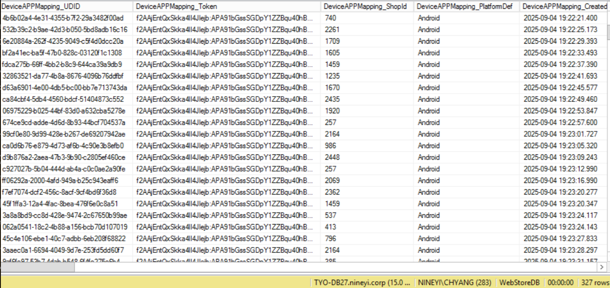

# DDoS 防護指南

## 目錄
- [以色列簡訊攻擊特徵](#以色列簡訊攻擊特徵)
- [阻擋網段](#阻擋網段)
  - [CIDR 聚合概念](#cidr-聚合概念)
  - [網段基本概念](#網段基本概念)
  - [常見範例](#常見範例)
- [SaSa 疑似被大量註冊攻擊](#sasa-疑似被大量註冊攻擊)
  - [攻擊資訊](#攻擊資訊)
  - [處理方式](#處理方式)
    - [設定會員註冊國家黑名單](#設定會員註冊國家黑名單)
    - [確認 SmsMessagePriorityHigh](#確認-smsmessagepriorityhigh)
    - [WAF 限流](#waf-限流)
    - [排程監控](#排程監控)

<br><br>

---

## 以色列簡訊攻擊特徵

以色列簡訊沒有集中特店，廣打不同 ShopId



<br><br>

---

## 阻擋網段

### CIDR 聚合概念

「first_ip」幾乎都落在同幾個網段，所以一次封整段是因為「用 CIDR 聚合（aggregation）」能用更少規則就擋掉同一批來源。對照一下：

<br>

**攻擊來源 IP 分析**

178.171.38、178.171.44、178.171.116、178.171.45、178.171.46、178.171.117、178.171.47、178.171.64、178.171.65、178.171.40

→ 全都屬於 178.171.0.0/16（178.171..）

<br>

### 網段基本概念

「網段」其實就是一段 IP 位址的範圍。我們在網路裡常用 CIDR 表示法（Classless Inter-Domain Routing），像你看到的 /16、/24 就是這種寫法。

<br>

**IP 位址 vs 網段**

| 類型 | 說明 | 範例 |
|------|------|------|
| IP 位址 | 單一的 IP | 178.171.38.1 |
| 網段 | 用「起始位址 + 子網遮罩」代表一大批 IP | 178.171.0.0/16 |

<br>

**178.171.0.0/16 解析**

- 178.171 固定
- /16 代表前 16 位是網路部分 → 後面 16 位可以變化
- 涵蓋範圍：178.171.0.0 ~ 178.171.255.255
- 總共有：65,536 個 IP

<br>

### 常見範例

| CIDR 表示法 | IP 數量 | 範圍說明 | 範例 |
|-------------|---------|----------|------|
| /32 | 1 個 | 單一 IP | 178.171.38.1/32 |
| /24 | 256 個 | 178.171.38.0 ~ 178.171.38.255 | 178.171.38.0/24 |
| /16 | 65,536 個 | 178.171.0.0 ~ 178.171.255.255 | 178.171.0.0/16 |

<br>

**實際應用**

👉 當你看到「阻擋 178.171.0.0/16」，意思就是：

把 178.171 這整段的所有 IP（共六萬多個）都擋掉，這樣就能一次防掉整批可疑來源。

<br>

**優勢**

- 用更少的防火牆規則
- 一次阻擋大量相關 IP
- 提高防護效率
- 減少系統負載

<br><br>

---

## SaSa 疑似被大量註冊攻擊

### 攻擊資訊

**基本資訊**

| 項目 | 詳細資料 |
|------|----------|
| 攻擊時間 | 2025/07/29 ~ 2025/09/01 |
| 處理時間 | 2025/08/01 (以會員註冊國家黑名單阻擋) |
| Country code | 44 (英國) |
| 主要商店 | SaSa (ShopId: 17) |
| 累積筆數 | 100,796 筆 |
| 每日攻擊量 | 約 3,000 ~ 4,000 筆 |

<br>

**統計查詢**

```sql
-- 總計攻擊筆數：100,796
SELECT
    COUNT(1)
FROM dbo.MemberRegister WITH (NOLOCK)
WHERE MemberRegister_ShopId = 17
AND MemberRegister_CreatedDateTime >= '20250801'
AND MemberRegister_CreatedDateTime < '20250901'
AND MemberRegister_ValidFlag = 1
AND MemberRegister_VerifyTypeDef = 'Register'
AND MemberRegister_VerifyCodeSendDateTime > ''
AND MemberRegister_CountryProfileId = 17
```

<br>

**每日註冊量分析**

```sql
-- 每日註冊量統計
SELECT 
    CONVERT(DATE, MemberRegister_CreatedDateTime) AS RegisterDate,
    COUNT(*) AS RegisterCount
FROM dbo.MemberRegister WITH (NOLOCK)
WHERE MemberRegister_ShopId = 17
  AND MemberRegister_CreatedDateTime >= '2025-06-01'
  AND MemberRegister_CreatedDateTime < '2025-09-01'
  AND MemberRegister_ValidFlag = 1
  AND MemberRegister_VerifyTypeDef = 'Register'
  AND MemberRegister_VerifyCodeSendDateTime > ''
  AND MemberRegister_CountryProfileId = 17
GROUP BY CONVERT(DATE, MemberRegister_CreatedDateTime)
ORDER BY RegisterDate;
```

<br>

**異常註冊趨勢**

| RegisterDate | RegisterCount |
|--------------|---------------|
| 2025-06-01 | 1 |
| 2025-06-02 | 3 |
| 2025-06-04 | 1 |
| ... | ... |

<br>

### 處理方式

#### 設定會員註冊國家黑名單

**操作步驟**

1. 設定會員註冊國家黑名單
2. 清除相關 cache

<br>

**Cache 清除**

```
Cache Key: Cache:Prod:WebAPI:ShopStaticSetting:GetShopStaticSettingByGroupNameKey-2019121719:17-MemberRegister-CountryAliasCodeBlackList-en-US
```

<br>

#### 確認 SmsMessagePriorityHigh

**檢查結果**

- SmsMessagePriorityHigh 停在 2025-09-01 18:53:26.853
- 共計 67 筆受影響

<br>

**查詢語法**

```sql
SELECT *
FROM dbo.Task(NOLOCK)
WHERE Task_ValidFlag = 1
    AND Task_CreatedDatetime > '2025-09-01 18:39'
    AND Task_Status = 'Switched'
    AND Task_JobId IN (264)
    AND Task_Data LIKE N'%會員註冊%'
    AND Task_Data LIKE N'%"ShopId":17,%'
    AND Task_Data LIKE N'%,"CountryProfileId":17}%'
ORDER BY Task_Id DESC
```

<br>

#### WAF 限流

實施 Web Application Firewall (WAF) 限流措施，限制同一來源的註冊請求頻率。

<br>

#### 排程監控

**監控機制**

使用排程監控系統：`OMO_Monitor_PS_CRMMonitorMemberRegisterCount`

<br>

**監控目的**

疑似商店會員註冊被攻擊時進行即時告警和處理。

<br>

**處理成效**

通過多重防護措施的實施，成功阻擋了大量的惡意註冊攻擊，保護了系統資源和簡訊服務的正常運作。