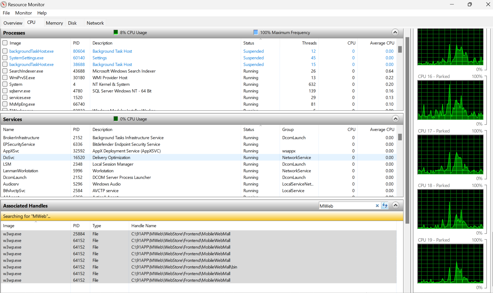

## 找出該死的 another process

Win + R
resmon
Associated Handles
在搜尋框輸入資料夾名稱 : MWeb

## shortcut

- Windows E 可以開啟檔案總管
- Windows D 可以回桌面
- Alt+F4可以關閉畫面中執行的程式而無須移動鼠標，同時在桌面按alt+f4可以跳出電源選單
- Windows 鍵 不放，再按鍵盤上方的數字鍵（1、2、3...），就能直接開啟螢幕下方工作列上，由左至右對應位置的程式
- Windows鍵+方向左、右可以平均分割兩個視窗，文件比對/修改/查閱、很方便
- Windows + L 可以鎖定桌面。（搜索pin, 可以設定指紋解鎖）
- ALT + F4 休眠

## UAC

Win >> UAC

□ 永遠不通知
■ 預設（推薦）
□ 僅在應用程式嘗試變更時通知
□ 一律通知

實際效果：

- 一般程式（IDE、Browser、Cursor）👉 用「使用者身分」跑
- 需要升權的操作（安裝軟體、改系統設定）👉 跳出 UAC 視窗

問你：「你確定嗎？」
關鍵意義：👉 權限是「即時借用」，不是永久給

## 亮度

System => Display

## 切換螢幕模式

Windows 鍵 + P

## 直接反白檔案總管的路徑

Alt + D

## 直接跳到 VS CODE

在路徑列 CMD => CODE .

## 刪不掉是因為咬檔

## 輸入法

設定 > 時間與語言 > 輸入 > 進階鍵盤設定

## 知道 pid 多少後要怎麼停

task manager => details => pid