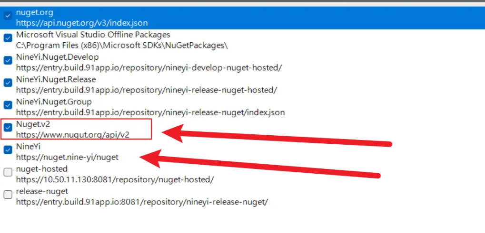
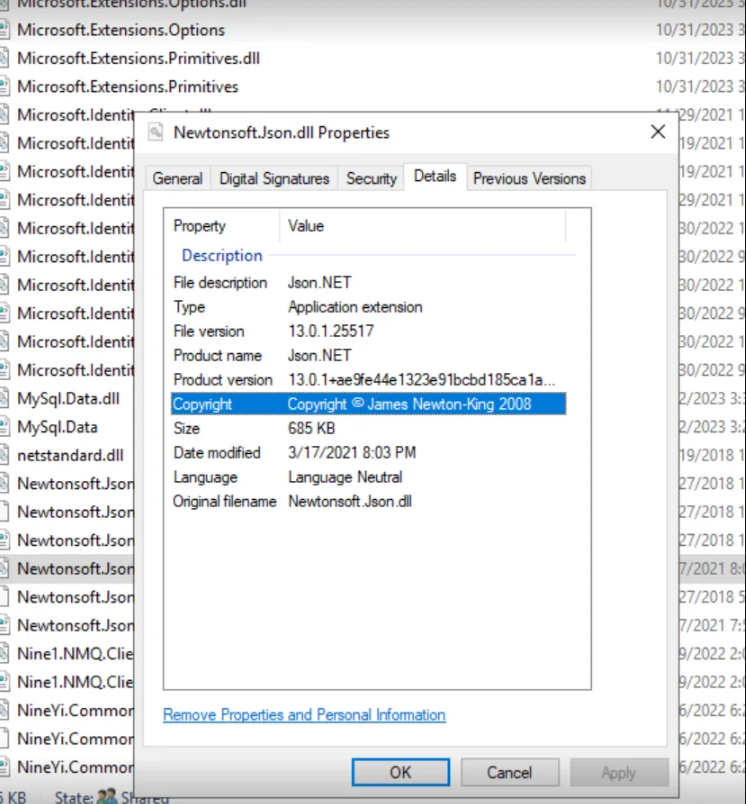
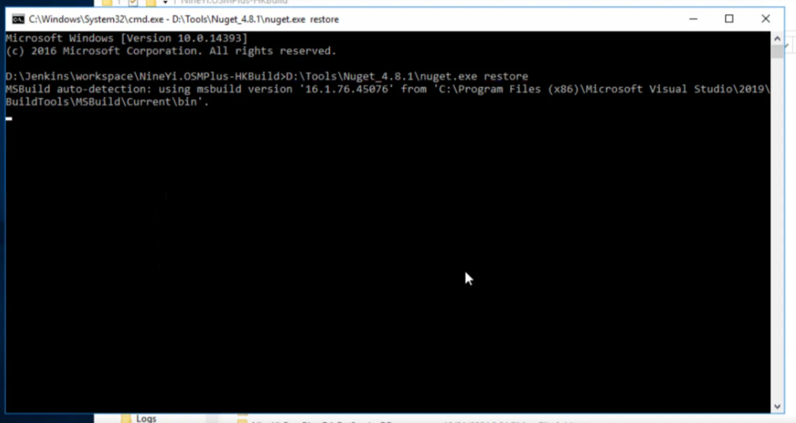

# 📦 NuGet 套件維護文件

<br>

## 📖 目錄

  - [🚨 異常紀錄](#-異常紀錄)
    - [案例 1：NuGet 遇到拉不到資源的錯誤訊息](#案例-1nuget-遇到拉不到資源的錯誤訊息)
    - [案例 2：OSMPLUS NewtonJson 版本問題](#案例-2osmplus-newtonjson-版本問題)
  - [🔧 本機測試套件方法](#-本機測試套件方法)

<br>

---

## 🚨 異常紀錄

### 案例 1：NuGet 遇到拉不到資源的錯誤訊息

**解決方案**：

<br>

來源要移除一些不該出現的項目



<br>

### 案例 2：OSMPLUS NewtonJson 版本問題

**異常訊息**：

<br>

```
14:30:30 Could not load file or assembly 'Newtonsoft.Json, Version=13.0.0.0, Culture=neutral, PublicKeyToken=30ad4fe6b2a6aeed' or one of its dependencies. The located assembly's manifest definition does not match the assembly reference. (Exception from HRESULT: 0x80131040)
14:30:33 Could not load file or assembly 'Newtonsoft.Json, Version=13.0.0.0, Culture=neutral, PublicKeyToken=30ad4fe6b2a6aeed' or one of its dependencies. The located assembly's manifest definition does not match the assembly reference. (Exception from HRESULT: 0x80131040)
```

<br>

**修復方法**：

<br>

直接用檔案覆蓋的方式來還原版本



<br>

**上版正確做法**：

<br>

如果有 NuGet 套件更新，需要到機器手動更新 NuGet

<br>

**位置**：
```
D:\Jenkins\workspace\NineYi.OSMPlus-HKBuild
```

<br>

**指令**：
```
D:\Tools\Nuget_4.8.1\nuget.exe restore
```


<br>

---

## 🔧 本機測試套件方法

直接拉套件的 Repository 下來進行修改，建置產生 DLL 檔案

<br>

**覆蓋位置**：
```
C:\91APP\NineYi.Sms\packages
```

<br>

將建置完成的 DLL 檔案覆蓋到此位置進行測試

<br>
