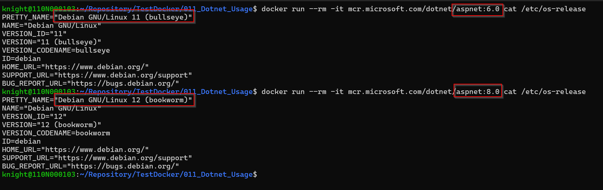

## dotnet 6.0 升 8.0

- CPU 跟 Memory 都有上升約 150%
- 先列一下差異點
  - OS 版本
  - dotnet Runtime 版本
  - Application Nuget 版本
- 查一下各 api 延遲狀況 (application insights)
- os 及 runtime 差異

[Large unmanaged memory growth (leak?) when upgrading from .NET 6 to 8 #95922](https://github.com/dotnet/runtime/issues/95922)

[possibly memory leak in .net 8 #96581](https://github.com/dotnet/runtime/issues/96581)

## 前台升版

https://91app.slack.com/archives/G06A3GDC7/p1697583367236989

為測試Nine1.BaseSDK 支援.net8升級
目前將
HK QA 環境的 PaymentMiddleware 更新為 .net6.0 + 新版BaseSDK
MY QA 環境的 PaymentMiddleware 更新為 .net 8.0 + 新版的BaseSDK
如有遇到支付異常 或是 有其他疑問 再麻煩告知 感謝

NMQ 可能 router 不支援 8.0